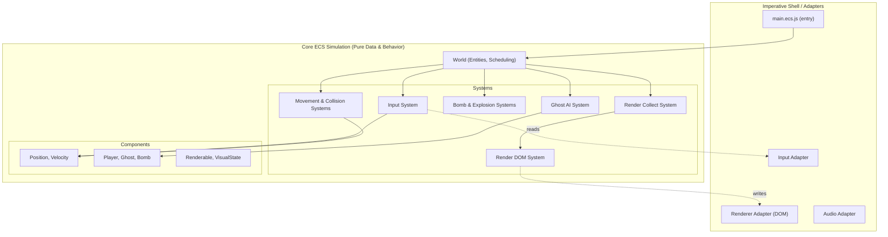

# 🎮 Ms. Ghostman — ECS Edition

> **Pac-Man × Bomberman** — Eat every pellet. Bomb every wall. Survive every ghost. Built purely with **Entity-Component-System (ECS)** architecture. 

A single-player browser game built with **pure JavaScript, HTML, and CSS** — no canvas, no frameworks. Navigate a haunted maze, drop bombs to clear destructible walls, eliminate ghosts, and collect every pellet to clear each level. This implementation leverages a strict **Data-Oriented ECS** architecture to guarantee 60 FPS performance, stable system passes, and modular logic boundaries.

---

## 📖 Table of Contents

- [Overview](#-overview)
- [Gameplay](#-gameplay)
- [Architecture Overview](#-architecture-overview)
- [Directory Structure](#-directory-structure)
- [Frame Pipeline](#-frame-pipeline)
- [Rendering & Performance](#-rendering--performance-targets)
- [Getting Started](#-getting-started)
- [Scripts & Commands](#-scripts--commands)
- [Development Workflow](#-development-workflow)
- [Documentation Flow](#-documentation-flow)
- [Testing & Verification](#-testing--verification)
- [Tech Stack & Constraints](#-tech-stack--constraints)
- [Contributing](#-contributing)
- [License](#-license)

---

## 🎯 Overview

Ms. Ghostman is a single-player arcade game with a Pac-Man-first loop and Bomberman-style bomb mechanics:

- **Pac-Man**: Navigate a grid-based maze, eat all pellets to complete a level.
- **Bomberman**: Drop bombs to destroy walls, create paths, and eliminate enemies.

The result is a strategic game where every move matters. Block off ghost routes, set bomb traps, chain explosions, and race against the clock.

### 🧠 What Is ECS?

**ECS** means **Entity-Component-System**:

- **Entity**: a simple numeric ID (for example, player, ghost, bomb).
- **Component**: pure data attached to entities (position, velocity, bomb fuse, score tags).
- **System**: logic that reads/writes component data in deterministic order (movement, AI, collisions, rendering).

Why this project uses ECS: it keeps gameplay logic modular, deterministic, and fast enough for stable 60 FPS DOM rendering.

### ✨ Key Features

- 🕹️ **Hold-to-move controls** — smooth, responsive keyboard input processed via input systems.
- 💣 **Bomb mechanics** — 3-second fuse, cross-shaped explosions, chain reactions.
- 👻 **4 unique ghost personalities** — from aggressive to unpredictable.
- ⚡ **Power-ups** — increased bomb range, extra bombs, speed boosts, ghost-stunning pellets.
- ⏱️ **Countdown timer** — beat the clock for bonus points.
- 🏆 **Scoring & combos** — chain-kill ghosts for exponential bonuses.
- ⏸️ **Pause menu** — continue or restart without losing progress.
- 📊 **3 difficulty levels** — increasing maze density, ghost count, and speed.
- 🎨 **60 FPS DOM rendering** — no canvas, pure CSS Grid + transform animations via a dedicated Render Batcher.

---

## 🎮 Gameplay

### ⌨️ Controls

| Key | Action |
|---|---|
| `↑` `↓` `←` `→` | Move Ms. Ghostman (hold for continuous movement) |
| `Space` | Drop a bomb |
| `Escape` / `P` | Pause / Resume |
| `Enter` | Confirm menu selections |

### 🏆 How to Win

1. **Eat all pellets** on the map to clear the level.
2. **Drop bombs** to destroy walls blocking your path.
3. **Avoid or eliminate ghosts** — they kill on contact.
4. **Don't get caught** in your own explosions!
5. **Beat the countdown** — time runs out = game over.
6. Clear all 3 levels to earn **VICTORY**.

### 💯 Scoring

| Action | Points |
|---|---|
| Eat pellet | 10 |
| Eat Power Pellet | 50 |
| Kill ghost (bomb) | 200 |
| Kill stunned ghost | 400 |
| Combo kills | 200 × 2^(n-1) per ghost |
| Collect power-up | 100 |
| Level complete | 1000 + time bonus |

---

## 🏛️ Architecture Overview

This project is built using a strict **Entity-Component-System (ECS)** architecture to ensure high performance, decoupling, and strict determinism. 



### 🧩 Core Concepts

| Concept | Definition |
|---|---|
| **Entity** | An opaque numeric ID. Contains no behavior or methods. |
| **Component** | Data-only records (POJOs) attached to entities. No DOM references. |
| **System** | Dedicated functions that query components and mutate state in a fixed order. |
| **World** | Owners of entities and systems. Orchestrates frame execution and resource access. |
| **Query** | High-performance filters that retrieve entities matching specific component masks. |

---

## 📁 Directory Structure

```text
make-your-game/
├── index.html                      # Single-page entry point
├── package.json                    # ES module config, scripts, exports
├── biome.json                      # Biome linter/formatter config
├── vite.config.js                  # Vite dev server config
│
├── docs/                           # 📚 Documentation
│   ├── requirements.md             # Original project requirements
│   ├── audit.md                    # Audit checklist for grading
│   ├── schemas/                    # JSON Schema 2020-12 contracts
│   │   ├── visual-manifest.schema.json
│   │   └── audio-manifest.schema.json
│   ├── game-description.md         # Full game rules & mechanics
│   └── implementation/             # Canonical implementation planning and tracking docs
│       ├── agentic-workflow-guide.md # Team workflow and PR process
│       ├── assets-pipeline.md       # Visual/audio authoring and validation workflow
│       ├── audit-traceability-matrix.md # Canonical requirement/audit/ticket/test coverage mapping and status
│       ├── implementation-plan.md  # ECS implementation milestones and integration timeline
│       ├── ticket-tracker.md       # Live ticket progress tracker for Section 3 implementation tickets
│       ├── track-a.md              # Track A ticket definitions and verification gates
│       ├── track-b.md              # Track B ticket definitions and verification gates
│       ├── track-c.md              # Track C ticket definitions and verification gates
│       └── track-d.md              # Track D ticket definitions and verification gates
│
├── tests/                          # 🧪 Automated test suites
│   ├── README.md                   # Coverage policy and completion rules
│   ├── e2e/
│   │   └── audit/
│   │       ├── audit-question-map.js
│   │       └── audit.e2e.test.js
│   ├── integration/
│   └── unit/
│
├── src/                            # 🧠 Source code
│   ├── main.ecs.js                 # App entry — bootstraps the ECS World
│   │
│   ├── ecs/                        # ⚙️ ECS Core
│   │   ├── world/                  # World, Entity Store, Queries
│   │   ├── components/             # Pure state (Position, Ghost, Bomb, etc.)
│   │   ├── systems/                # Domain logic (Movement, AI, Render Batching)
│   │   └── resources/              # Shared data (Clock, RNG, Maps)
│   │
│   ├── adapters/                   # 🔌 Imperative Boundaries
│   │   ├── dom/                    # Safe DOM layout & textContent updaters
│   │   └── io/                     # Input handlers & Audio wrappers
│   │
│   └── shared/                     # 🛠️ Cross-cutting utilities
│
├── assets/                         # 🎨 Static assets
│   └── manifests/                  # Runtime asset contract files
│       ├── visual-manifest.json
│       └── audio-manifest.json
│
└── styles/                         # 💅 CSS
    ├── variables.css               # Design tokens (colors, sizes, fonts)
    ├── grid.css                    # CSS Grid layout for game board
    └── animations.css              # Keyframe animations
```

---

## ⚙️ Frame Pipeline

1. **rAF Start**: `requestAnimationFrame` initiates the frame.
2. **Input Sync**: Input adapter snapshots key states into world resources.
3. **Simulation (Fixed-Step)**:
    - Input systems apply intents to components.
    - Movement and AI systems update positions and states.
    - Bomb and explosion systems process fuses and chain reactions.
    - Collision and scoring systems resolve overlaps and points.
    - Timer systems handle level countdowns and transitions.
4. **Visual Pre-processing**: Render collect system computes transform intents based on interpolation.
5. **DOM Commit**: Render DOM system applies a single batched style-write phase.
6. **HUD Update**: HUD adapter updates text metrics using `textContent` only.

### ⏸️ Pause Behavior
- `requestAnimationFrame` continues running to keep menus responsive.
- Simulation update steps are skipped when the pause flag is active.

### 🔒 2026 Runtime Contract
- Fixed-step simulation uses an accumulator with bounded catch-up (`maxStepsPerFrame`).
- `frameTime` is clamped before accumulator integration to avoid spiral-of-death bursts after stalls.
- Input is tracked as hold-state and consumed from deterministic per-step snapshots.
- On resume from pause or tab restore, timing baselines are re-synchronized before simulation continues.

---

## 🚀 Rendering & Performance Targets

### 🎨 DOM Strategy
- **Static Grid**: Persistent board elements created once at startup.
- **Node Pooling**: Transient entities (bombs, fire, effects) use recycled DOM nodes. Prevent GC pauses.
- **Compositor Friendly**: All movement updates restricted to `transform` and `opacity`.
- **Minimal Jank**: Strict avoidance of layout thrashing through batched read/write phases.

### ⚡ Targets

| Metric | Target |
|---|---|
| Frame rate | ≥ 60 FPS target with no sustained dropped-frame bursts |
| Frame budget | p95 <= 16.7ms over representative 60s scenarios |
| DOM elements | ≤ 500 |
| Layer count | 3-5 composited layers |
| GC pauses | < 1ms (object pooling, in-place component mutation) |
| JS heap | < 10MB |
| Layout thrashing | Zero (batch reads → writes via `render-dom-system.js`) |

---

## 🏁 Getting Started

### Prerequisites

- **Node.js** ≥ 20.x
- **npm** ≥ 10.x

### Installation

```bash
# Clone the repository
git clone <repo-url>
cd make-your-game

# Install dependencies
npm ci
```

### Run the Development Server

```bash
npm run dev
```

Open `http://localhost:5173` in your browser. Vite serves the app with hot-reload.

---

## 📜 Scripts & Commands

| Command | Description |
|---|---|
| `npm run dev` | Start Vite dev server with HMR |
| `npm run build` | Production build to `dist/` |
| `npm run preview` | Serve production build locally |
| `npm run test` | Run all unit tests (Vitest) |
| `npm run test:watch` | Run tests in watch mode |
| `npm run test:coverage` | Generate test coverage report |
| `npm run lint` | Run Biome linter |
| `npm run format` | Run Biome formatter |
| `npm run check` | Run Biome lint + format check |
| `npm run validate:schema` | Run JSON Schema 2020-12 validation for maps |
| `npm run sbom` | Generate SPDX SBOM for dependency auditing |

---

## 👥 Development Workflow

The project is split into **4 parallel workflow tracks** to enable multiple developers to work simultaneously with absolute ECS decoupling:

| Track | Dev | Scope | Key Systems & Files |
|---|---|---|---|
| **Track A** | Dev 1 | Core Engine, CI, Schema, and Evidence Wiring | `src/ecs/world/*`, `src/ecs/resources/*`, `main.ecs.js` |
| **Track B** | Dev 2 | Physics, Input, and Gameplay Logic & Rules | `input-system.js`, `player-move-system.js`, `ghost-ai-system.js`, `collision-system.js` |
| **Track C** | Dev 3 | Audio Production and Integration | `audio-adapter.js`, audio manifests, cue mapping, decode/preload flow |
| **Track D** | Dev 4 | Rendering, DOM Batching, and Visual Production and Integration | `render-collect-system.js`, `render-dom-system.js`, Adapters |

> **Note**: For the full integration milestone breakdown, check `docs/implementation/implementation-plan.md`.
> **Execution tracking**: Update `docs/implementation/ticket-tracker.md` as tickets move from Not Started -> In Progress -> Blocked/Done.

## 🧭 Documentation Flow

Recommended reading order for new contributors:

1. `AGENTS.md` (normative constraints and quality gates)
2. `docs/requirements.md` (project requirement source of truth)
3. `docs/game-description.md` (gameplay behavior source of truth)
4. `docs/audit.md` (acceptance/pass criteria source of truth)
5. `docs/implementation/implementation-plan.md` (ECS execution plan and milestones)
6. `docs/implementation/ticket-tracker.md` (live ticket status board and owner/progress updates)
7. `docs/implementation/track-a.md` + `docs/implementation/track-b.md` + `docs/implementation/track-c.md` + `docs/implementation/track-d.md` (detailed track ticket definitions and verification gates)
8. `docs/implementation/audit-traceability-matrix.md` (single-source requirement/audit/ticket/test coverage mapping and status)
9. `docs/implementation/assets-pipeline.md` (visual/audio asset creation, optimization, and validation workflow)

### 📌 Source Of Truth Policy

- Implementation constraints, architecture boundaries, and audit verification categories: `AGENTS.md`
- Requirement intent and feature scope: `docs/requirements.md` + `docs/game-description.md`
- Final pass/fail acceptance criteria: `docs/audit.md`
- Ticket execution progress and owner/status board: `docs/implementation/ticket-tracker.md`
- Cross-document requirement/audit/ticket/test traceability and coverage status: `docs/implementation/audit-traceability-matrix.md`
- Visual/audio authoring and asset quality gates: `docs/implementation/assets-pipeline.md`
- If there is ambiguity, decisions MUST be resolved against those references.

---

## 🧪 Testing & Verification

| Layer | Strategy |
|---|---|
| **Unit Tests** | Pure systems tested with seeded RNG and deterministic clocks via Vitest. No DOM required. |
| **Integration** | World scheduling and cross-system interaction (e.g., bomb chains, pause logic, respawns). |
| **Adapter Tests** | Verification of input normalization and DOM write batching outputs natively. |
| **Determinism** | Comparison of final state hashes across identical seed/input traces. |
| **Pause Invariants** | While paused, simulation state is frozen and rAF-driven UI remains responsive. |
| **Performance** | Profile-backed checks for frame-time percentiles, long tasks, layout/paint stability, and allocation behavior. |
| **Accessibility** | Keyboard navigation, pause-menu focus management, and meaningful HUD status updates. |

### 🗂️ Test Suite Structure

```text
tests/
├── README.md
├── e2e/
│   └── audit/
│       ├── audit-question-map.js
│       └── audit.e2e.test.js
├── integration/
└── unit/
```

### ✅ Audit Coverage Requirement

- The `tests/e2e/audit/audit.e2e.test.js` suite is mapped directly to `docs/audit.md`.
- Verification follows `AGENTS.md` test categories:
    - Fully Automatable: `F-01..F-16`, `B-01`, `B-02`, `B-03`
    - Semi-Automatable: `F-17`, `F-18`
    - Manual-With-Evidence: `F-19`, `F-20`, `F-21`, `B-04`, `B-05`, `B-06`
- The project is complete only when all mapped automated checks pass and required manual evidence artifacts are attached.

---

## 🛠️ Tech Stack & Constraints

### Used

| Technology | Purpose |
|---|---|
| **JavaScript (ES2026)** | Game logic, DOM manipulation |
| **HTML5** | Semantic page structure |
| **CSS3** | Grid layout, animations, styling |
| **Vite** | Dev server, bundler |
| **Biome** | Linting + formatting |
| **Vitest** | Unit testing |
| **SVG** | Sprites and visual assets |
| **Web Workers (profiling-gated)** | Optional offload for heavy computations only when profiling shows > 4 ms/frame main-thread impact |
| **Trusted Types / CSP** | DOM Security enforcement |
| **JSON Schema 2020-12** | Map data validation in CI |

### Explicitly NOT Used (by requirement)

| Technology | Reason |
|---|---|
| `<canvas>` | Project requirement — DOM/SVG only |
| React / Vue / Angular | No frameworks allowed |
| Game engines (Phaser, etc.) | Must build custom ECS engine |
| jQuery | Vanilla JS only |
| `var` | ES2026 standard — `const`/`let` only |
| CommonJS (`require`) | ES Modules only |
| `innerHTML` | XSS prevention by construction |

---

## 🤝 Contributing

1. Read `AGENTS.md` for ECS coding standards and constraints.
2. Read [docs/implementation/agentic-workflow-guide.md](docs/implementation/agentic-workflow-guide.md) for the 4-dev agent workflow, PR gates, and security checklist.
3. Review `docs/implementation/implementation-plan.md` and the corresponding `docs/implementation/track-*.md` file for your specific track assignment.
4. Feature branches should isolate specific ECS systems or component additions.
5. Core systems MUST remain pure functions handling data components; systems MUST access adapters via World resources and MUST NOT import adapters directly (including `render-dom-system.js`).
6. Run `npm run check && npm run test` before committing.
7. CI MUST pass all merge gates (schema validation, testing, lockfile integrity, policy gate) before merge. When coverage/SBOM scripts are configured, those gates MUST also pass.
8. The policy gate workflow enforces PR review, audit alignment, security boundaries, and dependency pairing.
9. Request review at integration milestones.

---

## 📄 License

This project is developed as an educational exercise for strict data-oriented ECS and high-performance DOM constraints.

---

*Ms. Ghostman — Where Pac-Man meets Bomberman. Eat. Bomb. Survive.* 🎮💣👻