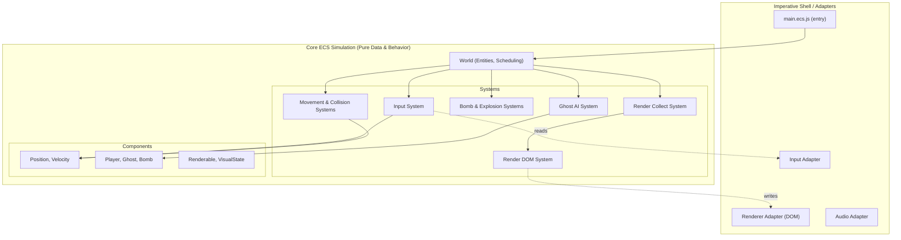

# 🎮 Ms. Ghostman — ECS Edition

[]()
[]()
[]()
[]()
[]()
[]()
[]()

A pure-JS Entity-Component-System game engine demonstrating data-oriented browser architecture. Built as an educational reference for ECS patterns — no canvas, no frameworks, 60 FPS DOM rendering with strict performance budgets.

> **Pac-Man × Bomberman** — Eat every pellet. Bomb every wall. Survive every ghost. Built purely with **Entity-Component-System (ECS)** architecture. 

---

## 🏁 Getting Started

The repository includes the current runtime/build toolchain, so the commands below are ready to use after installing dependencies.

### Prerequisites

- **Node.js** ≥ 24.0.0
- **npm** ≥ 10.x

### Installation

```bash
# Clone the repository
git clone https://github.com/ertval/make-your-game.git
cd make-your-game

# Install dependencies
npm ci
```

### Run the Development Server

```bash
npm run dev
```

Open `http://localhost:5173` in your browser. Vite serves the app with hot-reload.

---

## 📖 Table of Contents

- [Getting Started](#-getting-started)
- [Overview](#-overview)
- [Gameplay](#-gameplay)
- [Architecture Overview](#-architecture-overview)
- [Directory Structure](#-directory-structure)
- [Deployment](#-deployment)
- [Frame Pipeline](#-frame-pipeline)
- [Rendering & Performance](#-rendering--performance-targets)
- [Scripts & Commands](#-scripts--commands)
- [Development Workflow](#-development-workflow)
- [Documentation Flow](#-documentation-flow)
- [Testing & Verification](#-testing--verification)
- [Tech Stack & Constraints](#-tech-stack--constraints)
- [Contributing](#-contributing)
- [Related](#-related)
- [License](#-license)

---

## 🎯 Overview

Ms. Ghostman is a single-player arcade game with a Pac-Man-first loop and Bomberman-style bomb mechanics:

- **Pac-Man**: Navigate a grid-based maze, eat all pellets to complete a level.
- **Bomberman**: Drop bombs to destroy walls, create paths, and eliminate enemies.

The result is a strategic game where every move matters. Block off ghost routes, set bomb traps, chain explosions, and race against the clock.

### 🧠 What Is ECS?

**ECS** means **Entity-Component-System**:

- **Entity**: a simple numeric ID (for example, player, ghost, bomb).
- **Component**: pure data attached to entities (position, velocity, bomb fuse, score tags).
- **System**: logic that reads/writes component data in deterministic order (movement, AI, collisions, rendering).

Why this project uses ECS: it keeps gameplay logic modular, deterministic, and fast enough for stable 60 FPS DOM rendering.

### ✨ Target Feature Set

- 🕹️ **Hold-to-move controls** — smooth, responsive keyboard input processed via input systems.
- 💣 **Bomb mechanics** — 3-second fuse, cross-shaped explosions, chain reactions.
- 👻 **4 unique ghost personalities** — from aggressive to unpredictable.
- ⚡ **Power-ups** — increased bomb range, extra bombs, speed boosts, ghost-stunning pellets.
- ⏱️ **Countdown timer** — beat the clock for bonus points.
- 🏆 **Scoring & combos** — chain-kill ghosts for exponential bonuses.
- ⏸️ **Pause menu** — continue or restart without losing progress.
- 📊 **3 difficulty levels** — increasing maze density, ghost count, and speed.
- 🎨 **60 FPS DOM rendering** — no canvas, pure CSS Grid + transform animations via a dedicated Render Batcher.

## 🎮 Gameplay

### ⌨️ Controls

| Key | Action |
|---|---|
| `↑` `↓` `←` `→` | Move Ms. Ghostman (hold for continuous movement) |
| `Space` | Drop a bomb |
| `Escape` / `P` | Pause / Resume |
| `Enter` | Confirm menu selections |

### 🏆 How to Win

1. **Eat all pellets** on the map to clear the level.
2. **Drop bombs** to destroy walls blocking your path.
3. **Avoid or eliminate ghosts** — they kill on contact.
4. **Don't get caught** in your own explosions!
5. **Beat the countdown** — time runs out = game over.
6. Clear all 3 levels to earn **VICTORY**.

### 💯 Scoring

| Action | Points |
|---|---|
| Eat pellet | 10 |
| Eat Power Pellet | 50 |
| Kill ghost (bomb) | 200 |
| Kill stunned ghost | 400 |
| Combo kills | 200 × 2^(n-1) per ghost |
| Collect power-up | 100 |
| Level complete | 1000 + time bonus |

---

## 🏛️ Architecture Overview

This project is built using a strict **Entity-Component-System (ECS)** architecture to ensure high performance, decoupling, and strict determinism. 


```mermaid
graph TB
    subgraph "Imperative Shell / Adapters"
        MAIN["main.ecs.js (entry)"]
        RENDERER["Renderer Adapter (DOM)"]
        INPUT["Input Adapter"]
        AUDIO["Audio Adapter"]
    end

    subgraph "Core ECS Simulation (Pure Data & Behavior)"
        WORLD["World (Entities, Scheduling)"]
        
        subgraph "Systems"
            SYS_INPUT["Input System"]
            SYS_MOVE["Movement & Collision Systems"]
            SYS_BOMB["Bomb & Explosion Systems"]
            SYS_AI["Ghost AI System"]
            SYS_RENDER_C["Render Collect System"]
            SYS_RENDER_D["Render DOM System"]
        end
        
        subgraph "Components"
            COMP_POS["Position, Velocity"]
            COMP_ACT["Player, Ghost, Bomb"]
            COMP_REN["Renderable, VisualState"]
        end
    end

    MAIN --> WORLD
    WORLD --> SYS_INPUT
    WORLD --> SYS_AI
    WORLD --> SYS_MOVE
    WORLD --> SYS_BOMB
    WORLD --> SYS_RENDER_C
    SYS_RENDER_C --> SYS_RENDER_D
    
    SYS_INPUT -. reads .-> INPUT
    SYS_RENDER_D -. writes .-> RENDERER
    
    SYS_INPUT --> COMP_POS
    SYS_MOVE --> COMP_POS
    SYS_AI --> COMP_ACT
```

### 🧩 Core Concepts

| Concept | Definition |
|---|---|
| **Entity** | An opaque numeric ID. Contains no behavior or methods. |
| **Component** | Data-only records (POJOs) attached to entities. No DOM references. |
| **System** | Dedicated functions that query components and mutate state in a fixed order. |
| **World** | Owners of entities and systems. Orchestrates frame execution and resource access. |
| **Query** | High-performance filters that retrieve entities matching specific component masks. |

---

## 📁 Directory Structure

> **Note**: The tree below reflects the current repository layout plus the planned files that are still part of the docs-first roadmap. Entries marked as planned are not checked in yet.

```text
make-your-game/
├── .github/                        # 🔧 GitHub Actions and repository workflow files
│   └── workflows/
│       ├── deploy.yml               # GitHub Pages deployment workflow
│       └── policy-gate.yml         # PR merge gate workflow
├── assets/                         # 🎨 Static and generated asset roots
│   ├── generated/                  # Build-time generated sprite/UI/audio outputs
│   │   ├── music/
│   │   ├── sfx/
│   │   ├── sprites/
│   │   └── ui/
│   ├── manifests/                  # 📄 Runtime asset manifest contracts
│   │   ├── audio-manifest.json
│   │   └── visual-manifest.json
│   └── source/                     # ✏️ Hand-authored source art and audio
│       ├── audio/
│       └── visual/
├── biome.json                      # 🧹 Biome check/fix configuration
├── docs/                           # 📚 Documentation and implementation plans
│   ├── README.md                   # Documentation map and workflow guide
│   ├── audit.md                    # Audit checklist for grading
│   ├── deployment/                 # 🚀 Deployment guidance
│   │   └── github-pages.md         # GitHub Pages deployment guide
│   ├── game-description.md         # Full game rules & mechanics
│   ├── implementation/             # 🧭 Canonical implementation planning and tracking docs
│   │   ├── agentic-workflow-guide.md # Team workflow and PR process
│   │   ├── assets-pipeline.md      # Visual/audio authoring and validation workflow
│   │   ├── audit-traceability-matrix.md # Canonical requirement/audit/ticket/test coverage mapping and status
│   │   ├── implementation-plan.md   # ECS implementation milestones and integration timeline
│   │   ├── pr-template.md           # PR contract and checklist template
│   │   ├── ticket-tracker.md        # Live ticket progress tracker
│   │   ├── track-a.md               # Track A ticket definitions and verification gates
│   │   ├── track-b.md               # Track B ticket definitions and verification gates
│   │   ├── track-c.md               # Track C ticket definitions and verification gates
│   │   └── track-d.md               # Track D ticket definitions and verification gates
│   ├── requirements.md             # Original project requirements
│   └── schemas/                    # 📐 JSON Schema 2020-12 contracts
│       ├── audio-manifest.schema.json
│       └── visual-manifest.schema.json
├── index.html                      # 🏠 Single-page entry point
├── package-lock.json               # 🔒 Locked npm dependency graph
├── package.json                    # 📦 Core config, dependencies, and project quality scripts
├── sbom.json                       # 🔒 SPDX SBOM for dependency auditing (managed and enforced by CI)
├── src/                            # 🧠 Runtime source code
│   ├── adapters/                   # 🔌 Imperative boundaries for DOM and IO
│   ├── adapters/dom/               # DOM adapter implementations (present)
│   ├── adapters/io/                # IO adapter implementations (present)
│   ├── debug/                      # 🐞 Debug utilities and replay helpers
│   ├── ecs/                        # ⚙️ ECS core
│   │   ├── components/             # Pure state data definitions (present)
│   │   ├── resources/              # Shared data (Clock, RNG, Maps)
│   │   ├── systems/                # Domain logic systems (partial/iterative)
│   │   └── world/                  # World, entity store, queries
│   ├── game/                       # 🎮 Game bootstrap and flow orchestration
│   ├── main.ecs.js                 # App entry — bootstraps the ECS World
│   └── shared/                     # 🛠️ Cross-cutting utilities
├── styles/                         # 💅 Global CSS
│   ├── base.css                    # Design tokens, reset, and layout base
│   ├── grid.css                    # Grid layout stylesheet
│   └── animations.css              # Animation stylesheet
├── tests/                          # 🧪 Automated test suites
│   ├── README.md                   # Coverage policy and completion rules
│   ├── e2e/                        # Browser-level validation suites
│   │   └── audit/
│   │       ├── audit-question-map.js
│   │       └── audit.e2e.test.js
│   ├── integration/                # Cross-system integration tests
│   └── unit/                       # Pure unit tests
├── vite.config.js                  # ⚡ Vite dev server config
├── vitest.config.js                # ✅ Vitest config
└── playwright.config.js            # 🎭 Playwright browser test config
```

---

## 🚀 Deployment

The project is configured for automated continuous deployment (CD) via GitHub Actions. Any push to the `main` branch builds the production assets and deploys them directly to GitHub Pages.

For detailed information on the pipeline, Vite base path configurations, and dynamic asset path handling, see the [GitHub Pages Deployment Guide](docs/deployment/github-pages.md).

---

## ⚙️ Frame Pipeline

1. **rAF Start**: `requestAnimationFrame` initiates the frame.
2. **Input Sync**: Input adapter snapshots key states into world resources.
3. **Simulation (Fixed-Step)**:
    - Input systems apply intents to components.
    - Movement and AI systems update positions and states.
    - Bomb and explosion systems process fuses and chain reactions.
    - Collision and scoring systems resolve overlaps and points.
    - Timer systems handle level countdowns and transitions.
4. **Visual Pre-processing**: Render collect system computes transform intents based on interpolation.
5. **DOM Commit**: Render DOM system applies a single batched style-write phase.
6. **HUD Update**: HUD adapter updates text metrics using `textContent` only.

### ⏸️ Pause Behavior
- `requestAnimationFrame` continues running to keep menus responsive.
- Simulation update steps are skipped when the pause flag is active.

### 🔒 2026 Runtime Contract
- Fixed-step simulation uses an accumulator with bounded catch-up (`maxStepsPerFrame`).
- `frameTime` is clamped before accumulator integration to avoid spiral-of-death bursts after stalls.
- Input is tracked as hold-state and consumed from deterministic per-step snapshots.
- On resume from pause or tab restore, timing baselines are re-synchronized before simulation continues.

---

## 🚀 Rendering & Performance Targets

### 🎨 DOM Strategy
- **Static Grid**: Persistent board elements created once at startup.
- **Node Pooling**: Transient entities (bombs, fire, effects) use recycled DOM nodes. Prevent GC pauses.
- **Compositor Friendly**: All movement updates restricted to `transform` and `opacity`.
- **Minimal Jank**: Strict avoidance of layout thrashing through batched read/write phases.

### 📐 Responsive Board Fit
- The board automatically scales to fill the available viewport (centered, capped at `--board-max-scale`) and re-fits on window resize, coalesced to one recalculation per animation frame.
- Scaling is **visual-only**: it applies a uniform `transform: scale()` via `--fit-scale`. The fixed `--tile-size` grid, integer `(row, col)` coordinates, and all gameplay/ECS logic are unchanged.
- The scale factor is computed in JS (`fitBoardToViewport` in `src/adapters/dom/renderer-adapter.js`) rather than CSS. A CSS `calc()` would divide a length by a length (viewport ÷ board size), which Firefox/Gecko rejects per spec while Chrome/Blink accepts — so the board would render at its small intrinsic size in Firefox. A JS-computed plain number scales identically across engines.

### ⚡ Targets

| Metric | Target |
|---|---|
| Frame rate | 60 FPS target with no dropped frames in audited scenarios; acceptance must match docs/audit.md criteria |
| Frame budget | p95 <= 16.7ms over representative 60s scenarios |
| DOM elements | ≤ 500 |
| Layer usage | Layers must be as few as possible but non-zero, with intentional promotion justified by audit evidence |
| GC pauses | < 1ms (object pooling, in-place component mutation) |
| JS heap | < 10MB |
| Layout thrashing | Zero (batch reads → writes via `render-dom-system.js`) |

---


## 📜 Scripts & Commands

> [!TIP]
> The unified pre-PR validation gate is the most critical workflow checkpoint. All other checks are automatically orchestrated by it.

### The Policy Gate: `npm run policy`

The `npm run policy` command is the main pre-PR gate. It must pass successfully before any changes can be merged into `main`. The gate automatically collects local/branch metadata and enforces the following checks:

- **Project Quality:** Runs Biome formatting and linting, Vitest tests, test coverage metrics, JSON Schema validations for game maps, and lockfile-paired SBOM generation.
- **Track & Ownership Boundaries:** Enforces single-track ownership. Developers may only modify files within their assigned track scopes (unless using an `<owner>/bugfix-<slug>` or `<owner>/integration<slug>` branch prefix to bypass).
- **Forbidden Tech Scan:** Inspects changed files to ensure they do not introduce forbidden technologies (such as `<canvas>`, WebGL, WebGPU, or external UI/rendering frameworks) as prohibited by [AGENTS.md](file:///home/ertval/code/zone-modules/make-your-game/AGENTS.md).
- **Source Headers Check:** Verifies that all newly created or modified source files start with the required top-of-file block comment documenting the file's purpose, public API, and constraints.
- **Traceability Gate:** Validates the consistency of the requirement-to-audit traceability matrix and that all audit questions map correctly to active tests.
- **Approval Check:** Verifies PR approval requirements when executing in a CI or PR-review context.

### Essential Development Scripts

For day-to-day development, use these core commands:

- **`npm run dev`**: Start the Vite development server with Hot Module Replacement (HMR) at `http://localhost:5173`.
- **`npm run build`**: Compile and bundle the game for production, outputting static files to `dist/`.
- **`npm run test`**: Run the Vitest unit and integration test suite once.
- **`npm run test:audit`**: Run the full Playwright and Vitest E2E audit suite to verify all acceptance criteria.

---

## 👥 Development Workflow

The project is split into **4 parallel workflow tracks** to enable multiple developers to work simultaneously with absolute ECS decoupling:

- **Track A** (Dev 1 — Core Engine, CI, Schema, Testing, QA, and Evidence Wiring): `src/ecs/world/*`, `src/ecs/resources/*`, `main.ecs.js`, `tests/**/*`, `vitest.config.js`, `playwright.config.js`
- **Track B** (Dev 2 — Physics, Input, and Gameplay Logic & Rules): `input-system.js`, `player-move-system.js`, `ghost-ai-system.js`, `collision-system.js`
- **Track C** (Dev 3 — Scoring, timer, lives, pause and progression, HUD and overlays, storage flow, and audio integration): `scoring-system.js`, `timer-system.js`, `life-system.js`, `pause-system.js`, `level-progress-system.js`, `hud-adapter.js`, `screens-adapter.js`, `audio-adapter.js`
- **Track D** (Dev 4 — Rendering, DOM Batching, and Visual Production and Integration): `render-collect-system.js`, `render-dom-system.js`, Adapters

> **Note**: For the full integration milestone breakdown, check `docs/implementation/implementation-plan.md`.
> **Execution tracking**: Update `docs/implementation/ticket-tracker.md` as tickets move from `[ ]` -> `[-]` -> `[x]`.

### Phase Transitions & Codebase Audits

> **Important Instruction:**
> Every time a phase of the plan tracker is finished, each dev should run the prompt `codebase-analysis-audit` against the whole codebase. Merge the resulting report to main. Then there should be created a deduplicated consolidated report with all issues found. Then each can fix the ones owned by the track they follow.

## 🧭 Documentation Flow

Recommended reading order for new contributors:

1. `AGENTS.md` (normative constraints and quality gates)
2. `docs/requirements.md` (project requirement source of truth)
3. `docs/game-description.md` (gameplay behavior source of truth)
4. `docs/audit.md` (acceptance/pass criteria source of truth)
5. `docs/implementation/implementation-plan.md` (ECS execution plan and milestones)
6. [`docs/implementation/ticket-tracker.md`](docs/implementation/ticket-tracker.md) (live line-by-line ticket status board and canonical ticket ID index for automated policy checks)
7. `docs/implementation/agentic-workflow-guide.md` (team process, PR checklist, and PR Message and Gate Workflow)
8. `docs/implementation/pr-template.md` (docs entrypoint for PR contract and canonical template source)
9. `docs/implementation/track-a.md` + `docs/implementation/track-b.md` + `docs/implementation/track-c.md` + `docs/implementation/track-d.md` (detailed track ticket definitions and verification gates)
10. `docs/implementation/audit-traceability-matrix.md` (single-source requirement/audit/ticket/test coverage mapping and status)
11. `docs/implementation/assets-pipeline.md` (visual/audio asset creation, optimization, and validation workflow)
12. `docs/deployment/github-pages.md` (GitHub Pages publishing options and static-hosting constraints)

### 📌 Source Of Truth Policy

- Requirement intent and feature scope: `docs/requirements.md` + `docs/game-description.md`
- Final pass/fail acceptance criteria: `docs/audit.md`
- Implementation constraints, architecture boundaries, and audit verification categories: `AGENTS.md`
- Ticket execution progress and dependency/block mapping board: `docs/implementation/ticket-tracker.md`
- Canonical ticket ID index for branch enforcement: `docs/implementation/ticket-tracker.md`
- PR message and gate workflow: `docs/implementation/agentic-workflow-guide.md#12-pr-message-and-gate-workflow`
- Cross-document requirement/audit/ticket/test traceability and coverage status: `docs/implementation/audit-traceability-matrix.md`
- Visual/audio authoring and asset quality gates: `docs/implementation/assets-pipeline.md`
- If there is ambiguity, decisions MUST be resolved against those references.

---

## 🧪 Testing & Verification

| Layer | Strategy |
|---|---|
| **Unit Tests** | Pure systems tested with seeded RNG and deterministic clocks via Vitest. No DOM required. |
| **Integration** | World scheduling and cross-system interaction (e.g., bomb chains, pause logic, respawns). |
| **Adapter Tests** | Verification of input normalization and DOM write batching outputs natively. |
| **Determinism** | Comparison of final state hashes across identical seed/input traces. |
| **Pause Invariants** | While paused, simulation state is frozen and rAF-driven UI remains responsive. |
| **Performance** | Profile-backed checks for frame-time percentiles, long tasks, layout/paint stability, and allocation behavior. |
| **Accessibility** | Keyboard navigation, pause-menu focus management, and meaningful HUD status updates. |

### 🗂️ Test Suite Structure

```text
tests/
├── README.md
├── e2e/
│   └── audit/
│       ├── audit-question-map.js
│       └── audit.e2e.test.js
├── integration/
└── unit/
```

### ✅ Audit Coverage Requirement

- The `tests/e2e/audit/audit.e2e.test.js` suite is mapped directly to `docs/audit.md`.
- Verification follows `AGENTS.md` test categories:
    - Fully Automatable: `F-01..F-16`, `B-01`, `B-02`, `B-03`, `B-04`
    - Semi-Automatable: `F-17`, `F-18`, `B-05`
    - Manual-With-Evidence: `F-19`, `F-20`, `F-21`, `B-06`
- The project is complete only when all mapped automated checks pass and required manual evidence artifacts are attached.
- See the [Phase Testing & Verification Report](file:///home/ertval/code/zone-modules/make-your-game/docs/audit-reports/phase-testing-verification-report.md) for detailed testing instructions and exit criteria for each phase.

---

## 🛠️ Tech Stack & Constraints

> The stack below reflects the intended implementation target for the game. It is the roadmap for the runtime that will eventually live alongside this documentation, not a claim about the current checked-in files.

### Used

- **JavaScript (ES2026)**: Game logic, DOM manipulation
- **HTML5**: Semantic page structure
- **CSS3**: Grid layout, animations, styling
- **Vite**: Dev server, bundler
- **Biome**: Check + fix (linting + formatting)
- **Vitest**: Unit testing
- **SVG**: Sprites and visual assets
- **Web Workers (profiling-gated)**: Optional offload for heavy computations only when profiling shows > 4 ms/frame main-thread impact
- **Trusted Types / CSP**: DOM Security enforcement
- **JSON Schema 2020-12**: Map data validation in CI

### Explicitly NOT Used (by requirement)

- **`<canvas>`**: Project requirement — DOM/SVG only
- **React / Vue / Angular**: No frameworks allowed
- **Game engines (Phaser, etc.)**: Must build custom ECS engine
- **jQuery**: Vanilla JS only
- **`var`**: ES2026 standard — `const`/`let` only
- **CommonJS (`require`)**: ES Modules only
- **`innerHTML`**: XSS prevention by construction

---

## 🤝 Contributing

1. Read `AGENTS.md` for ECS coding standards and constraints.
2. Read [docs/implementation/agentic-workflow-guide.md](docs/implementation/agentic-workflow-guide.md) for the 4-dev agent workflow, PR gates, and security checklist.
3. Use [docs/implementation/pr-template.md](docs/implementation/pr-template.md) as the docs entrypoint for the enforced PR checklist and section contract.
4. Review `docs/implementation/implementation-plan.md` and the corresponding `docs/implementation/track-*.md` file for your specific track assignment.
5. Feature branches should isolate specific ECS systems or component additions.
6. Core systems MUST remain pure functions handling data components; systems MUST access adapters via World resources and MUST NOT import adapters directly (including `render-dom-system.js`).
7. Run baseline checks locally: `npm run ci` for the standard local wrapper, plus any scope-specific tests (`npm run test:unit`, `npm run test:integration`, `npm run test:e2e`, `npm run test:audit`).
8. Run the all-in-one PR gate before opening the PR: `npm run policy`.
9. Use `npm run policy:repo` and narrow reruns (`policy:quality`, `policy:checks:local`, `policy:checks`, `policy:forbidden`, `policy:header`, `policy:forbiddenrepo`, `policy:headerrepo`, `policy:trace`, `policy:approve`) only as needed for troubleshooting. If a branch is intentionally docs/process-only, mark the PR body with `process` so the gate can classify it without a ticket ID.
10. CI MUST pass all merge gates (schema validation, testing, lockfile integrity, policy gate) before merge. When coverage/SBOM scripts are configured, those gates MUST also pass.
11. The policy gate workflow enforces PR review, audit alignment, security boundaries, and dependency pairing.
12. Request review at integration milestones.

---

## 📄 License

This project is licensed under the **GNU General Public License v3.0**. See the [LICENSE](LICENSE) file for the full text.

This project is developed as an educational exercise for strict data-oriented ECS and high-performance DOM constraints.

---

*Ms. Ghostman — Where Pac-Man meets Bomberman. Eat. Bomb. Survive.* 🎮💣👻