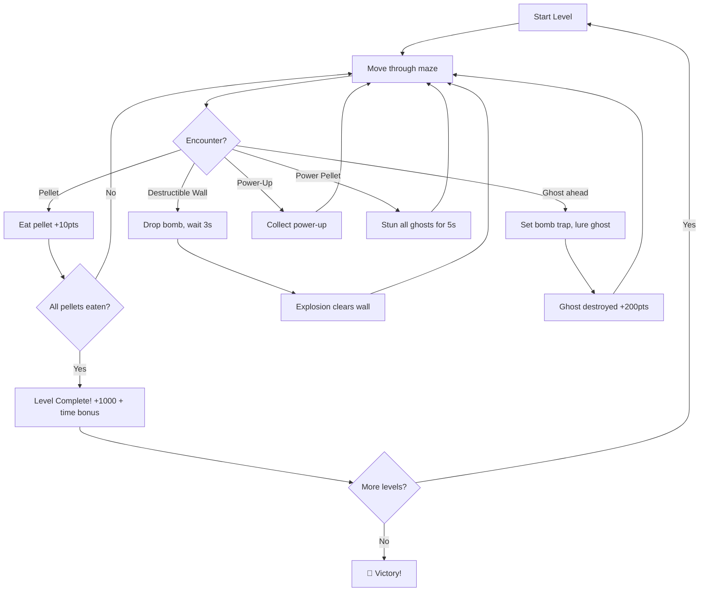

# 🎮 Ms. Ghostman — Game Description & Rules

> **Genre**: Pac-Man × Bomberman Hybrid  
> **Players**: Single-player  
> **Renderer**: Pure DOM / CSS Grid (no `<canvas>`, no frameworks)  
> **Target Performance**: Constant 60 FPS via `requestAnimationFrame`

---

## 1. Premise

Ms. Ghostman is trapped inside a haunted labyrinth crawling with ghosts. The only way out is to **eat every pellet** scattered across the maze. But the maze is littered with **destructible walls** that block her path and hide pellets behind them. Her weapon? **Bombs**.

Drop a bomb, run for cover, and watch the explosion rip through walls and any ghost unlucky enough to be standing in the blast radius. Clear the pellets, survive the ghosts, and beat the clock.

---

## 2. The Map & Environment

The playing field is a **rigid CSS Grid**. Every cell sits at an integer `(row, col)` coordinate and contains exactly one of the following:

| Cell Type | Symbol | Description |
|---|---|---|
| **Indestructible Wall** | `🧱` | Permanent maze structure. Cannot be destroyed. Typically arranged in a repeating grid pattern. |
| **Destructible Wall** | `📦` | Breakable block. Destroyed by bomb explosions. May hide pellets, power-ups, or empty space underneath. |
| **Pellet (Dot)** | `·` | Collectible dot placed in open paths. Ms. Ghostman must eat **all** pellets to clear the level. |
| **Power Pellet** | `⚡` | Rare, larger pellet. Eating one triggers a brief **Ghost Frenzy** — all ghosts become stunned and flee for a few seconds, giving the player breathing room (no bomb needed). |
| **Bomb Power-Up** | `💣+` | Increases the player's maximum simultaneous bomb count by 1. |
| **Fire Power-Up** | `🔥+` | Increases the player's bomb explosion radius by 1 tile. |
| **Speed Boost** | `👟` | Temporarily increases Ms. Ghostman's movement speed. |
| **Empty Space** | ` ` | Passable tile for the player, ghosts, and bomb placement. |

### 2.1 Map Generation

- The map is defined as a 2D array of cell-type identifiers.
- Levels are loaded from static JSON map data (easy to author new levels).
- Destructible walls are placed to create interesting strategic choices.
- Pellets fill all remaining open corridors.

---

## 3. The Player — Ms. Ghostman

### 3.1 Movement

| Key | Action |
|---|---|
| `↑` Arrow Up | Move up |
| `↓` Arrow Down | Move down |
| `←` Arrow Left | Move left |
| `→` Arrow Right | Move right |

- **Hold-to-move**: Pressing and holding an arrow key causes continuous movement. Releasing the key stops movement immediately.
- Movement is **grid-aligned**: the character smoothly translates from one grid cell to the next using CSS `transform: translate()` driven by `requestAnimationFrame`.
- If the target cell is a wall (indestructible or destructible), the player **stops**.
- Collecting a pellet removes it from the grid and increments the score.

### 3.2 Bombing

| Key | Action |
|---|---|
| `Space` | Drop a bomb on current grid cell |

- The player starts with a maximum of **1 bomb** at a time (upgradeable via power-ups).
- Each bomb has a **3-second fuse timer**, displayed visually on the bomb sprite.
- Only one bomb per cell — dropping on an existing bomb does nothing.

### 3.3 Lives

- The player starts with **3 lives**.
- A life is lost when:
  - A ghost touches the player.
  - The player is caught in a bomb explosion (including their own).
- On death, the player respawns at the starting position after a brief invincibility window (2 seconds).
- **Game Over** when all lives are depleted.

---

## 4. The Bomb & Explosion

### 4.1 Bomb Placement

1. Player presses `Space`.
2. A bomb entity is placed on the player's current cell.
3. The bomb begins a **3-second** countdown (visual fuse animation).

### 4.2 Explosion Mechanics

When the fuse expires:

1. The bomb detonates in a **cross pattern (+)** extending `N` tiles in each cardinal direction (default `N = 2`).
2. Fire tiles appear along the cross for **0.5 seconds**, then disappear.

**Explosion interactions:**

| Target Hit | Effect |
|---|---|
| **Indestructible Wall** | Fire stops at this tile (does NOT pass through). |
| **Destructible Wall** | Wall is destroyed. Fire stops here (does NOT pass through). May reveal a power-up. |
| **Ghost** | Ghost is destroyed. Player earns **200 bonus points** per ghost kill. |
| **Player** | Player loses **1 life**. |
| **Another Bomb** | Chain reaction — the second bomb detonates immediately. |
| **Pellet** | Pellet is destroyed (counts as eaten, adds to score). |
| **Power-Up** | Power-up is destroyed (lost, not collected). |

### 4.3 Chain Reactions

If a bomb explosion hits another bomb, that bomb detonates instantly, creating spectacular chain reactions. Players can set up multi-bomb traps for ghost-clearing combos (**combo bonus**: `200 × 2^(n-1)` points for `n` ghosts killed in one chain).

---

## 5. The Enemies — Ghosts

### 5.1 Ghost Types

There are **4 ghost types**, each with a distinct color and subtle behavior bias:

| Ghost | Color | Behavior Tendency |
|---|---|---|
| **Blinky** | 🔴 Red | Tends to choose the direction closest to the player at intersections. |
| **Pinky** | 🩷 Pink | Tends to predict the player's heading and cut them off. |
| **Inky** | 🔵 Cyan | Semi-random — influenced by both Blinky's position and the player's. |
| **Clyde** | 🟠 Orange | Fully random at intersections. Unpredictable wildcard. |

### 5.2 Ghost Movement

- Ghosts move continuously through open paths at a constant speed.
- At **intersections** (≥ 3 valid exits), each ghost selects a direction based on its personality bias (see above), but with a random element to keep things unpredictable.
- Ghosts **never reverse direction** during normal movement (they can only turn at intersections).
- Ghosts cannot pass through indestructible walls or active bombs.

### 5.3 Ghost States

| State | Duration | Behavior |
|---|---|---|
| **Normal** | Default | The ghost patrols the maze and is lethal on contact with the player. |
| **Stunned (Frenzy)** | ~5 seconds | Triggered by Power Pellet. Ghost turns blue, moves slowly, and flees from the player. Killing a stunned ghost yields **400 points**. |
| **Dead** | ~5 seconds | After being killed by a bomb, the ghost's "eyes" travel back to the ghost spawn area, where it regenerates. |

### 5.4 Ghost Spawning

- Ghosts spawn from a dedicated **ghost house** in the center of the map.
- At the start of the level, ghosts leave the house one at a time with staggered delays.
- Dead ghosts return to the ghost house and respawn after a delay.

---

## 6. Scoring System

| Action | Points |
|---|---|
| Eat a pellet | **10** |
| Eat a Power Pellet | **50** |
| Kill a ghost (bomb) | **200** |
| Kill a stunned ghost (Power Pellet) | **400** |
| Combo kill (chain reaction) | **200 × 2^(n-1)** per ghost |
| Collect a power-up | **100** |
| Level clear (all pellets eaten) | **1000 + time bonus** |
| Time bonus | **remaining seconds × 10** |

---

## 7. Timer / Countdown

- Each level has a **countdown timer** (default: **180 seconds** / 3 minutes).
- The timer is always visible on the scoreboard.
- When the timer reaches **0**, the game ends (even if lives remain).
- Remaining time converts to bonus points upon level completion.

---

## 8. Level Progression

- The game ships with **3 levels** of increasing difficulty:
  - **Level 1**: Open layout, few destructible walls, 2 ghosts, generous time.
  - **Level 2**: Tighter corridors, more destructible walls, 3 ghosts, moderate time.
  - **Level 3**: Dense maze, many destructible walls, 4 ghosts, tight time.
- Between levels, a brief **level-complete screen** shows stats (score, time, ghosts killed).
- Ghost speed and aggression increase with each level.

---

## 9. HUD / Scoreboard

The HUD displays at all times during gameplay:

```
┌─────────────────────────────────┐
│  ❤️ ❤️ ❤️   SCORE: 00000   ⏱️ 2:45  │
│  💣×1  🔥×2   LEVEL 1          │
└─────────────────────────────────┘
```

- **Lives**: Heart icons (decrement on death)
- **Score**: 5-digit counter
- **Timer**: `M:SS` countdown format
- **Bomb Count**: Current max simultaneous bombs
- **Fire Radius**: Current explosion range
- **Level**: Current level number

---

## 10. Pause Menu

Press **`Escape`** or **`P`** to pause. The game loop halts (no animation frames consumed). The overlay shows:

```
╔═══════════════════╗
║    ⏸️ PAUSED       ║
║                   ║
║   ▶ Continue      ║
║   🔄 Restart      ║
╚═══════════════════╝
```

- **Continue**: Resumes the game from exactly where it paused (timer, positions, state all preserved).
- **Restart**: Resets the current level from scratch (score preserved from previous levels).

---

## 11. Game Over & Win Screens

### Game Over (All lives lost OR timer expired)
```
╔═══════════════════╗
║   💀 GAME OVER    ║
║                   ║
║  Final Score: XXX ║
║                   ║
║   🔄 Play Again   ║
╚═══════════════════╝
```

### Victory (All levels cleared)
```
╔═══════════════════════╗
║  🎉 YOU WIN!          ║
║                       ║
║  Final Score: XXXXX   ║
║  Ghosts Killed: XX    ║
║  Total Time: X:XX     ║
║                       ║
║   🔄 Play Again       ║
╚═══════════════════════╝
```

---

## 12. Technical Constraints (from Requirements & Audit)

| Constraint | Enforced |
|---|---|
| Must run at **≥ 60 FPS** with no frame drops | ✅ |
| Must use `requestAnimationFrame` for animation | ✅ |
| **No `<canvas>`** — pure DOM only | ✅ |
| **No frameworks** — vanilla JS/HTML/CSS | ✅ |
| Keyboard-only controls (no mouse required) | ✅ |
| Hold-to-move (no key spamming) | ✅ |
| Minimal but non-zero layer promotion | ✅ |
| Minimal paint operations | ✅ |
| Pause does not drop frames | ✅ |
| Memory reuse to avoid GC jank | ✅ |

---

## 13. Core Gameplay Loop — Summary



---

*Ms. Ghostman — Where Pac-Man meets Bomberman. Eat. Bomb. Survive.*
