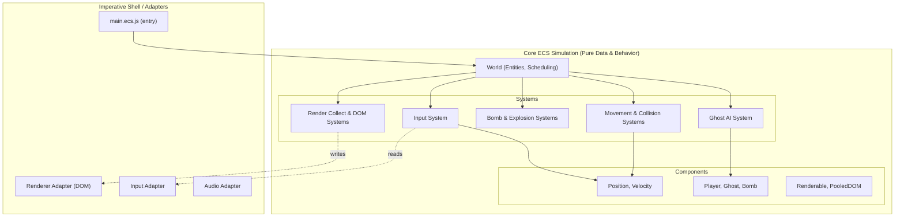

# 📋 Ms. Ghostman — ECS Implementation Plan

> **Architecture**: Entity-Component-System (ECS)  
> **Stack**: Vanilla JS (ES2026) · HTML · CSS Grid · DOM API only  
> **Tooling**: Biome (lint + format) · Vite (dev server + bundler) · Vitest (unit tests)  
> **Target**: 60 FPS via `requestAnimationFrame` · No canvas · No frameworks

---

## Table of Contents

1. [Architecture Overview](#1-architecture-overview)
2. [Directory Structure](#2-directory-structure)
3. [Workflow Tracks (Balanced Workload)](#3-workflow-tracks-balanced-workload)
   - [Track A — Engine & World Layer (Dev 1)](#track-a--engine--world-layer-dev-1)
   - [Track B — Physics, Player & Input (Dev 2)](#track-b--physics-player--input-dev-2)
   - [Track C — AI, Game Rules & Mechanics (Dev 3)](#track-c--ai-game-rules--mechanics-dev-3)
   - [Track D — Rendering & DOM Shell (Dev 4)](#track-d--rendering--dom-shell-dev-4)
4. [Integration Milestones](#4-integration-milestones)
5. [Shared Contracts & Interfaces](#5-shared-contracts--interfaces)
6. [Testing Strategy](#6-testing-strategy)
7. [Performance Budget & Acceptance Criteria](#7-performance-budget--acceptance-criteria)
8. [Done Criteria](#8-done-criteria)
9. [Migration Notes from Current FCIS Plan](#9-migration-notes-from-current-fcis-plan)

---

## 1. Architecture Overview



### Core Architectural Boundaries

1. **World Layer**
   - Owns entity lifecycle, component stores, resources, and system scheduler.
   - Provides deterministic frame context (dt, pause flag, elapsed simulation time).
2. **ECS Simulation Layer (Pure or Mostly Pure)**
   - Systems run in fixed order and mutate component data in place in hot paths.
   - No DOM calls in simulation systems.
3. **Adapter Layer**
   - Input adapter, render adapter, storage adapter, audio adapter.
   - Converts browser events/DOM into normalized data for ECS resources.
4. **Render Boundary**
   - Two-stage rendering:
     - `render-collect-system`: computes render intents from ECS state
     - `render-dom-system`: applies batched DOM writes only at end-of-frame

### Frame Pipeline

1. `requestAnimationFrame` tick.
2. **Input snapshot** (adapter).
3. **Fixed-step simulation pass** (0..N updates from accumulator, bounded to prevent spiral-of-death).
4. **Render intent collection**.
5. **One batched DOM commit pass**.
6. **HUD and overlay updates** via `textContent` and class toggles.

### Deterministic Runtime Contract

1. Simulation uses a fixed timestep (`16.6667ms`) with accumulator.
2. Catch-up is clamped (`maxStepsPerFrame`) after tab throttling or CPU stalls.
3. `frameTime` is clamped before accumulator integration to avoid runaway bursts.
4. System order and query iteration are stable and centrally declared in `world.js`.
5. Structural entity/component mutations are deferred and applied at one sync point per tick.
6. Cross-system events (bomb chains, collisions, scoring) pass through deterministic event queues.

### Pause Semantics

- `rAF` continues running.
- Simulation updates are skipped while paused.
- Pause UI remains responsive; no timer progression while paused.

### Key Principles

1. **ECS-First**: The game strictly follows Entity (numeric IDs), Components (pure data records), and Systems (deterministic behavior).
2. **DOM Isolation**: Simulation systems (movement, AI, collisions) must NEVER touch the DOM object. All DOM side effects are handled exclusively by the `Render DOM System` and adapters explicitly built to wrap DOM nodes.
3. **Data-Oriented & Zero Allocation**: Inside the core fixed-timestep update, arrays and pools are pre-allocated. Mutations on hot-path buffers occur in-place to avoid GC pause and frame drops.
4. **Stable Scheduling**: System execution order is rigidly defined in the `World` object. Components are updated predictably.
5. **Rendering Pipeline**: Simulation feeds intents. The `Render Collect System` processes what needs drawing, mapping it into `Renderable` and `PooledDOM` components. The `Render DOM System` then applies a single batch-write phase of transforms and opacity to avoid layout thrashing.

---

## 2. Directory Structure

```text
make-your-game/
├── index.html
├── package.json
├── biome.json
├── vite.config.js
│
├── docs/
│   ├── requirements.md
│   ├── audit.md
│   ├── README-ecs-alternative.md
│   ├── implementation-plan.md
│   └── implementation-plan-ecs.md     # This file
│
├── src/
│   ├── main.ecs.js                    # App entry — bootstraps the ECS World
│   │
│   ├── ecs/
│   │   ├── world/
│   │   │   ├── world.js               # Lifecycle, system scheduling, frame context
│   │   │   ├── entity-store.js        # ID generation & recycling
│   │   │   └── query.js               # Component mask matching
│   │   ├── components/
│   │   │   ├── position.js            # row/col + interpolation targets
│   │   │   ├── velocity.js            # Direction and speed
│   │   │   ├── player.js              # Tag / player specific stats
│   │   │   ├── ghost.js               # AI type, personality, state
│   │   │   ├── bomb.js                # Fuse timers
│   │   │   ├── fire.js                # Explosion remnants
│   │   │   ├── power-up.js            # Bomb+, fire+, speed, and power-pellet tags
│   │   │   ├── collider.js            # Bounding box or cell alignment
│   │   │   ├── stats.js               # Health, lives, score, timer tags
│   │   │   ├── input-state.js         # Intended actions
│   │   │   ├── renderable.js          # Sprite key, animations
│   │   │   └── pooled-dom.js          # DOM references managed purely by rendering system
│   │   ├── systems/
│   │   │   ├── input-system.js        # Applies adapter input to components
│   │   │   ├── player-move-system.js  # Grid-constrained player motion
│   │   │   ├── ghost-ai-system.js     # Chasing, fleeing, pathing
│   │   │   ├── bomb-tick-system.js    # Fuse countdown, chain reaction marking
│   │   │   ├── explosion-system.js    # Bomb destruction and fire spawn
│   │   │   ├── collision-system.js    # Entity overlap checks
│   │   │   ├── power-up-system.js     # Applies pickups and timed boosts
│   │   │   ├── scoring-system.js      # Applies events to total score
│   │   │   ├── timer-system.js        # Level countdown
│   │   │   ├── life-system.js         # Respawn and invincibility logic
│   │   │   ├── pause-system.js        # Freeze simulation while rAF continues
│   │   │   ├── spawn-system.js        # Ghost stagger spawn and respawn
│   │   │   ├── level-progress-system.js # Manages levels and game states
│   │   │   ├── render-collect-system.js # Maps simulation to visuals
│   │   │   └── render-dom-system.js   # Batches writes to the DOM
│   │   └── resources/
│   │       ├── constants.js           # Enums, speeds, config
│   │       ├── rng.js                 # Seeded RNG for determinism
│   │       ├── clock.js               # Deterministic / injected time tracking
│   │       ├── event-queue.js         # Deterministic event ordering between systems
│   │       ├── map-resource.js        # Loaded static grid & spawn points
│   │       └── game-status.js         # High-level state (menu, playing, gameover)
│   │
│   ├── adapters/
│   │   ├── dom/
│   │   │   ├── renderer-adapter.js    # DOM helper wrappers (no `innerHTML`)
│   │   │   ├── sprite-pool-adapter.js # Object pool for DOM elements
│   │   │   ├── hud-adapter.js         # Updates textContent for UI
│   │   │   └── screens-adapter.js     # Menus and overlays
│   │   ├── io/
│   │   │   ├── input-adapter.js       # Captures native key events
│   │   │   ├── storage-adapter.js     # Highscore saving
│   │   │   └── audio-adapter.js       # Sound playback
│   │
│   └── shared/
│       ├── result.js
│       └── utils.js                   # Pure math wrappers, arrays
│
└── styles/
    ├── variables.css
    ├── grid.css
    └── animations.css
```

---

## 3. Workflow Tracks (Balanced Workload)

The work (roughly 72 hours) is divided into 4 tracks (each ~18 hours) based on ECS responsibilities. Since systems and components are heavily decoupled, tracks can be developed independently with mocked resources.

---

### Track A — Engine & World Layer (Dev 1)

> **Scope**: Scaffolding, ECS internals (World, Entity Store, Queries), and Core Resources.
> **Estimate**: ~17 hours

#### A-1: Project Scaffolding & Tooling
**Priority**: 🔴 Critical  
**Estimate**: 2 hours

- [ ] Initialize `package.json` with ES modules, configure Vite and Biome.
- [ ] Setup Vitest for pure system/component testing.
- [ ] Create `index.html` structure with core `<div>` mount points.
- [ ] Commit basic CSS reset and variable stubs.

#### A-2: ECS Architecture Core (World, Entity, Query)
**Priority**: 🔴 Critical  
**Estimate**: 5 hours

- [ ] Implement `src/ecs/world/entity-store.js` using ID arrays via a recycling pool to avoid GC chunks.
- [ ] Implement `src/ecs/world/query.js`: Provides fast entity lookups matching component masks.
- [ ] Implement `src/ecs/world/world.js`:
  - Registers systems and dictates phase ordering (Input -> Physics -> Logic -> Render).
  - Handles fixed-step logic loop (`accumulator`) and calls simulation systems.
  - Passes resource references smoothly without global singleton abuse.
- [ ] Unit Test: Entity generation, recycling, and system pass ordering.

#### A-3: Resources (Time, Constants, RNG)
**Priority**: 🔴 Critical  
**Estimate**: 2 hours

- [ ] Add `src/ecs/resources/constants.js`: Sizes, rules, entity IDs.
- [ ] Implement `src/ecs/resources/clock.js`: Tracks elapsed simulation time, delta, and logic pause-state vs unpaused system state.
- [ ] Implement `src/ecs/resources/rng.js`: Predictable `Math.random` replacement for deterministic runs.

#### A-4: Game Loop & Main Initialization
**Priority**: 🔴 Critical  
**Estimate**: 4 hours

- [ ] Implement `main.ecs.js`: Boots World, binds `window.requestAnimationFrame`.
- [ ] Connect `rAF` pipeline into World's internal accumulator update.
- [ ] Implement basic state-transition flow (playing, paused) handled by checking `clock.isPaused` to freeze simulation while keeping rAF active.
- [ ] Test the empty loop verifies consistent 60 FPS overhead with Performance API.

#### A-5: Map Loading Resource
**Priority**: 🔴 Critical  
**Estimate**: 4 hours

- [ ] Create 3 JSON map blueprints.
- [ ] Implement `map-resource.js`: Parses map on load, stores a fixed representation of the static grid cells (walls, emptiness, intersections).
- [ ] Injects map info into the World context upon level start.

---

### Track B — Physics, Player & Input (Dev 2)

> **Scope**: Input acquisition, movement validation, colliding bodies, and explosion logic. All pure ECS.
> **Estimate**: ~18 hours

#### B-1: Action Components
**Priority**: 🔴 Critical  
**Estimate**: 2 hours

- [ ] Implement pure data files in `src/ecs/components/`:
  - `position.js` (row, col, targetRow, targetCol).
  - `velocity.js` (direction vector).
  - `input-state.js` (requested moving direction, bomb requested).
  - `collider.js` (types: player, entity, obstacle).
  - `player.js` (lives, stats).

#### B-2: Input Adapter & System
**Priority**: 🔴 Critical  
**Estimate**: 3 hours

- [ ] Implement `adapters/io/input-adapter.js`: Captures `keydown`/`keyup` securely mapping into an intent buffer. No OS key repeat reliance.
- [ ] Implement `ecs/systems/input-system.js`: Reads adapter, writes into the `input-state` component attached to the Player entity within the frame logic.

#### B-3: Movement & Grid Collision System
**Priority**: 🔴 Critical  
**Estimate**: 5 hours

- [ ] Implement `player-move-system.js`: Queries the grid from `map-resource` based on Position vs Velocity intentions. Ensures smooth sub-cell locking and prevents walking through walls.
- [ ] Works cleanly using ECS state-machine variables rather than loose classes. Updates TargetRow/Col.
- [ ] Unit test grid boundaries and interpolation steps.

#### B-4: Bomb Components & Bomb Tick System
**Priority**: 🔴 Critical  
**Estimate**: 4 hours

- [ ] Implement `bomb.js` (fuse timing) and `fire.js` (burn timer).
- [ ] Implement `bomb-tick-system.js`: Decrements fuse, validates explosion radius against `map-resource`.
- [ ] Implement `explosion-system.js`: Translates detonated bombs into Fire entities mapping over map resources (destructible wall clears). Chains active explosions.

#### B-5: Entity Collision System
**Priority**: 🟡 Medium  
**Estimate**: 4 hours

- [ ] Implement `collision-system.js`: Scans positions overlapping via Query.
  - Fire vs Player -> damage/death intent.
  - Fire vs Ghost -> death intent.
  - Player vs Ghost -> Player death intent (or Ghost kill intent if Ghost is stunned).
  - Player vs Power-up/Pellet -> mark for destruction/collection and tag points.
- [ ] Tests collision permutations locally using mocked World queries.

---

### Track C — AI, Game Rules & Mechanics (Dev 3)

> **Scope**: Ghost behaviors, score keeping, lives management, pause, and high-level progression.
> **Estimate**: ~19 hours

#### C-1: AI Components & Spawning Logic
**Priority**: 🔴 Critical  
**Estimate**: 3 hours

- [ ] Implement `ghost.js` (AI behaviors: blinky, pinky, inky, clyde).
- [ ] Setup a ghost-spawning sub-routine via map resource that creates entities utilizing `World.EntityStore`.

#### C-2: Ghost AI System
**Priority**: 🔴 Critical  
**Estimate**: 6 hours

- [ ] Implement `ghost-ai-system.js`. For every ghost:
  - Pathfinding based on its personality (chase target offsets, intersection evaluation).
  - Must not mutate target positions when not at cell centers.
  - Enforce "no reversing" logic unless a Power Pellet is eaten (flee mode).
  - Fleeing: Random intersection logic aiming to maximize player distance.
  - Dead state: Eyes-only return to ghost house.
- [ ] Reused zero-allocation heuristics for distance computing.

#### C-3: Power Up & Stun Routines
**Priority**: 🟡 Medium  
**Estimate**: 3 hours

- [ ] Process power-pellet collection events from the Collision System.
- [ ] Toggles ghost states across components to "stunned".
- [ ] Countdown timers within the Ghost System that flicker out and return to normal chasing routines.

#### C-4: Timer System & Scoring System
**Priority**: 🔴 Critical  
**Estimate**: 4 hours

- [ ] Implement `scoring-system.js`: Reacts to collision events (dead ghosts, cleared pellets, powerups) and updates a singular `stats.js` Score component. Handles combo multipliers.
- [ ] Implement `timer-system.js`: Manages level timing, applying time bonuses when levels complete.
- [ ] Implement `life-system.js`: Handles loss of lives from player death intents.

#### C-5: Pause & Progression Systems
**Priority**: 🔴 Critical  
**Estimate**: 3 hours

- [ ] Implement `pause-system.js` and `level-progress-system.js`: Triggering pause freezes the global simulation timer while `clock.elapsedMs` and actual `rAF` continue. This ensures the pause UI transitions cleanly. Handles level resets and map reloading.

---

### Track D — Rendering & DOM Shell (Dev 4)

> **Scope**: Safe, minimal DOM mutation. Adapting ECS simulation outputs into visual representations using CSS grids and pooled DOM elements without leaking memory or `frames`.
> **Estimate**: ~18 hours

#### D-1: Renderer Structure & CSS Layout
**Priority**: 🔴 Critical  
**Estimate**: 3 hours

- [ ] Build `styles/grid.css` using strict grid-template layouts, absolute positioning over grid cells, and `will-change: transform`. Minimize layer promotion globally except for moving sprites.
- [ ] Implement CSS animations (walking pulse, explosion fade, flashings).

#### D-2: Adapters (DOM & HUD)
**Priority**: 🔴 Critical  
**Estimate**: 4 hours

- [ ] Implement `renderer-adapter.js`: Strict `document.createElementNS` logic for generating the static board. Zero `innerHTML`.
- [ ] Implement `sprite-pool-adapter.js`: Allocates (e.g., 50x Fire elements, 10x Bomb elements) upfront. Hides and displays using CSS `display` or offscreen transform. No repeated `createElement` or `remove` calls mid-game.
- [ ] Implement `hud-adapter.js` and `screens-adapter.js`: Binds text nodes natively with `.textContent` to update metrics securely.

#### D-3: Render Components
**Priority**: 🔴 Critical  
**Estimate**: 2 hours

- [ ] Define `renderable.js` (sprite class references natively mapped) and `pooled-dom.js` (the DOM node handle associated with the visual representation, maintained only by the render system).

#### D-4: Render Collect System
**Priority**: 🔴 Critical  
**Estimate**: 4 hours

- [ ] Implement `render-collect-system.js`: Called after Simulation but before Batch DOM write. Matches all entities with Position + Renderable logic. Checks bounds. Computes intended absolute pixels or transform positions using the interpolation factor (`alpha`) passed by the `accumulator` logic. Outputs a purely structured batch-write array.

#### D-5: Render DOM System (The Batcher)
**Priority**: 🔴 Critical  
**Estimate**: 5 hours

- [ ] Implement `render-dom-system.js`: The ONLY system in the loop where the DOM mutates.
- [ ] Applies calculated batched writes:
  - Exclusively updates `.style.transform = "translate3d(x, y, 0)"` and `.style.opacity`.
  - Swaps `classList` values based on states (like stunned/invincible).
  - Informs `sprite-pool-adapter` to reclaim nodes when entities lack `pooled-dom.js` bindings (entity death).
- [ ] DevTools trace verification to prove zero multi-pass layout recalcs (layout thrashing) during a full bomb explosion.

---

## 4. Integration Milestones

```mermaid
gantt
    title Ms. Ghostman - ECS Integration Timeline
    dateFormat  X
    axisFormat %s

    section Engine (A)
    Scaffolding & Core World: a1, 0, 7
    Resources & Map Load: a2, 7, 6
    Game Loop Wrap: a3, 13, 4

    section Physics (B)
    Adapter & Input Sys: b1, 2, 5
    Movement Grid Resolve: b2, 7, 5
    Bomb & Collision: b3, 12, 8

    section AI & Rule (C)
    Ghost AI Sys: c1, 4, 9
    Mechanics & Scoring: c2, 13, 6

    section Shell (D)
    CSS Structure & Gen: d1, 0, 7
    Sprite Pools & Adapts: d2, 7, 6
    Render Batcher: d3, 13, 10
    
    section Integration
    M1 Complete ECS Engine + Static Grid: milestone, m1, 7, 0
    M2 Player Intention -> Bounds: milestone, m2, 14, 0
    M3 Render Maps Chasing AI: milestone, m3, 18, 0
    M4 Full Mechanics, 60fps Lock: milestone, m4, 21, 0
    M5 Audit and Performance Hardening: milestone, m5, 23, 0
```



### Milestone 1: Engine + Static View (Day 3)
**Requires**: A-2, A-5, D-1, D-2  
**Result**: The core world schedules a tick, generating a layout based on pure simulation mapping of static `Grid` resource entities via safe DOM manipulation.

### Milestone 2: Movement & Actions (Day 4)
**Requires**: M1 + A-4, B-2, B-3, B-4, D-4, D-5  
**Result**: Player moves flawlessly aligned to grid offsets. Bombs are tracked physically. Rendering interpolates movement using pooled DOM components.

### Milestone 3: AI Ecosystem (Day 5)
**Requires**: M2 + C-1, C-2, B-5  
**Result**: Ghosts navigate intersecting pathways appropriately utilizing distance vectors. Collision sets are triggered.

### Milestone 4: Game Polish & Audit Lock (Day 6-7)
**Requires**: M3 + A-4, C-3, C-4, C-5, D-2, D-5  
**Result**: Playable from Start Menu to Win/Loss. Fully measurable 60fps loop via profiler with zero component pooling GC delays. Strict ECS conformance met. Pause logic bypasses simulation accurately.

### Milestone 5: Audit and Performance Hardening
**Requires**: All tracks complete
**Result**: Audit checklist pass evidence and performance trace summary.

---

## 5. Shared Contracts & Interfaces

Shared structure inside component storage array definitions. These are documented using JSDoc `typedef` for IDE support and clarity.

### Primitive Types
```js
/** @typedef {number} EntityId - Simply a unique numeric ID */
```

### Frame Context & Clock (Resource)
```js
/** 
 * @typedef {Object} FrameContext
 * @property {number} dtMs - Delta time in milliseconds
 * @property {number} simTimeMs - Elapsed simulation time
 * @property {number} alpha - Interpolation factor (0 to 1) for rendering
 * @property {boolean} isPaused - Global simulation freeze flag
 */
```

### Input State (Resource/Component)
```js
/**
 * @typedef {Object} InputState
 * @property {boolean} up
 * @property {boolean} down
 * @property {boolean} left
 * @property {boolean} right
 * @property {boolean} bomb - Action 1
 * @property {boolean} pause - Menu toggle
 */
```

### Event Queue (Resource)
```js
/**
 * @typedef {Object} GameEvent
 * @property {string} type - Event discriminator (e.g. BombDetonated, GhostKilled)
 * @property {number} frame - Fixed-step frame index
 * @property {number} order - Monotonic insertion index used for deterministic ordering
 * @property {Object} payload - Event-specific data
 */
```

### Core Components
```js
/**
 * @typedef {Object} Position
 * @property {number} row - Current grid row
 * @property {number} col - Current grid column
 * @property {number} prevRow - Row in previous fixed frame
 * @property {number} prevCol - Col in previous fixed frame
 * @property {number} targetRow - Destination for lerping
 * @property {number} targetCol - Destination for lerping
 */

/**
 * @typedef {Object} Player
 * @property {number} lives
 * @property {number} maxBombs
 * @property {number} fireRadius
 * @property {number} invincibilityMs - Protection timer
 */

/**
 * @typedef {Object} Ghost
 * @property {number} type - Personality ID
 * @property {number} state - Chasing, Fleeing, Dead, Stunned
 * @property {number} speed
 * @property {number} timerMs - State duration timer
 */

/**
 * @typedef {Object} Bomb
 * @property {number} fuseMs - Time until detonation
 * @property {number} radius
 * @property {number} ownerId - Entity that placed it
 */
```

### Render Intent
```js
/**
 * @typedef {Object} RenderIntent
 * @property {number} entityId
 * @property {string} kind - Sprite/Element type
 * @property {number} row
 * @property {number} col
 * @property {string[]} classes - CSS class toggles (e.g. ['stunned', 'invisible'])
 */
```

### Map Resource
```js
/**
 * @typedef {Object} MapResource
 * @property {number} width
 * @property {number} height
 * @property {Uint8Array} cells - Flattened grid cell layout
 * @property {number} pelletCount - Progress tracker
 * @property {Object} playerSpawn - {row, col}
 * @property {Array<{row, col}>} ghostSpawns
 */
```

---

## 6. Testing Strategy

| Boundary Layer | Tool | What to Test |
|---|---|---|
| **World Engine** | Vitest | Component registration, query accuracy, entity ID pooling constraints, deterministic execution order. |
| **Pure Systems** | Vitest | Deterministic output: Mock a system tick against an mocked component pool. Verify exact property writes. No DOM needed. |
| **Map Loader** | Vitest | Parses blueprint strictly. Rejects invalid maps. |
| **DOM Adapters** | Vitest + jsdom | Verifies `createElementNS` behaves securely without string/`innerHTML` injections. Assert pooled lengths. |
| **Replay Determinism** | Vitest | Same seed and same input trace must produce same state hash at frame N. |
| **Pause & Timer Invariants** | Vitest + integration fixtures | While paused, rAF remains active and simulation time remains frozen. Timer/fuse/invincibility counters do not drift. |
| **Regression Fixes**| Vitest | Repro test first, then fix, then pass. Verify no cross-system side effects outside component/resource contracts. |
| **Performance** | DevTools | Validates that DOM layouts (`paint`/`layout`) only happen on intended `transform/opacity` changes. Validate GC patterns and strictly <=16.7ms frame outputs. |
| **Audit Compliance** | Manual | Manually assert all checkmarks in `audit.md` sequentially. |

---

## 7. Performance Budget & Acceptance Criteria

Failure to meet these budgets violates the `audit.md` strict pass parameters.

### Budget Targets

| Metric | Budget | ECS Implementation Enforcement |
|---|---|---|
| FPS | **Strictly ≥ 60** | Engine completely decouples Fixed Loop updates (systems) from the rAF callback rendering pass. |
| Frame Time | p95 <= 16.7ms, p99 <= 20ms | Logic routines perform zero internal allocations (no `.map` or `.filter` in hot loops, strict `for` loops over entity Query buffers). No recurring long tasks > 50 ms in interaction-critical path. |
| DOM Elements | ≤ 500 total | Transient rendering uses fixed Object Pools mapped dynamically during the Render Phase. Static map blocks painted once. |
| Layout Thrashing | **Zero** | System boundaries ensure properties are ONLY written via single batch function at the tail of the tick (Render DOM System). Minimal paint and minimal-but-nonzero layer promotion. |
| GC Pauses / Jank | **Zero** | Component data is preallocated or re-assigned. Entities are recycled from a pool, never freely `deleted`. No sustained dropped-frame patterns during normal gameplay. |
| Catch-up Stability | Max fixed steps per frame enforced | Accumulator updates are bounded to avoid spiral-of-death after tab throttling. |
| Modularity Leak | **Zero** | All game systems must remain completely agnostic of DOM APIs. |

### Required Evidence

For gameplay-critical changes (update/render/input):
1. DevTools Performance trace summary.
2. Pause/resume verification note (rAF active, simulation frozen).
3. Brief note on paint/layer observations.
4. Frame-time stats (`p50`, `p95`, `p99`) from a representative 60-second run.
5. Environment note (browser version, machine class, and scenario).

---

## 8. Done Criteria

A change is complete only when:
1. Biome passes for modified scope.
2. Relevant Vitest suites pass.
3. ECS boundaries are respected (pure systems have no DOM side effects).
4. Functional coverage remains intact:
   - Single player
   - Pause Continue/Restart
   - Timer/score/lives HUD
   - Genre-aligned gameplay
5. Performance criteria are validated for gameplay-critical changes.

---

## 9. Migration Notes from Current FCIS Plan

1. Keep existing pure domain logic and wrap as ECS systems where possible.
2. Replace monolithic game-state object with component stores in phases.
3. Keep map format stable initially; adapt loader to component initialization.
4. Transition renderer to render-intent batching before deep AI refactors.
5. Maintain audit parity throughout migration by preserving pause and HUD behavior.