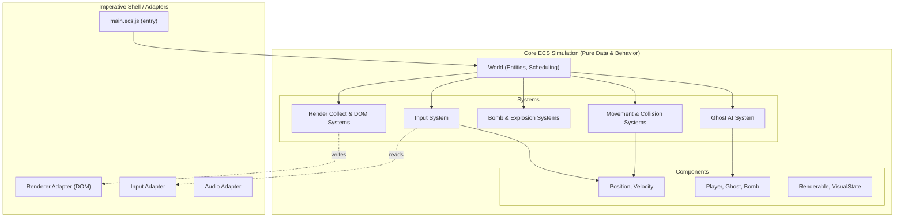

# 📋 Ms. Ghostman — ECS Implementation Plan v2

> **Architecture**: Entity-Component-System (ECS)  
> **Stack**: Vanilla JS (ES2026) · HTML · CSS Grid · DOM API only  
> **Tooling**: Biome (lint + format) · Vite (dev server + bundler) · Vitest (unit tests) · Playwright (e2e)  
> **Target**: 60 FPS via `requestAnimationFrame` · No canvas · No frameworks

---

## Table of Contents

1. [Architecture Overview](#1-architecture-overview)
2. [Directory Structure](#2-directory-structure)
3. [Workflow Tracks (Balanced Workload)](#3-workflow-tracks-balanced-workload)
   - [Track A — Orchestration, Scaffolding, Testing & QA (Dev 1)](#track-a--orchestration-scaffolding-testing--qa-dev-1)
   - [Track B — Physics, Input, Gameplay Logic & Rules (Dev 2)](#track-b--physics-input-gameplay-logic--rules-dev-2)
   - [Track C — Audio Production & Integration (Dev 3)](#track-c--audio-production--integration-dev-3)
   - [Track D — Visual Production & Integration (Dev 4)](#track-d--visual-production--integration-dev-4)
4. [Integration Milestones](#4-integration-milestones)
5. [Shared Contracts & Interfaces](#5-shared-contracts--interfaces)
6. [Testing Strategy](#6-testing-strategy)
7. [Performance Budget & Acceptance Criteria](#7-performance-budget--acceptance-criteria)
8. [Done Criteria](#8-done-criteria)
9. [Asset Creation & Pipeline](#9-asset-creation--pipeline)
10. [Maintenance Notes](#10-maintenance-notes)

---

## 1. Architecture Overview

### 1.1 What Is ECS?

**Entity-Component-System (ECS)** is a data-oriented architecture:

- **Entity**: an opaque ID representing a game object.
- **Component**: pure data attached to entities (no behavior, no DOM state).
- **System**: deterministic logic that processes entities with matching components.

For this game, ECS helps keep simulation deterministic, isolate DOM side effects, and scale gameplay features without creating tightly coupled classes.

### 1.2 Source Of Truth References

1. `docs/requirements.md` + `docs/game-description.md` define project requirements and intended gameplay behavior.
2. `docs/audit.md` defines pass/fail acceptance criteria.
3. `docs/audit-traceability-matrix.md` is the canonical requirement-to-audit-to-ticket-to-test coverage map and status tracker.
4. `docs/ticket-tracker.md` tracks live execution status for Section 3 tickets.
5. `docs/assets-pipeline.md` defines visual/audio authoring and optimization standards.
6. When implementation details are ambiguous, resolve against those references first.



### Core Architectural Boundaries

1. **World Layer**
   - Owns entity lifecycle, component stores, resources, and system scheduler.
   - Provides deterministic frame context (dt, pause flag, elapsed simulation time).
2. **ECS Simulation Layer (Pure or Mostly Pure)**
   - Systems run in fixed order and mutate component data in place in hot paths.
   - No DOM calls in simulation systems.
3. **Adapter Layer**
   - Input adapter, render adapter, storage adapter, audio adapter.
   - Converts browser events/DOM into normalized data for ECS resources.
   - **Adapters are registered as World resources** and accessed via the resource API. Systems MUST NOT import adapters directly — direct imports violate DOM isolation boundaries.
4. **Render Boundary**
   - Two-stage rendering:
     - `render-collect-system`: computes render intents from ECS state
     - `render-dom-system`: applies batched DOM writes only at end-of-frame

### Frame Pipeline

1. `requestAnimationFrame` tick.
2. **Input snapshot** (adapter).
3. **Fixed-step simulation pass** (0..N updates from accumulator, bounded to prevent spiral-of-death).
4. **Render intent collection**.
5. **One batched DOM commit pass**.
6. **HUD and overlay updates** via `textContent` and class toggles.

### Deterministic Runtime Contract

1. Simulation uses a **configurable fixed timestep** driven by `SIMULATION_HZ` (default `60`), yielding `FIXED_DT_MS = 1000 / SIMULATION_HZ` (`≈16.6667ms`). The `SIMULATION_HZ` constant lives in `constants.js`; changing it adjusts simulation rate without touching loop logic.
2. Catch-up is clamped (`maxStepsPerFrame`, default `5`) after tab throttling or CPU stalls.
3. `frameTime` is clamped before accumulator integration to avoid runaway bursts.
4. System order and query iteration are stable and centrally declared in `world.js`.
5. Structural entity/component mutations are deferred and applied at one sync point per tick.
6. Cross-system events (bomb chains, collisions, scoring) pass through deterministic event queues.

### Pause Semantics

- `rAF` continues running.
- Simulation updates are skipped while paused.
- Pause UI remains responsive; no timer progression while paused.
- On unpause, timing baseline is reset and accumulator is cleared/capped to prevent burst catch-up.
- `visibilitychange` / `blur` are treated as lifecycle events that force input and clock resynchronization.

### Input Determinism Contract

1. Input adapter tracks hold state from `keydown`/`keyup` sets; gameplay does not depend on OS key-repeat.
2. Held key state is cleared on `blur` and document hidden transitions.
3. World snapshots input once per fixed simulation step and systems consume only that snapshot.

### ECS Mutation Contract

1. Structural mutations (add/remove entity/component) are deferred to a sync point after system execution.
2. Entity IDs are recycled with stale-handle protection semantics.
3. Cross-system event queues are processed in deterministic insertion order.

### Key Principles

1. **ECS-First**: The game strictly follows Entity (numeric IDs), Components (pure data records), and Systems (deterministic behavior).
2. **DOM Isolation**: Simulation systems (movement, AI, collisions) must NEVER touch the DOM object. All DOM side effects are handled exclusively by the `Render DOM System` and adapters explicitly built to wrap DOM nodes.
3. **Data-Oriented & Zero Allocation**: Inside the core fixed-timestep update, arrays and pools are pre-allocated. Mutations on hot-path buffers occur in-place to avoid GC pause and frame drops.
4. **Stable Scheduling**: System execution order is rigidly defined in the `World` object. Components are updated predictably.
5. **Rendering Pipeline**: Simulation feeds intents. The `Render Collect System` processes what needs drawing and emits a frame-local render-intent buffer from ECS data. The `Render DOM System` then applies a single batch-write phase of transforms and opacity to avoid layout thrashing.

### Component Storage Architecture

Component storage uses a **Struct-of-Arrays (SoA)** layout for numeric hot-path data and plain object arrays for complex/non-numeric components:

- **Numeric components** (position, velocity, timers): `TypedArray` per field (e.g., `Float64Array`, `Int32Array`) indexed by entity ID. Maximises cache locality and eliminates per-entity GC pressure.
- **Complex components** (ghost state, renderable, visual-state): Plain object arrays — one object per entity slot, mutated in place.
- **Query matching**: Bitmask-based in `query.js` — each component type owns a unique power-of-two bit; an entity's component mask is the bitwise OR of all attached component bits. Fastest approach for ≤ 32 component types.

```js
// Example SoA for Position — hot-path friendly
const positions = {
  row:       new Float64Array(MAX_ENTITIES),
  col:       new Float64Array(MAX_ENTITIES),
  prevRow:   new Float64Array(MAX_ENTITIES),
  prevCol:   new Float64Array(MAX_ENTITIES),
  targetRow: new Float64Array(MAX_ENTITIES),
  targetCol: new Float64Array(MAX_ENTITIES),
};
```

Entity IDs are recycled via a free-list pool in `entity-store.js`. Stale-handle protection is provided by a generation counter per slot.

---

## 2. Directory Structure

```text
make-your-game/
├── index.html
├── package.json
├── biome.json
├── vite.config.js
│
├── docs/
│   ├── requirements.md
│   ├── audit.md
│   ├── audit-traceability-matrix.md
│   ├── ticket-tracker.md
│   ├── assets-pipeline.md
│   ├── schemas/
│   │   ├── visual-manifest.schema.json
│   │   └── audio-manifest.schema.json
│   ├── game-description.md
│   └── implementation-plan.md          # This file
│
├── tests/
│   ├── README.md
│   ├── e2e/
│   │   └── audit/
│   │       ├── audit-question-map.js
│   │       └── audit.e2e.test.js       # Playwright-based (F-01..F-21, B-01..B-06)
│   ├── integration/
│   │   ├── gameplay/               # Multi-system interaction tests
│   │   └── adapters/               # Adapter boundary tests (jsdom)
│   └── unit/
│       ├── systems/                # One test file per system
│       ├── resources/              # clock, rng, event-queue tests
│       └── world/                  # entity-store, query, world tests
│
├── src/
│   ├── main.ecs.js                    # App entry — bootstraps the ECS World
│   │
│   ├── game/                          # Game-flow orchestration (not ECS simulation)
│   │   ├── bootstrap.js               # World assembly + system registration order
│   │   ├── level-loader.js            # Level transition orchestration
│   │   └── game-flow.js               # FSM driver: MENU → PLAYING ↔ PAUSED → GAMEOVER/VICTORY
│   │
│   ├── debug/                         # Dev/test utilities — excluded from production builds
│   │   └── replay.js                  # Input recording, state hashing, replay playback
│   │
│   ├── ecs/
│   │   ├── world/
│   │   │   ├── world.js               # Lifecycle, system scheduling, frame context
│   │   │   ├── entity-store.js        # ID generation & recycling
│   │   │   └── query.js               # Component mask matching
│   │   ├── components/
│   │   │   ├── spatial.js             # position + velocity + collider (always co-occur)
│   │   │   ├── actors.js              # player + ghost + input-state (actor data)
│   │   │   ├── props.js               # bomb + fire + power-up (prop data)
│   │   │   ├── stats.js               # Health, lives, score, timer tags
│   │   │   └── visual.js              # renderable + visual-state (render queries)
│   │   ├── systems/
│   │   │   ├── input-system.js        # Applies adapter input to components
│   │   │   ├── player-move-system.js  # Grid-constrained player motion
│   │   │   ├── ghost-ai-system.js     # Chasing, fleeing, pathing
│   │   │   ├── bomb-tick-system.js    # Fuse countdown, chain reaction marking
│   │   │   ├── explosion-system.js    # Bomb destruction and fire spawn
│   │   │   ├── collision-system.js    # Entity overlap checks
│   │   │   ├── power-up-system.js     # Applies pickups and timed boosts
│   │   │   ├── scoring-system.js      # Applies events to total score
│   │   │   ├── timer-system.js        # Level countdown
│   │   │   ├── life-system.js         # Respawn and invincibility logic
│   │   │   ├── pause-system.js        # Freeze simulation while rAF continues
│   │   │   ├── spawn-system.js        # Ghost stagger spawn and respawn
│   │   │   ├── level-progress-system.js # Manages levels and game states
│   │   │   ├── render-collect-system.js # Maps simulation to visuals
│   │   │   └── render-dom-system.js   # Batches writes to the DOM
│   │   └── resources/
│   │       ├── constants.js           # Enums, speeds, config
│   │       ├── rng.js                 # Seeded RNG for determinism
│   │       ├── clock.js               # Deterministic / injected time tracking
│   │       ├── event-queue.js         # Deterministic event ordering between systems
│   │       ├── map-resource.js        # Loaded static grid & spawn points
│   │       └── game-status.js         # FSM: MENU → PLAYING ↔ PAUSED, WIN_LEVEL → LEVEL_COMPLETE → PLAYING/VICTORY, GAME_OVER
│   │
│   ├── adapters/
│   │   ├── dom/
│   │   │   ├── renderer-adapter.js    # DOM helper wrappers (no `innerHTML`)
│   │   │   ├── sprite-pool-adapter.js # Object pool for DOM elements
│   │   │   ├── hud-adapter.js         # Updates textContent for UI
│   │   │   └── screens-adapter.js     # Menus and overlays
│   │   ├── io/
│   │   │   ├── input-adapter.js       # Captures native key events
│   │   │   ├── storage-adapter.js     # Highscore saving
│   │   │   └── audio-adapter.js       # Sound playback
│   │
│   └── shared/
│       ├── result.js
│       └── utils.js                   # Pure math wrappers, arrays
│
├── assets/
│   ├── source/
│   │   ├── visual/
│   │   └── audio/
│   ├── generated/
│   │   ├── sprites/
│   │   ├── ui/
│   │   ├── sfx/
│   │   └── music/
│   └── manifests/
│       ├── visual-manifest.json
│       └── audio-manifest.json
│
└── styles/
    ├── variables.css
    ├── grid.css
    └── animations.css
```

---

## 3. Workflow Tracks (Balanced Workload)

The work is divided into **4 independent, balanced tracks**. Each track can be developed in parallel with mocked resources. Track A owns **all** scaffolding, orchestration, testing (unit, integration, e2e, audit), validation, QA, and final polish. Track B owns all gameplay simulation logic (physics, input, AI, rules, scoring). Track C owns everything audio. Track D owns everything visual.

### Ticket Progress Tracking

Live ticket progress for this section is tracked in `docs/ticket-tracker.md`.

### Workload Summary (Balanced)

| Track | Developer | Estimated Hours | Scope |
|---|---|---:|---|
| Track A | Dev 1 | ~24h | Orchestration, scaffolding, ECS core, game loop, testing (all layers), CI, QA & polish |
| Track B | Dev 2 | ~24h | Input, movement, collisions, bombs, explosions, ghost AI, scoring, timer, lives, pause, progression, power-ups |
| Track C | Dev 3 | ~22h | Audio adapter, SFX/music creation, audio manifest & schema, audio cue mapping, audio preloading, audio integration |
| Track D | Dev 4 | ~22h | Renderer, sprite pools, HUD, screen overlays, CSS layout, render systems, visual assets, visual manifest & schema |
| **Total** | **4 Devs** | **~92h** | **~23h average per dev** |

### Critical Path By Dev

| Dev | Critical Path Focus | Must Land Before | Depends On |
|---|---|---|---|
| Dev 1 | ECS core bootstrap, game loop, map loading, CI/schema wiring, **ALL** testing & QA, final evidence | Any gameplay integration | None initially; later depends on B/C/D feature code for integration/e2e tests |
| Dev 2 | Input, movement, collision, bombs, explosions, ghost AI, scoring, timer, lives, pause, progression | Audio/visual cue integration | Dev 1 world/resource setup |
| Dev 3 | Audio adapter, SFX/music production, audio manifest, cue mapping, preloading | Final gameplay audio integration | Dev 1 schemas; Dev 2 event contracts |
| Dev 4 | Render pipeline, DOM batching, sprite pools, HUD, overlays, CSS, visual assets | Visual completeness | Dev 1 render boundary setup; Dev 2 entity state events |

#### Scheduling Rule

1. Dev 1 starts first to land the boot, world, resource, and test rails.
2. Dev 2 starts gameplay systems once ECS core is stable.
3. Dev 3 and Dev 4 work fully independently on audio and visual tracks respectively.
4. Dev 1 writes all tests against the code produced by Dev 2, 3, and 4.

---

### Track A — Orchestration, Scaffolding, Testing & QA (Dev 1)

> **Scope**: Project scaffolding, ECS internals (World, Entity Store, Queries), core resources, game loop, map loading, CI/schema wiring, **ALL testing** (unit, integration, e2e, audit), QA, polish, and evidence aggregation.  
> **Estimate**: ~24 hours

#### A-1: Project Scaffolding & Tooling
**Priority**: 🔴 Critical  
**Estimate**: 2 hours  
**Covers**: `requirements.md` (vanilla JS, no canvas, no frameworks); `audit.md` F-04, F-05

- [ ] Initialize `package.json` with ES modules, configure Vite and Biome.
- [ ] Setup Vitest for pure system/component testing.
- [ ] Setup Playwright for e2e/audit testing.
- [ ] Configure CI merge gates (lint, tests, coverage minimums, protected branch checks).
- [ ] Implement dependency governance (strict lockfile policy and SBOM generation).
- [ ] Create `index.html` structure with core `<div>` mount points (game-board, hud, overlay containers).
- [ ] Commit basic CSS reset and variable stubs.
- [ ] Add scripts in `package.json`: `dev`, `build`, `preview`, `lint`, `format`, `test`, `test:unit`, `test:integration`, `test:e2e`, `test:audit`, `coverage`, `ci`, `sbom`.
- [ ] Add `vite.config.js`, `biome.json`, `vitest.config.js`, and `playwright.config.js` with CI-compatible defaults.
- [ ] Add a static CI scan that fails on `<canvas>` usage and banned framework dependencies (`react`, `vue`, `angular`, `svelte`).
- [ ] Verification gate: CI passes on baseline and fails when intentionally introducing a banned dependency or `<canvas>` node.

#### A-2: ECS Architecture Core (World, Entity, Query)
**Priority**: 🔴 Critical  
**Estimate**: 4 hours  
**Covers**: ECS architecture requirement from `AGENTS.md`

- [ ] Implement `src/ecs/world/entity-store.js` using ID arrays via a recycling pool to avoid GC chunks.
- [ ] Implement `src/ecs/world/query.js`: Provides fast entity lookups matching component masks (bitmask-based).
- [ ] Implement `src/ecs/world/world.js`:
  - Registers systems and dictates phase ordering (Input -> Physics -> Logic -> Render).
  - Handles fixed-step logic loop (`accumulator`) and calls simulation systems.
  - Passes resource references smoothly without global singleton abuse.
- [ ] Enforce deterministic system ordering and a single deferred-structural-mutation sync point per fixed step.
- [ ] Add generation-based stale-handle protection semantics for recycled entity IDs.
- [ ] Verification gate: unit tests cover ID recycling, stale-handle rejection, deferred mutation application, and deterministic system order.

#### A-3: Resources (Time, Constants, RNG, Events, Game Status)
**Priority**: 🔴 Critical  
**Estimate**: 2 hours  
**Covers**: Determinism contracts from `AGENTS.md`; `game-description.md` §6-§8 constants

- [ ] Add `src/ecs/resources/constants.js`: Define all canonical gameplay constants: `SIMULATION_HZ=60`, `MAX_STEPS_PER_FRAME=5`, `PLAYER_START_LIVES=3`, `BOMB_FUSE_MS=3000`, `FIRE_DURATION_MS=500`, `DEFAULT_FIRE_RADIUS=2`, `INVINCIBILITY_MS=2000`, `STUN_MS=5000`, `SPEED_BOOST_MULTIPLIER=1.5`, `SPEED_BOOST_MS=10000`, `MAX_CHAIN_DEPTH=10`.
- [ ] Implement `src/ecs/resources/clock.js`: Tracks elapsed simulation time, delta, and logic pause-state vs unpaused system state.
- [ ] Implement `src/ecs/resources/rng.js`: Predictable `Math.random` replacement for deterministic runs.
- [ ] Implement `src/ecs/resources/event-queue.js`: Deterministic insertion-order event queue for cross-system communication.
- [ ] Implement `src/ecs/resources/game-status.js`: FSM enum states: `MENU → PLAYING ↔ PAUSED → LEVEL_COMPLETE → VICTORY` or `GAME_OVER`.
- [ ] Verification gate: unit tests validate deterministic RNG sequences, event ordering, and pause-safe simulation clock progression.

#### A-4: Game Loop & Main Initialization
**Priority**: 🔴 Critical  
**Estimate**: 3 hours  
**Covers**: `requirements.md` (60 FPS, rAF); `audit.md` F-02, F-10, F-17, F-18

- [ ] Implement `main.ecs.js`: Boots World, binds `window.requestAnimationFrame`.
- [ ] Connect `rAF` pipeline into World's internal accumulator update.
- [ ] Implement basic state-transition flow (playing, paused) handled by checking `clock.isPaused` to freeze simulation while keeping rAF active.
- [ ] Add resume safety and lifecycle handling: baseline reset (`lastFrameTime = now`) and accumulator clamp/clear on unpause and tab restore.
- [ ] Clamp catch-up using `MAX_STEPS_PER_FRAME` and resync clock baselines on `blur` and `visibilitychange` recovery.
- [ ] Add instrumentation hooks for Playwright frame-time/FPS collection in semi-automated audit tests.
- [ ] Implement `src/game/bootstrap.js`: World assembly + system registration order.
- [ ] Implement `src/game/game-flow.js`: FSM driver that coordinates state transitions.
- [ ] Verification gate: integration tests prove pause invariants; e2e proves rAF continues while simulation is frozen.

#### A-5: Map Loading Resource
**Priority**: 🔴 Critical  
**Estimate**: 3 hours  
**Covers**: `game-description.md` §2, §8 (3 levels, cell types, level timing)

- [ ] Create 3 JSON map blueprints (Levels 1, 2, and 3) matching `game-description.md` §8:
  - Level 1: Open layout, few destructible walls, 2 ghosts, 120s timer.
  - Level 2: Tighter corridors, more destructible walls, 3 ghosts, 180s timer.
  - Level 3: Dense maze, many destructible walls, 4 ghosts, 240s timer.
- [ ] Implement JSON Schema 2020-12 validation in CI, failing build on invalid level data.
- [ ] Implement `map-resource.js`: Parses map on load, stores a fixed representation of the static grid cells.
- [ ] Maps MUST include strict grid placement rules for: empty space (` `), indestructible walls (`🧱`), destructible walls (`📦`), pellets (`·`), power pellets (`⚡`), bomb+ (`💣+`), fire+ (`🔥+`), speed boost (`👟`), and ghost house area.
- [ ] Load map resources asynchronously and reject invalid data before world injection.
- [ ] Verification gate: schema tests (valid + invalid fixtures) and e2e restart test prove canonical map reset.

#### A-6: Unit Tests — ECS Core & Resources
**Priority**: 🔴 Critical  
**Estimate**: 2 hours

- [ ] Write unit tests for `entity-store.js`: ID generation, recycling, stale-handle rejection, capacity limits.
- [ ] Write unit tests for `query.js`: bitmask matching, multi-component queries, empty result sets.
- [ ] Write unit tests for `world.js`: system registration, execution ordering, deferred mutation sync, frame context delivery.
- [ ] Write unit tests for `clock.js`: time progression, pause freeze, resume baseline reset, accumulator clamp.
- [ ] Write unit tests for `rng.js`: deterministic sequences from same seed, different seeds produce different sequences.
- [ ] Write unit tests for `event-queue.js`: insertion ordering, flush behavior, deterministic iteration.
- [ ] Write unit tests for `game-status.js`: FSM transitions, invalid transition rejection.
- [ ] Write unit tests for `constants.js`: all canonical values correct.
- [ ] Write unit tests for `map-resource.js`: valid parse, invalid JSON rejection, spawn point extraction.
- [ ] Verification gate: all core/resource unit tests green with >90% line coverage on tested files.

#### A-7: Unit Tests — All Gameplay Systems
**Priority**: 🔴 Critical  
**Estimate**: 3 hours  
**Dependencies**: Track B systems must be implemented

- [ ] Write unit tests for `input-system.js`: snapshot consumption, direction mapping, bomb request forwarding.
- [ ] Write unit tests for `player-move-system.js`: grid boundary blocking, interpolation steps, no diagonal drift.
- [ ] Write unit tests for `ghost-ai-system.js`: each personality (Blinky/Pinky/Inky/Clyde), flee mode, dead return, no-reverse rule, seeded determinism.
- [ ] Write unit tests for `bomb-tick-system.js`: fuse countdown, one-bomb-per-cell, detonation trigger.
- [ ] Write unit tests for `explosion-system.js`: cross-pattern geometry, wall blocking, chain reactions (iterative queue), pellet immunity, power-up destruction, combo multiplier `200 * 2^(n-1)`.
- [ ] Write unit tests for `collision-system.js`: all collision permutations (fire/player, fire/ghost, player/ghost, player/pellet, player/powerup, stunned-ghost harmless).
- [ ] Write unit tests for `power-up-system.js`: stun entry/exit, speed boost entry/exit, bomb+/fire+ increment.
- [ ] Write unit tests for `scoring-system.js`: all point values match `game-description.md` §6 exactly.
- [ ] Write unit tests for `timer-system.js`: countdown, time-up triggers GAME_OVER, time bonus calculation.
- [ ] Write unit tests for `life-system.js`: life decrement, respawn, invincibility window `2000ms`, zero-lives triggers GAME_OVER.
- [ ] Write unit tests for `pause-system.js`: simulation freeze, timer freeze, fuse freeze.
- [ ] Write unit tests for `spawn-system.js`: staggered ghost release, death-return respawn.
- [ ] Write unit tests for `level-progress-system.js`: all-pellets-eaten detection, level transition, victory after level 3.
- [ ] Verification gate: all system unit tests green; determinism tests produce identical outputs for identical seed + input.

#### A-8: Integration Tests — Multi-System & Adapter Boundaries
**Priority**: 🟡 Medium  
**Estimate**: 2 hours  
**Dependencies**: Track B, C, D adapter code

- [ ] Write integration tests for `tests/integration/gameplay/`: multi-system interaction scenarios (bomb→explosion→collision→scoring pipeline).
- [ ] Write integration tests for gameplay event emission: event order, payload schema, deterministic ordering across seeded runs.
- [ ] Write integration tests for pause invariants: rAF active, simulation frozen, HUD responsive, timer/fuse frozen.
- [ ] Write integration tests for `tests/integration/adapters/`: adapter boundary tests using jsdom.
  - `input-adapter.js`: keydown/keyup mapping, blur clearing, no OS key-repeat dependency.
  - `renderer-adapter.js`: safe DOM sinks (no innerHTML), createElementNS.
  - `sprite-pool-adapter.js`: pool sizing, offscreen-transform hiding (not display:none), pool exhaustion.
  - `hud-adapter.js`: textContent updates, no unsafe sinks.
  - `screens-adapter.js`: overlay toggling, keyboard focus transfer.
  - `audio-adapter.js`: async decode path, cue mapping, fallback behavior for missing clips.
  - `storage-adapter.js`: untrusted data validation on read.
- [ ] Write replay determinism test: same seed + input trace → identical `hashWorldState` at frame N.
- [ ] Verification gate: all integration tests green.

#### A-9: E2E Audit Tests (Playwright)
**Priority**: 🔴 Critical  
**Estimate**: 3 hours  
**Covers**: `audit.md` ALL questions F-01..F-21, B-01..B-06

- [ ] Implement `tests/e2e/audit/audit-question-map.js` mapping each audit question to a test ID.
- [ ] **Fully Automatable tests** (Playwright real browser):
  - F-01: Game runs without crashing (60s smoke test with randomized input).
  - F-02: Animation uses `requestAnimationFrame` (assert rAF in source/runtime).
  - F-03: Game is single player.
  - F-04: No `<canvas>` element in DOM.
  - F-05: No framework usage.
  - F-06: Game is from pre-approved list (Pac-Man + Bomberman hybrid).
  - F-07: Pause menu displays with Continue and Restart options.
  - F-08: Continue resumes game from exact paused state.
  - F-09: Restart resets current level.
  - F-10: No dropped frames during pause (rAF rate unaffected).
  - F-11: Player obeys keyboard commands (arrow keys move player).
  - F-12: Hold-to-move works (no key spamming needed).
  - F-13: Game works as expected (genre-aligned gameplay loop).
  - F-14: Timer/countdown clock works.
  - F-15: Score increases on player actions (pellet collection, ghost kill).
  - F-16: Lives decrease on death.
  - B-01: Project runs quickly and effectively.
  - B-03: Memory reuse (no jank from GC).
- [ ] **Semi-Automatable tests** (Playwright + `page.evaluate()`):
  - F-17: No frame drops (Performance API measurement over 30s window).
  - F-18: Game runs at ~60fps (p95 frame time ≤ 20ms over 30s window).
- [ ] **Manual-With-Evidence** (DevTools traces as PR artifacts):
  - F-19: Paint usage minimal (evidence note with trace).
  - F-20: Layers minimal but non-zero (evidence note with layer count).
  - F-21: Layer promotion proper (evidence note with will-change policy verification).
  - B-04: SVG usage (evidence note).
  - B-05: Asynchronicity for performance (evidence note for async decode, preloading).
  - B-06: Overall project quality (signed evidence note).
- [ ] Verification gate: all automated audit tests pass; evidence artifacts attached for manual items.

#### A-10: CI, Schema Validation & Asset Gates
**Priority**: 🟡 Medium  
**Estimate**: 1 hour

- [ ] Wire schema checks for `assets/manifests/*.json` against `docs/schemas/*.schema.json` into CI.
- [ ] Add file existence checks for manifest paths and fail CI on missing assets.
- [ ] Enforce naming and size-budget checks for generated assets.
- [ ] Verification gate: CI fails on schema mismatch, missing file, naming-rule violation, or budget overrun.

#### A-11: Evidence Aggregation & Final QA Polish
**Priority**: 🟡 Medium  
**Estimate**: 1 hour  
**Dependencies**: All other tracks complete

- [ ] Capture before/after size report for generated visual and audio assets.
- [ ] Collect runtime evidence notes for paint/layer behavior and audio startup timing.
- [ ] Produce evidence bundle for `AUDIT-F-17..F-21` and `AUDIT-B-01..B-06`: environment, frame stats (`p50/p95/p99`), long-task notes, paint/layer observations.
- [ ] Link evidence artifacts to `docs/audit-traceability-matrix.md` rows.
- [ ] Final QA pass: play through all 3 levels verifying complete gameplay loop.
- [ ] Verification gate: evidence links attached and all audit matrix rows covered.

---

### Track B — Physics, Input, Gameplay Logic & Rules (Dev 2)

> **Scope**: All ECS components, ALL gameplay systems (input, movement, collision, bombs, explosions, ghost AI, scoring, timer, lives, pause, progression, power-ups), and gameplay event hooks. Pure ECS simulation — no DOM, no audio, no visuals.  
> **Estimate**: ~24 hours

#### B-1: ECS Components (All Data Definitions)
**Priority**: 🔴 Critical  
**Estimate**: 2 hours  
**Covers**: ECS data layer for all gameplay entities (`game-description.md` §2-§5)

- [ ] Implement `src/ecs/components/spatial.js`:
  - `position` (row, col, prevRow, prevCol, targetRow, targetCol) — SoA Float64Array.
  - `velocity` (direction vector, speed multiplier).
  - `collider` (type enum: player, ghost, bomb, fire, pellet, powerup, wall).
- [ ] Implement `src/ecs/components/actors.js`:
  - `player` (lives, maxBombs, fireRadius, invincibilityMs, speedBoostMs, isSpeedBoosted).
  - `ghost` (type: blinky/pinky/inky/clyde, state: normal/stunned/dead, timerMs, speed).
  - `input-state` (up, down, left, right, bomb, pause — snapshot per fixed step).
- [ ] Implement `src/ecs/components/props.js`:
  - `bomb` (fuseMs, radius, ownerId, row, col).
  - `fire` (burnTimerMs, row, col).
  - `power-up` (type: powerPellet/bombPlus/firePlus/speedBoost).
  - `pellet` (isPowerPellet flag).
- [ ] Implement `src/ecs/components/stats.js`:
  - `score` (total points, combo counter).
  - `timer` (remainingMs, levelDurationMs).
  - `health` (lives remaining, invincibility state).
- [ ] Implement `src/ecs/components/visual.js`:
  - `renderable` (kind: player/ghost/bomb/fire/pellet/wall/powerup, spriteId).
  - `visual-state` (classBits bitmask: STUNNED=1, INVINCIBLE=2, HIDDEN=4, DEAD=8, SPEED_BOOST=16).
- [ ] Ensure component fields cover all gameplay described in `game-description.md` §2-§8.
- [ ] Verification gate: unit tests assert defaults, shape integrity, and component-mask registration.

#### B-2: Input Adapter & Input System
**Priority**: 🔴 Critical  
**Estimate**: 3 hours  
**Covers**: `requirements.md` (hold-to-move, no spam); `audit.md` F-11, F-12; `game-description.md` §3.1

- [ ] Implement `adapters/io/input-adapter.js`: Captures `keydown`/`keyup` securely mapping into an intent buffer. No OS key repeat reliance.
- [ ] Ensure held-key state clears on `blur`/`visibilitychange` to prevent stuck movement after focus loss.
- [ ] Implement `ecs/systems/input-system.js`: Reads adapter, writes into the `input-state` component attached to the Player entity within the frame logic.
- [ ] Snapshot input state once per fixed simulation step and consume immutable snapshots in gameplay systems.
- [ ] Use canonical bindings: Arrow keys movement, `Space` bomb, `Escape`/`P` pause toggle.
- [ ] Handle `Enter` key for menu navigation, Start Game, Next Level, and Play Again confirmations.
- [ ] Verification gate: tests cover hold-to-move behavior, focus-loss clearing, and no dependency on OS key-repeat.

#### B-3: Movement & Grid Collision System
**Priority**: 🔴 Critical  
**Estimate**: 4 hours  
**Covers**: `game-description.md` §3.1 (grid movement, wall blocking, smooth translation)

- [ ] Implement `player-move-system.js`: Queries the grid from `map-resource` based on Position vs Velocity intentions. Ensures smooth sub-cell locking and prevents walking through walls.
- [ ] Works using ECS state-machine variables. Updates TargetRow/Col.
- [ ] Enforce no diagonal drift and deterministic motion under variable render FPS.
- [ ] Handle speed boost multiplier (`1.5x`) when player has active speed boost.
- [ ] Verification gate: unit tests for blocked movement, path continuity, and interpolation correctness.

#### B-4: Bomb & Explosion Systems
**Priority**: 🔴 Critical  
**Estimate**: 4 hours  
**Covers**: `game-description.md` §4 (bomb placement, explosion mechanics, chain reactions)

- [ ] Implement `bomb-tick-system.js`: Decrements fuse, validates explosion radius against `map-resource`.
- [ ] Implement `explosion-system.js`: Translates detonated bombs into Fire entities mapping over map resources (destructible wall clears). Chain reactions use an **iterative detonation queue** (NOT recursive) with `MAX_CHAIN_DEPTH = 10`.
- [ ] Enforce one-bomb-per-cell placement, `3000ms` fuse, `500ms` fire lifetime, cross-pattern propagation, and wall-stop rules.
- [ ] Enforce strict pellet pass-through mechanics (pellets are NEVER destroyed by fire).
- [ ] Enforce power-up destruction (power-ups ARE destroyed by fire without being collected).
- [ ] Apply combo explosion multipliers logic (`200 * 2^(n-1)` for `n` ghosts killed in one chain).
- [ ] Verification gate: unit tests for explosion geometry, chain determinism, pellet immunity, and wall blocking.

#### B-5: Entity Collision System
**Priority**: 🔴 Critical  
**Estimate**: 3 hours  
**Covers**: `game-description.md` §3.3, §4.2, §5.2 (all collision interactions)

- [ ] Implement `collision-system.js` using a **cell-occupancy map** for O(1) spatial lookups:
  - Fire vs Player → damage/death intent.
  - Fire vs Ghost → ghost death intent.
  - Player vs Ghost (normal) → Player death intent. **Ghosts cannot be killed by touch**.
  - Player vs Ghost (stunned) → harmless contact (no damage).
  - Player vs Pellet → mark for collection (+10 points).
  - Player vs Power Pellet → mark for collection (+50 points, stun all ghosts).
  - Player vs Power-up → mark for collection (+100 points, apply effect).
- [ ] Include bomb-cell occupancy constraints and ghost push-back when bomb dropped on shared cell.
- [ ] Verification gate: integration tests cover all listed collision permutations.

#### B-6: Ghost AI System & Spawning
**Priority**: 🔴 Critical  
**Estimate**: 5 hours  
**Covers**: `game-description.md` §5 (all ghost types, states, spawning, movement rules)

- [ ] Implement `ghost-ai-system.js` with 4 distinct personalities:
  - **Blinky** (Red): Targets direction closest to player at intersections.
  - **Pinky** (Pink): Predicts player's heading and attempts to cut them off.
  - **Inky** (Cyan): Semi-random influenced by both Blinky and player positions.
  - **Clyde** (Orange): Fully random wildcard at intersections.
- [ ] Implement ghost state machine: Normal → Stunned (on Power Pellet) → Dead (on bomb kill) → respawn.
  - **Normal**: Patrols maze, lethal on contact.
  - **Stunned**: Blue, slow, flees from player for `5000ms`. Harmless. Kill by bomb = 400pts.
  - **Dead**: Eyes-only return to ghost house, respawn after delay.
- [ ] Enforce "no reversing" unless Power Pellet triggers flee mode.
- [ ] Ghosts cannot pass through indestructible walls or active bombs.
- [ ] Implement `spawn-system.js`: Staggered ghost-house release timing per level (2/3/4 ghosts). Death-return respawn.
- [ ] Use zero-allocation heuristics (pre-compute direction scores in-place, no temporary arrays).
- [ ] **Worker offload gate**: Do NOT add a Web Worker unless profiling shows ghost pathfinding exceeds 2ms/frame.
- [ ] Verification gate: seeded determinism tests produce identical ghost movement traces.

#### B-7: Scoring, Timer & Life Systems
**Priority**: 🔴 Critical  
**Estimate**: 3 hours  
**Covers**: `game-description.md` §6, §7, §3.3 (all scoring values, timer, lives)

- [ ] Implement `scoring-system.js` with exact canonical values:
  - Pellet: +10, Power Pellet: +50, Ghost kill (normal): +200, Ghost kill (stunned): +400.
  - Chain multiplier: `200 * 2^(n-1)` per ghost. Power-up pickup: +100.
  - Level clear: +1000 + (remainingSeconds × 10).
- [ ] Implement `timer-system.js`: countdown per level (120s/180s/240s). Timer hits zero → GAME_OVER.
- [ ] Implement `life-system.js`: 3 starting lives, decrement on death, respawn with 2000ms invincibility. Zero lives → GAME_OVER.
- [ ] Verification gate: unit tests match every value in `game-description.md` §6.

#### B-8: Power-Up System
**Priority**: 🟡 Medium  
**Estimate**: 2 hours  
**Covers**: `game-description.md` §2 (all 4 collectibles), §5.3 (stun mechanics)

- [ ] Implement `power-up-system.js` processing collection intents from collision system:
  1. **Power Pellet (`⚡`)**: Stuns all ghosts for `5000ms`. Non-stacking (resets timer).
  2. **Bomb Power-Up (`💣+`)**: Increments `maxBombs` by 1.
  3. **Fire Power-Up (`🔥+`)**: Increments `fireRadius` by 1.
  4. **Speed Boost (`👟`)**: Applies `1.5x` speed multiplier for `10000ms`. Non-stacking (resets timer). Visual trail/tint indicator.
- [ ] Manage parallel countdown timers for stun and speed boost expiry.
- [ ] Verification gate: unit/integration tests cover stun, speed boost, bomb+, fire+ effects and exact durations.

#### B-9: Pause & Level Progression Systems
**Priority**: 🔴 Critical  
**Estimate**: 2 hours  
**Covers**: `audit.md` F-07..F-10; `game-description.md` §8, §10 (pause menu, level progression)

- [ ] Implement `pause-system.js`: Freezes simulation timer while `rAF` continues. Fuse timers, invincibility, and stun timers all freeze.
- [ ] Implement `level-progress-system.js` and `src/game/level-loader.js`:
  - All pellets eaten → `LEVEL_COMPLETE` state with stats screen.
  - Level Complete → load next level map or `VICTORY` after level 3.
  - `GAME_OVER` on timer expiry or zero lives.
- [ ] Enforce FSM: `MENU → PLAYING ↔ PAUSED → LEVEL_COMPLETE → VICTORY` or `GAME_OVER`.
- [ ] Pause Continue: resumes exact prior simulation state.
- [ ] Pause Restart: resets current level, preserves cumulative score from previous levels.
- [ ] Verification gate: e2e pause open/continue/restart tests pass with keyboard-only flow.

#### B-10: Gameplay Event Hooks
**Priority**: 🟡 Medium  
**Estimate**: 1 hour  
**Covers**: Cross-system communication contract for audio/visual cues

- [ ] Define deterministic event payloads: `BombPlaced`, `BombDetonated`, `PelletCollected`, `PowerPelletCollected`, `PowerUpCollected`, `LifeLost`, `GhostDefeated`, `GhostStunned`, `LevelCleared`, `GameOver`, `Victory`.
- [ ] Include `frame` and monotonic `order` fields for deterministic ordering.
- [ ] Ensure collision, explosion, and scoring systems emit stable, ordered events.
- [ ] Verification gate: repeated seeded runs produce identical event order and payload schema.

---

### Track C — Audio Production & Integration (Dev 3)

> **Scope**: Everything audio — adapter implementation, SFX/music asset creation, audio manifest schema, cue mapping from gameplay events, preloading/decoding strategy, and runtime integration. Fully independent from visual work.  
> **Estimate**: ~22 hours

#### C-1: Audio Adapter Implementation
**Priority**: 🔴 Critical  
**Estimate**: 4 hours  
**Covers**: `AGENTS.md` audio preload rules; `audit.md` B-05 (asynchronicity)

- [ ] Implement `adapters/io/audio-adapter.js`:
  - `AudioContext` initialization on first user interaction (browser autoplay policy).
  - Pre-decode gameplay-critical SFX using `AudioContext.decodeAudioData()` during level load.
  - Provide `playSfx(cueId)` and `playMusic(trackId)` methods that map to decoded buffers.
  - Support volume control per category (SFX, music, UI).
  - Support simultaneous SFX playback (bomb + pellet collect can overlap).
- [ ] Provide fallback behavior for missing clips: `console.warn` and continue without breaking the game loop.
- [ ] Register adapter as a World resource (never imported directly by systems).
- [ ] Handle `visibilitychange` to suspend/resume AudioContext for battery and tab-throttle.
- [ ] Verification gate: adapter tests validate async decode path, playback, and fallback behavior.

#### C-2: Audio Manifest Schema & Validation
**Priority**: 🔴 Critical  
**Estimate**: 2 hours  
**Covers**: Asset validation pipeline from `docs/assets-pipeline.md`

- [ ] Finalize `docs/schemas/audio-manifest.schema.json` (JSON Schema 2020-12):
  - Required fields: `id`, `category` (sfx|music|ambience|ui), `file`, `format`, `durationMs`, `sampleRate`, `channels`, `loudnessLUFS`.
  - Optional: `loopPoints`, `priority`, `fallbackFile`.
- [ ] Create `assets/manifests/audio-manifest.json` with all audio asset entries.
- [ ] Wire manifest schema validation into CI (fails on invalid entries).
- [ ] Verification gate: CI rejects invalid manifest entries; valid entries pass.

#### C-3: UI Sound Effects Production
**Priority**: 🟡 Medium  
**Estimate**: 4 hours  
**Covers**: `game-description.md` §9.5, §10, §11 (start screen, pause menu, game over, victory)

- [ ] Create/export UI SFX set:
  - Menu navigate (button hover/focus change).
  - Menu confirm (start game, continue, restart, play again).
  - Menu cancel (back/close).
  - Pause open.
  - Pause close (resume).
  - Level complete jingle.
  - Game over sting.
  - Victory fanfare.
- [ ] Normalize loudness across UI category.
- [ ] Export in `.mp3` (primary) and `.ogg` (optional higher-efficiency variant).
- [ ] Pre-trim all clips (no silence padding) for instant playback.
- [ ] Verification gate: all UI SFX listed in manifest with correct metadata.

#### C-4: Gameplay Sound Effects Production
**Priority**: 🔴 Critical  
**Estimate**: 4 hours  
**Covers**: `game-description.md` §3-§5 (player actions, bombs, ghosts, pellets, power-ups)

- [ ] Create/export gameplay SFX set:
  - Bomb place.
  - Bomb fuse ticking (loopable, ~3s duration).
  - Bomb explode.
  - Chain reaction explode (variant or layered).
  - Wall destroy.
  - Pellet collect (short, satisfying).
  - Power pellet collect (distinct, impactful).
  - Power-up collect (generic for bomb+/fire+/speed).
  - Speed boost activate (whoosh).
  - Speed boost deactivate.
  - Ghost stun (all ghosts turn blue).
  - Ghost kill (bomb hit ghost).
  - Ghost return to house.
  - Player death.
  - Player respawn.
  - Player hit (life lost).
- [ ] Normalize loudness across gameplay category.
- [ ] Export in `.mp3` (primary) and `.ogg` (optional).
- [ ] Keep SFX short (< 1s for most, except fuse tick loop).
- [ ] Verification gate: all gameplay SFX listed in manifest with correct metadata.

#### C-5: Music Track Production
**Priority**: 🟡 Medium  
**Estimate**: 3 hours  
**Covers**: Ambient audio experience; `audit.md` B-06 (overall quality)

- [ ] Create/export at least one loop-safe level music track:
  - Loop-safe edit points with crossfade handling (no seam artifacts).
  - Appropriate energy level for maze-chase gameplay.
  - Duration: 60-120s loop.
- [ ] Optional: Create an ambience loop for menus/overlays.
- [ ] Normalize loudness below gameplay SFX to avoid masking.
- [ ] Export in `.mp3` with optional `.ogg` variant.
- [ ] Record metadata fields (duration, sample rate, channels, loudness) in manifest.
- [ ] Verification gate: music plays loop-safe without audible seam; manifest metadata complete.

#### C-6: Audio Cue Mapping & Runtime Integration
**Priority**: 🔴 Critical  
**Estimate**: 3 hours  
**Covers**: Connecting gameplay event hooks (B-10) to audio playback

- [ ] Define audio cue mapping table from gameplay event types to manifest audio IDs:
  - `BombPlaced` → `sfx-bomb-place`
  - `BombDetonated` → `sfx-bomb-explode`
  - `PelletCollected` → `sfx-pellet-collect`
  - `PowerPelletCollected` → `sfx-power-pellet-collect`
  - `PowerUpCollected` → `sfx-powerup-collect`
  - `LifeLost` → `sfx-player-hit`
  - `GhostDefeated` → `sfx-ghost-kill`
  - `GhostStunned` → `sfx-ghost-stun`
  - `LevelCleared` → `sfx-level-complete`
  - `GameOver` → `sfx-game-over`
  - `Victory` → `sfx-victory`
- [ ] Implement cue consumption in audio adapter: read event queue each frame and trigger corresponding audio.
- [ ] Handle overlapping SFX (multiple pellets, chain explosions) without clipping.
- [ ] Ensure music stops/changes appropriately across game states (MENU, PLAYING, PAUSED, GAME_OVER, VICTORY).
- [ ] Verification gate: integration tests validate every event→audio mapping fires correctly.

#### C-7: Audio Preloading & Performance
**Priority**: 🟡 Medium  
**Estimate**: 2 hours  
**Covers**: `AGENTS.md` audio preload rules; `audit.md` B-05

- [ ] Implement preloading strategy during level load:
  - Decode all gameplay-critical SFX asynchronously using `decodeAudioData()`.
  - Show loading state if decode takes > 200ms.
  - Cache decoded buffers for reuse across levels.
- [ ] Implement lazy loading for non-critical audio (music, ambience) — start decoding after critical SFX are ready.
- [ ] Audio decode MUST NOT block the main thread or game loop startup.
- [ ] Verification gate: evidence artifact shows async decode timing and no main-thread blocking.

---

### Track D — Visual Production & Integration (Dev 4)

> **Scope**: Everything visual — renderer adapters, sprite pools, HUD, screen overlays, CSS layout, render systems (collect + DOM batch), visual asset creation, visual manifest schema, and all DOM/CSS work. Fully independent from audio work.  
> **Estimate**: ~22 hours

#### D-1: CSS Layout & Grid Structure
**Priority**: 🔴 Critical  
**Estimate**: 3 hours  
**Covers**: `requirements.md` (DOM-only rendering); `audit.md` F-19, F-20, F-21 (paint/layers)

- [ ] Build `styles/variables.css`: color palette, spacing tokens, z-index scale, animation timing.
- [ ] Build `styles/grid.css` using strict grid-template layouts and absolute positioning over grid cells.
- [ ] Apply strict **`will-change` policy**:
  - Player sprite: `will-change: transform` (always moving).
  - Ghost sprites: `will-change: transform` (always moving).
  - Bomb sprites: `will-change: transform` only while fuse animation is active (add/remove dynamically).
  - Fire tiles, static grid cells, HUD elements: **NO** `will-change`.
  - Target layer count: ~6 (player + 4 ghosts + active bomb group).
- [ ] Build `styles/animations.css`: walking pulse, bomb fuse animation, explosion fade, ghost stun flash, invincibility blink, speed boost trail/tint.
- [ ] Respect `prefers-reduced-motion` for non-gameplay animations (menus, transitions, overlays).
- [ ] Verification gate: DevTools layer evidence confirms minimal-but-nonzero layers and policy compliance.

#### D-2: Renderer Adapter & Board Generation
**Priority**: 🔴 Critical  
**Estimate**: 3 hours  
**Covers**: `AGENTS.md` safe DOM sinks; `audit.md` F-04 (no canvas)

- [ ] Implement `renderer-adapter.js`: Strict `document.createElement` / `createElementNS` logic for generating the static board. Zero `innerHTML`.
- [ ] Generate static grid cells from `map-resource` data: walls get appropriate CSS classes, empty cells are passable.
- [ ] Define Content Security Policy (CSP) and Trusted Types rollout plan (relaxed for Vite dev, strict for production).
- [ ] Use `textContent` and explicit attribute APIs for all dynamic content.
- [ ] Verification gate: adapter tests confirm safe DOM sinks, no innerHTML usage.

#### D-3: Sprite Pool Adapter
**Priority**: 🔴 Critical  
**Estimate**: 3 hours  
**Covers**: `AGENTS.md` DOM pooling rules; `audit.md` B-03 (memory reuse)

- [ ] Implement `sprite-pool-adapter.js`:
  - Pre-allocates pools sized from `constants.js` (e.g., `POOL_FIRE = maxBombs * fireRadius * 4`, `POOL_BOMBS = MAX_BOMBS`, `POOL_PELLETS = maxPellets`).
  - Hidden elements MUST use `transform: translate(-9999px, -9999px)` — never `display:none` (triggers layout).
  - When pool exhausted: log `console.warn` in development; silently recycle oldest active element in production.
- [ ] Pool acquire/release API for render-dom-system consumption.
- [ ] Pre-warm pools during level load to avoid runtime allocation bursts.
- [ ] Verification gate: pool tests validate sizing, hiding strategy, and exhaustion behavior.

#### D-4: HUD Adapter
**Priority**: 🔴 Critical  
**Estimate**: 2 hours  
**Covers**: `requirements.md` (score, timer, lives); `audit.md` F-14, F-15, F-16; `game-description.md` §9

- [ ] Implement `hud-adapter.js`:
  - Binds text nodes natively with `.textContent` to update:
    - Lives display: heart icons (decrement on death).
    - Score display: 5-digit counter.
    - Timer display: `M:SS` countdown format.
    - Bomb count: current max simultaneous bombs.
    - Fire radius: current explosion range.
    - Level number: current level.
  - Uses throttled `aria-live` updates for accessibility (not per-frame spam).
- [ ] Verification gate: adapter tests confirm all HUD metrics update correctly via safe sinks.

#### D-5: Screen Overlays Adapter
**Priority**: 🔴 Critical  
**Estimate**: 3 hours  
**Covers**: `game-description.md` §9.5, §10, §11 (all game screens)

- [ ] Implement `screens-adapter.js` with fully distinct game state screens:
  - **Start Screen** (`game-description.md` §9.5): Title, Start Game button, High Scores display, control instructions. `Enter` to start.
  - **Pause Menu** (`game-description.md` §10): Continue and Restart options. Arrow keys to select, `Enter` to confirm.
  - **Level Complete Screen** (`game-description.md` §8): Level stats (score, time, ghosts killed). `Enter` for next level.
  - **Game Over Screen** (`game-description.md` §11): Final score, Play Again button.
  - **Victory Screen** (`game-description.md` §11): Final score, ghosts killed, total time, Play Again button.
- [ ] Implement keyboard focus transfer: Arrow keys for menu navigation, Enter for confirm. Focus enters overlay on open, restores to gameplay on close.
- [ ] Implement `adapters/io/storage-adapter.js`: High score saving/reading from `localStorage` with untrusted data validation on read.
- [ ] Verification gate: e2e tests confirm keyboard-only navigation across all screens.

#### D-6: Render Data Contracts
**Priority**: 🔴 Critical  
**Estimate**: 1 hour  
**Covers**: ECS render boundary contracts

- [ ] Define `renderable.js` (sprite class references mapped to visual kinds) and `visual-state.js` (pure render flags only; no DOM handles in ECS components).
- [ ] Define `render-intent.js` as a frame-local batch structure consumed by `render-dom-system.js`.
- [ ] Enforce `classBits`-based visual flags and strict prohibition of DOM references in ECS component data.
- [ ] Verification gate: contract tests validate no adapter/DOM leakage into ECS storage.

#### D-7: Render Collect System
**Priority**: 🔴 Critical  
**Estimate**: 2 hours  
**Covers**: `AGENTS.md` render boundary rules

- [ ] Implement `render-collect-system.js`: Called after simulation but before DOM write. Matches all entities with Position + Renderable. Computes intended transforms using interpolation factor (`alpha`). Outputs a preallocated render-intent buffer.
- [ ] Use stable intent ordering for deterministic commits.
- [ ] Verification gate: unit tests validate interpolation math and deterministic intent ordering.

#### D-8: Render DOM System (The Batcher)
**Priority**: 🔴 Critical  
**Estimate**: 3 hours  
**Covers**: `AGENTS.md` DOM batching rules; `audit.md` F-19, F-20, F-21

- [ ] Implement `render-dom-system.js`: The ONLY system where DOM mutates.
- [ ] Applies batched writes:
  - Exclusively updates `.style.transform = "translate3d(x, y, 0)"` and `.style.opacity`.
  - Swaps `classList` values based on states (stunned, invincible, speed-boosted, dead).
  - Informs `sprite-pool-adapter` to reclaim/hide nodes not in current frame's render-intent set.
- [ ] Enforce strict render commit phases: no layout reads interleaved with write loops.
- [ ] Keep commit path write-only and pool reclaim in same commit window.
- [ ] Verification gate: traces show no forced-layout thrash loops and no recurring long tasks > 50ms.

#### D-9: Visual Asset Production — Gameplay Sprites
**Priority**: 🔴 Critical  
**Estimate**: 3 hours  
**Covers**: `game-description.md` §2-§5 (all entity visuals); `audit.md` B-04 (SVG usage)

- [ ] Create/export core gameplay sprites (SVG preferred, < 50 path elements each):
  - Ms. Ghostman: idle, walking frames (4 directions), death animation, invincibility blink, speed boost tint/trail.
  - 4 Ghost types: Blinky (red), Pinky (pink), Inky (cyan), Clyde (orange) — each with normal, stunned (blue), and dead (eyes-only) variants.
  - Bombs: idle, fuse ticking animation frames.
  - Fire: explosion cross tiles (animated fade).
  - Pellets: regular dot, power pellet (larger, pulsing).
  - Walls: indestructible (brick pattern), destructible (crate/box), destruction animation.
- [ ] Create/export power-up sprites/icons: Power Pellet `⚡`, Bomb+ `💣+`, Fire+ `🔥+`, Speed Boost `👟`.
- [ ] Ensure all sprites have declared dimensions in metadata for layout reservation.
- [ ] Verification gate: all sprites render correctly at target display size.

#### D-10: Visual Asset Production — UI & Screens
**Priority**: 🟡 Medium  
**Estimate**: 2 hours  
**Covers**: `game-description.md` §9, §9.5, §10, §11 (all UI screens)

- [ ] Design and build CSS layouts for all screen overlays:
  - Start Screen: title treatment, button styles, high score table.
  - Pause Menu: semi-transparent overlay, button styles.
  - Level Complete: stats layout, next level button.
  - Game Over: final score display, play again button.
  - Victory: celebration treatment, final stats, play again button.
- [ ] Create HUD layout CSS: lives icons, score counter, timer, bomb/fire indicators, level number.
- [ ] Ensure responsive sizing within the game viewport.
- [ ] Verification gate: all screens render correctly with keyboard focus indicators visible.

#### D-11: Visual Manifest & Asset Validation
**Priority**: 🟡 Medium  
**Estimate**: 1 hour  
**Covers**: Asset validation pipeline from `docs/assets-pipeline.md`

- [ ] Finalize `docs/schemas/visual-manifest.schema.json` (JSON Schema 2020-12):
  - Required fields: `id`, `category` (sprite|ui|effect), `file`, `format`, `width`, `height`.
  - Optional: `frames`, `animationDuration`, `fallbackClass`.
- [ ] Create/maintain `assets/manifests/visual-manifest.json` with all visual asset entries.
- [ ] Build manifest-to-renderable mapping table and define missing-asset fallback class behavior.
- [ ] Optimize SVG/raster outputs and validate against layer/paint constraints.
- [ ] Verification gate: manifest validation passes CI; runtime fallback tests prove robust asset mapping.

### Coverage Traceability Reference

Coverage mapping has been centralized in `docs/audit-traceability-matrix.md`.
Ticket execution status has been centralized in `docs/ticket-tracker.md`.

1. Requirement-to-audit coverage mapping is maintained only in the matrix.
2. Audit-to-ticket and audit-to-test/evidence mapping is maintained only in the matrix.
3. Section 3 tickets remain the implementation source of truth and must keep verification-gate checklist items up to date.
4. Ticket status changes (owner, state, PR/evidence links) must be updated in `docs/ticket-tracker.md`.
5. Any ticket, audit, or test-anchor change in this plan must be mirrored in `docs/audit-traceability-matrix.md` in the same PR.

---

## 4. Integration Milestones

```mermaid
gantt
    title Ms. Ghostman - ECS Integration Timeline
    dateFormat  X
    axisFormat %s

    section Orchestration (A)
    Scaffolding & ECS Core: a1, 0, 8
    Game Loop & Map Load: a2, 8, 6
    Unit Tests Core: a3, 8, 6
    Unit Tests Systems: a4, 14, 6
    Integration Tests: a5, 18, 4
    E2E Audit Tests: a6, 20, 4

    section Gameplay (B)
    Components & Input: b1, 2, 5
    Movement & Bombs: b2, 7, 7
    Collisions & AI: b3, 14, 7
    Scoring & Progression: b4, 18, 6

    section Audio (C)
    Audio Adapter & Schema: c1, 0, 6
    SFX Production: c2, 6, 8
    Music Production: c3, 14, 3
    Cue Mapping & Preload: c4, 17, 5

    section Visual (D)
    CSS & Renderer: d1, 0, 6
    Pools & HUD & Screens: d2, 6, 8
    Render Systems: d3, 14, 5
    Sprite & UI Assets: d4, 14, 8
    
    section Integration
    M1 ECS Engine + Static Grid: milestone, m1, 8, 0
    M2 Player Movement + Bombs: milestone, m2, 14, 0
    M3 AI + Collisions + Render: milestone, m3, 20, 0
    M4 Full Game + Polish: milestone, m4, 24, 0
```



### Milestone 1: Engine + Static View (Day 3)
**Requires**: A-1, A-2, A-3, A-5, D-1, D-2  
**Result**: Core ECS world schedules a tick, static grid rendered via safe DOM manipulation.

### Milestone 2: Movement & Actions (Day 4-5)
**Requires**: M1 + A-4, B-1, B-2, B-3, B-4, D-3, D-7, D-8  
**Result**: Player moves grid-aligned, bombs place and explode, rendering interpolates via pooled DOM.

### Milestone 3: AI Ecosystem + Full Render (Day 6)
**Requires**: M2 + B-5, B-6, B-7, B-8, D-4, D-5, C-1, C-6  
**Result**: Ghosts navigate with all 4 personalities, collisions work, scoring/timer/lives functional, HUD and screens operational, audio cues firing.

### Milestone 4: Full Game + Polish (Day 7)
**Requires**: All tracks complete + A-6, A-7, A-8, A-9, A-10, A-11  
**Result**: Playable from Start Menu through all 3 levels to Victory/Game Over. All tests passing, audit evidence collected.

### Gate Evidence Required (All Milestones)

1. Test evidence: relevant Vitest suites green, including new deterministic replay or regression tests for changed systems.
2. Performance evidence (for gameplay-critical changes): p50/p95/p99 frame-time stats + dropped-frame notes over representative 60s traces.
3. Pause evidence: rAF remains active while simulation/timer/fuse progression is frozen.
4. Rendering evidence: no recurring forced layout/reflow loops in render commit.
5. Environment evidence: browser version, OS, machine class, and throttle conditions.

---

## 5. Shared Contracts & Interfaces

Shared structure inside component storage array definitions. These are documented using JSDoc `typedef` for IDE support and clarity.

### Primitive Types
```js
/** @typedef {number} EntityId - Simply a unique numeric ID */
```

### Frame Context & Clock (Resource)
```js
/** 
 * @typedef {Object} FrameContext
 * @property {number} dtMs       - Fixed simulation delta time in ms (= FIXED_DT_MS = 1000/SIMULATION_HZ)
 * @property {number} simTimeMs  - Elapsed simulation time (does not advance while paused)
 * @property {number} alpha      - Render interpolation factor: `accumulator / FIXED_DT_MS` (0…1).
 *                                 Used in render-collect-system to lerp visual positions:
 *                                 `displayRow = prevRow + (row - prevRow) * alpha`
 *                                 `displayCol = prevCol + (col - prevCol) * alpha`
 * @property {boolean} isPaused  - Global simulation freeze flag
 * @property {number} frameIndex - Monotonic fixed-step counter (for deterministic event ordering)
 */
```

### Input State (Resource/Component)
```js
/**
 * @typedef {Object} InputState
 * @property {boolean} up
 * @property {boolean} down
 * @property {boolean} left
 * @property {boolean} right
 * @property {boolean} bomb - Action 1
 * @property {boolean} pause - Menu toggle
 */
```

### Event Queue (Resource)
```js
/**
 * @typedef {Object} GameEvent
 * @property {string} type - Event discriminator (e.g. BombDetonated, GhostKilled)
 * @property {number} frame - Fixed-step frame index
 * @property {number} order - Monotonic insertion index used for deterministic ordering
 * @property {Object} payload - Event-specific data
 */
```

### Core Components
```js
/**
 * @typedef {Object} Position
 * @property {number} row - Current grid row
 * @property {number} col - Current grid column
 * @property {number} prevRow - Row in previous fixed frame
 * @property {number} prevCol - Col in previous fixed frame
 * @property {number} targetRow - Destination for lerping
 * @property {number} targetCol - Destination for lerping
 */

/**
 * @typedef {Object} Player
 * @property {number} lives
 * @property {number} maxBombs
 * @property {number} fireRadius
 * @property {number} invincibilityMs - Protection timer
 * @property {number} speedBoostMs - Speed boost remaining time
 * @property {boolean} isSpeedBoosted - Speed boost active flag
 */

/**
 * @typedef {Object} Ghost
 * @property {number} type - Personality ID (0=Blinky, 1=Pinky, 2=Inky, 3=Clyde)
 * @property {number} state - Chasing, Fleeing, Dead, Stunned
 * @property {number} speed
 * @property {number} timerMs - State duration timer
 */

/**
 * @typedef {Object} Bomb
 * @property {number} fuseMs - Time until detonation
 * @property {number} radius
 * @property {number} ownerId - Entity that placed it
 */
```

### Render Intent

The render-intent buffer is **pre-allocated once** (`new Array(MAX_RENDER_INTENTS)`) at startup and reused every frame. CSS class state is encoded as a **bitmask integer** (`classBits`) instead of `string[]` to eliminate per-frame array allocations.

```js
/**
 * @typedef {Object} RenderIntent
 * @property {number} entityId
 * @property {string} kind      - Sprite/element type key
 * @property {number} row       - Interpolated display row
 * @property {number} col       - Interpolated display col
 * @property {number} classBits - Bitmask of visual state flags (see VISUAL_FLAGS in constants.js)
 */
// Visual state bit flags (combine with bitwise OR):
// const VISUAL_FLAGS = { STUNNED: 1, INVINCIBLE: 2, HIDDEN: 4, DEAD: 8, SPEED_BOOST: 16 };
```

### Map Resource
```js
/**
 * @typedef {Object} MapResource
 * @property {number} width
 * @property {number} height
 * @property {Uint8Array} cells - Flattened grid cell layout
 * @property {number} pelletCount - Progress tracker
 * @property {Object} playerSpawn - {row, col}
 * @property {Array<{row, col}>} ghostSpawns
 */
```

---

## 6. Testing Strategy

| Boundary Layer | Tool | What to Test |
|---|---|---|
| **World Engine** | Vitest | Component registration, query accuracy, entity ID pooling constraints, deterministic execution order. |
| **Pure Systems** | Vitest | Deterministic output: Mock a system tick against a mocked component pool. Verify exact property writes. No DOM needed. |
| **Map Loader** | Vitest | Parses blueprint strictly. Rejects invalid maps. |
| **DOM Adapters** | Vitest + jsdom | Verifies `createElementNS` behaves securely without string/`innerHTML` injections. Assert pooled lengths; verify pool hiding via offscreen transform. |
| **Replay Determinism** | Vitest | Same seed + same input trace (`src/debug/replay.js`) must produce same `hashWorldState` output at frame N. |
| **Pause & Timer Invariants** | Vitest + integration fixtures | While paused, rAF remains active and simulation time remains frozen. Timer/fuse/invincibility counters do not drift. |
| **Accessibility Invariants** | Vitest + jsdom | Pause focus enters overlay on open and restores to prior target on close. Keyboard-only control path remains valid. |
| **Security Boundaries** | Vitest + static checks | HUD/menu updates use safe sinks (`textContent`, explicit attributes); untrusted storage data is validated on read. |
| **Regression Fixes** | Vitest | Repro test first, then fix, then pass. Verify no cross-system side effects outside component/resource contracts. |
| **Smoke Test** | **Playwright** | Boot game, run headlessly for 60 s with randomised input injections. Assert no unhandled exceptions. Write this first — it is the single highest-value test. |
| **Audit — Fully Automatable (F-01..F-16, B-01, B-03)** | **Playwright** (real browser) | Crash-free run, rAF usage, pause/continue/restart, hold-to-move, HUD metrics, genre compliance. One test per audit ID. |
| **Audit — Semi-Automatable (F-17, F-18)** | **Playwright** + `page.evaluate()` | Frame timing via Performance API. Assert p95 frame time ≤ 20 ms over a 30-second measurement window. |
| **Audit — Manual-With-Evidence (F-19, F-20, F-21, B-04, B-05, B-06)** | DevTools traces (PR artifacts) | Paint usage, layer count, layer promotion, SVG usage, async patterns. Require a signed evidence note — NOT a Vitest assertion. |

---

## 7. Performance Budget & Acceptance Criteria

Failure to meet these budgets violates the `audit.md` strict pass parameters.

### Budget Targets

| Metric | Budget | ECS Implementation Enforcement |
|---|---|---|
| FPS | **Target: 60 FPS sustained. Acceptable: ≥ 55 FPS at p95. Unacceptable: any sustained period > 500 ms below 50 FPS.** | Engine decouples fixed-step loop (systems) from rAF render pass. |
| Frame Time | p95 ≤ 16.7 ms, p99 ≤ 20 ms | Zero internal allocations in hot loops. No recurring long tasks > 50 ms. |
| DOM Elements | ≤ 500 total (assert at startup) | Dev-mode assertion after level load. Transient rendering uses fixed Object Pools. |
| Layout Thrashing | **Zero** | Properties ONLY written via single batch function at tail of tick (Render DOM System). |
| Layer Promotion (`will-change`) | Player + 4 ghost sprites only | `will-change: transform` on always-moving sprites. Target ≈6 compositor layers. |
| GC Pauses / Jank | **Zero** | SoA TypedArray storage. Entity recycling via free-list pool. Render-intent buffer reused each frame. |
| Catch-up Stability | Max `5` fixed steps per frame | Accumulator bounded to prevent spiral-of-death. |
| Modularity Leak | **Zero** | Simulation systems agnostic of DOM APIs. Adapters injected as World resources. |

### Required Evidence

For gameplay-critical changes (update/render/input):
1. DevTools Performance trace summary.
2. Pause/resume verification note (rAF active, simulation frozen).
3. Brief note on paint/layer observations.
4. Frame-time stats (`p50`, `p95`, `p99`) from a representative 60-second run.
5. Environment note (browser version, machine class, and scenario).

---

## 8. Done Criteria

A change is complete only when:
1. Biome passes for modified scope.
2. Relevant Vitest suites pass.
3. ECS boundaries are respected (pure systems have no DOM side effects).
4. Functional coverage remains intact:
   - Single player
   - Pause Continue/Restart
   - Timer/score/lives HUD
   - Genre-aligned gameplay
5. Performance criteria are validated for gameplay-critical changes.
6. Every question in `docs/audit.md` has explicit automated test coverage and all those tests pass.

---

## 9. Asset Creation & Pipeline

This section is mandatory for delivery readiness and complements Track C (Audio) and Track D (Visual).

### 9.1 Scope and Ownership

1. Track D owns visual asset authoring, rendering, and optimization.
2. Track C owns audio asset authoring, decoding, and playback.
3. Asset authoring, optimization, and validation standards are defined in `docs/assets-pipeline.md`.
4. Asset changes should be reviewed with gameplay and performance in the same PR when behavior is affected.

### 9.2 Visual Asset Rules (DOM/SVG-first)

1. Preferred format is SVG for icons, characters, and UI glyphs where feasible.
2. Raster textures should be exported at exact display targets to avoid runtime scaling churn.
3. Every image asset must have declared dimensions in metadata/manifests so layout space is reserved and CLS risk is minimized.
4. Animation in gameplay paths must favor `transform` and `opacity` to preserve compositor-only motion.
5. Do not use unbounded filter stacks or expensive paint-heavy effects in hot scenes.

### 9.3 Audio Asset Rules

1. Provide at least one broadly compatible compressed format for each clip category (`.mp3` or `.m4a`), and optional higher-efficiency/open variants when supported (`.ogg`/Opus).
2. Use short, pre-trimmed SFX for gameplay events; avoid long tails that overlap and inflate active voice count.
3. Looping tracks must include loop-safe edit points and fade handling to prevent seam artifacts.
4. Normalize loudness across categories (UI, gameplay, ambience, music) and keep headroom for mix peaks.
5. Keep decode/startup latency constraints explicit for latency-sensitive cues.

### 9.4 Build and Validation Gates

1. Add CI checks for maximum asset sizes and required naming conventions.
2. Enforce that assets referenced by manifests/routes exist and are reachable.
3. Reject oversized additions without documented justification in the PR.
4. Keep an auditable source-to-export path (source files, export settings, generated outputs).

### 9.5 Runtime Loading Strategy

1. Load first-interaction critical assets eagerly (player sprite set, HUD, immediate SFX).
2. Defer non-critical/offscreen assets and prefetch upcoming-level bundles during safe frames.
3. Reserve dimensions for lazily loaded visual media to avoid layout shifts.
4. Keep object pools warm for high-churn entities and map visual instances from render intents only.

---

## 10. Maintenance Notes

1. This repository is ECS-only; no legacy alternative-architecture workflow docs are maintained.
2. `AGENTS.md` is the normative constraints source. This plan is the execution source for ECS work.
3. Keep documentation links synchronized when adding/removing docs under `docs/`.
4. If architecture constraints change, update `AGENTS.md` first and then align this plan.
