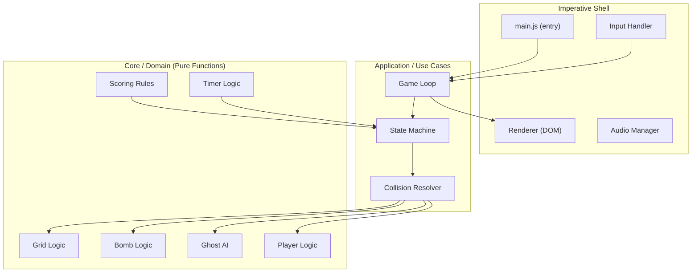

# 📋 Ms. Ghostman — Implementation Plan

> **Architecture**: Feature-First / Clean Architecture (Functional Core, Imperative Shell)  
> **Stack**: Vanilla JS (ES2026) · HTML · CSS Grid · DOM API only  
> **Tooling**: Biome (lint + format) · Vite (dev server + bundler) · Vitest (unit tests)  
> **Target**: 60 FPS via `requestAnimationFrame` · No canvas · No frameworks

---

## Table of Contents

1. [Architecture Overview](#1-architecture-overview)
2. [Directory Structure](#2-directory-structure)
3. [Workflow Tracks](#3-workflow-tracks)
   - [Track A — Core Engine & Game Loop](#track-a--core-engine--game-loop-dev-1)
   - [Track B — Player, Bombs & Interactions](#track-b--player-bombs--interactions-dev-2)
   - [Track C — Enemy AI & Entity System](#track-c--enemy-ai--entity-system-dev-3)
   - [Track D — UI, HUD, Maps & Polish](#track-d--ui-hud-maps--polish-dev-4)
4. [Integration Milestones](#4-integration-milestones)
5. [Shared Contracts & Interfaces](#5-shared-contracts--interfaces)
6. [Testing Strategy](#6-testing-strategy)
7. [Performance Budget](#7-performance-budget)

---

## 1. Architecture Overview



### Key Principles

1. **Functional Core**: All game rules (`grid`, `bomb`, `ghost`, `player`, `scoring`, `timer`) are **pure functions** — no DOM references, no side effects. They accept state and return new state.
2. **Imperative Shell**: The game loop, renderer, and input handler are the only modules that touch the DOM or browser APIs.
3. **Signals for Reactivity**: The HUD subscribes to game-state signals (score, lives, timer) and updates only the specific DOM nodes that changed — no full re-renders.
4. **Object Pooling**: Explosion fire tiles, bomb entities, and ghost sprites are pooled to avoid GC pressure.
5. **CSS `transform` + `will-change`**: All movement uses `transform: translate()` on promoted layers. No `top`/`left` animation.

---

## 2. Directory Structure

```
make-your-game/
├── index.html                     # Entry HTML — single page
├── package.json                   # ES module, exports, scripts
├── biome.json                     # Biome linter/formatter config
├── vite.config.js                 # Dev server config
│
├── docs/
│   ├── requirements.md            # Original project requirements
│   ├── audit.md                   # Audit checklist
│   ├── game-description.md        # Full game rules & description
│   └── implementation-plan.md     # This file
│
├── src/
│   ├── main.js                    # App entry — bootstraps everything
│   │
│   ├── core/                      # 🧠 Domain layer (PURE — zero DOM)
│   │   ├── grid.js                # Grid creation, cell queries, pathfinding
│   │   ├── grid.test.js           # Grid unit tests
│   │   ├── bomb.js                # Bomb placement, fuse, explosion calc
│   │   ├── bomb.test.js           # Bomb unit tests
│   │   ├── ghost.js               # Ghost AI decision logic
│   │   ├── ghost.test.js          # Ghost AI unit tests
│   │   ├── player.js              # Player state transitions
│   │   ├── player.test.js         # Player unit tests
│   │   ├── scoring.js             # Score calculations, combos
│   │   ├── scoring.test.js        # Scoring unit tests
│   │   ├── timer.js               # Countdown logic
│   │   ├── timer.test.js          # Timer unit tests
│   │   ├── collision.js           # Collision detection (grid-based)
│   │   ├── collision.test.js      # Collision unit tests
│   │   └── constants.js           # Shared enums, cell types, speeds
│   │
│   ├── features/                  # 🎯 Feature modules (colocated)
│   │   ├── feat.game-loop/
│   │   │   ├── game-loop.js       # requestAnimationFrame loop
│   │   │   ├── state-machine.js   # Game states (menu, playing, paused, over, win)
│   │   │   └── game-loop.test.js
│   │   │
│   │   ├── feat.renderer/
│   │   │   ├── renderer.js        # DOM grid builder & updater
│   │   │   ├── sprite-pool.js     # Object pool for fire/bomb sprites
│   │   │   ├── animations.js      # CSS class toggling, transitions
│   │   │   └── renderer.test.js
│   │   │
│   │   ├── feat.input/
│   │   │   ├── input-handler.js   # Keyboard event management
│   │   │   └── input-handler.test.js
│   │   │
│   │   ├── feat.hud/
│   │   │   ├── hud.js             # Score, lives, timer DOM updates (Signals)
│   │   │   ├── hud.css            # HUD styling
│   │   │   └── hud.test.js
│   │   │
│   │   ├── feat.pause-menu/
│   │   │   ├── pause-menu.js      # Pause overlay: continue / restart
│   │   │   ├── pause-menu.css     # Overlay styling
│   │   │   └── pause-menu.test.js
│   │   │
│   │   ├── feat.screens/
│   │   │   ├── start-screen.js    # Title / start screen
│   │   │   ├── game-over.js       # Game over screen
│   │   │   ├── victory.js         # Victory screen
│   │   │   ├── level-complete.js  # Level transition screen
│   │   │   ├── screens.css        # Screen styling
│   │   │   └── screens.test.js
│   │   │
│   │   └── feat.maps/
│   │       ├── level-1.json       # Map data for level 1
│   │       ├── level-2.json       # Map data for level 2
│   │       ├── level-3.json       # Map data for level 3
│   │       └── map-loader.js      # Parses JSON → grid state
│   │
│   ├── infrastructure/            # 🔌 Adapters & side-effect boundaries
│   │   ├── dom-adapter.js         # Safe DOM creation utilities
│   │   ├── audio-adapter.js       # Sound effect playback (optional bonus)
│   │   └── storage-adapter.js     # High score persistence (localStorage)
│   │
│   └── shared/                    # 🔗 Cross-cutting utilities
│       ├── signal.js              # Minimal Signal implementation
│       ├── signal.test.js
│       ├── object-pool.js         # Generic object pool
│       ├── object-pool.test.js
│       ├── result.js              # Result<T, E> pattern helpers
│       └── types.js               # JSDoc typedefs (shared)
│
├── assets/
│   ├── sprites/                   # SVG sprites for player, ghosts, bombs, etc.
│   └── sounds/                    # Optional sound effects
│
└── styles/
    ├── reset.css                  # CSS reset / normalize
    ├── variables.css              # CSS custom properties (colors, sizes, timing)
    ├── grid.css                   # CSS Grid layout for the game board
    └── animations.css             # Keyframe animations (explosion, death, spawn)
```

---

## 3. Workflow Tracks

Each track is designed so that developers work on **independent modules** with clear **interface contracts** between them. No track needs to touch another track's internal files.

---

### Track A — Core Engine & Game Loop (Dev 1)

> **Scope**: The heartbeat of the game — the loop, state machine, timing, and the shared utilities everything depends on.

#### A-1: Project Scaffolding & Tooling
**Priority**: 🔴 Critical  
**Estimate**: 2 hours

- [ ] Initialize `package.json` with `"type": "module"` and `exports` map
- [ ] Install and configure **Vite** for dev server (no framework plugin)
- [ ] Install and configure **Biome** (`biome.json`) for linting + formatting
- [ ] Install and configure **Vitest** for unit testing
- [ ] Create `index.html` with semantic structure:
  - `<div id="game-root">` — game board mount point
  - `<div id="hud-root">` — HUD mount point
  - `<div id="overlay-root">` — Pause/game-over overlay mount point
- [ ] Create CSS files: `reset.css`, `variables.css`, `grid.css`, `animations.css`
- [ ] Create `src/main.js` entry point (empty bootstrap)
- [ ] Verify dev server runs, linter passes, test runner works
- [ ] Commit: `feat: project scaffolding with Vite, Biome, Vitest`

**Files**: `package.json`, `biome.json`, `vite.config.js`, `index.html`, `styles/*`, `src/main.js`

---

#### A-2: Shared Utilities — Signals, Object Pool, Result Pattern
**Priority**: 🔴 Critical  
**Estimate**: 3 hours

- [ ] Implement `src/shared/signal.js`:
  - `createSignal(initialValue)` → `{ get, set, subscribe }`
  - `createComputed(fn, deps)` → read-only signal derived from other signals
  - `createEffect(fn, deps)` → side-effect runner
  - Must support batched updates to avoid redundant subscriber calls
- [ ] Implement `src/shared/object-pool.js`:
  - `createPool(factory, reset, initialSize)` → `{ acquire, release, releaseAll }`
  - Pre-allocates `initialSize` objects, grows on demand
  - `reset` function clears object state for reuse
- [ ] Implement `src/shared/result.js`:
  - `ok(data)` → `{ ok: true, data }`
  - `err(error)` → `{ ok: false, error }`
  - `isOk(result)`, `isErr(result)` guards
- [ ] Define JSDoc typedefs in `src/shared/types.js`:
  - `@typedef {Object} GameState`
  - `@typedef {Object} GridCell`
  - `@typedef {Object} Entity`
  - `@typedef {Object} BombState`
  - `@typedef {Object} GhostState`
- [ ] Write comprehensive unit tests for signal and object-pool
- [ ] Commit: `feat: shared utilities — signals, object pool, result`

**Files**: `src/shared/*`

---

#### A-3: Constants & Cell Types
**Priority**: 🔴 Critical  
**Estimate**: 1 hour

- [ ] Define `src/core/constants.js`:
  - Cell type enum: `WALL`, `DESTRUCTIBLE`, `EMPTY`, `PELLET`, `POWER_PELLET`, `BOMB_POWERUP`, `FIRE_POWERUP`, `SPEED_BOOST`, `GHOST_HOUSE`, `PLAYER_SPAWN`
  - Direction enum: `UP`, `DOWN`, `LEFT`, `RIGHT`
  - Game state enum: `MENU`, `PLAYING`, `PAUSED`, `GAME_OVER`, `VICTORY`, `LEVEL_COMPLETE`
  - Tuning constants: `BOMB_FUSE_MS`, `EXPLOSION_DURATION_MS`, `DEFAULT_FIRE_RADIUS`, `DEFAULT_BOMB_COUNT`, `GHOST_STUN_DURATION_MS`, `RESPAWN_INVINCIBILITY_MS`, `BASE_PLAYER_SPEED`, `BASE_GHOST_SPEED`, `LEVEL_TIME_S`, etc.
  - Scoring constants: `PELLET_SCORE`, `POWER_PELLET_SCORE`, `GHOST_KILL_SCORE`, `STUNNED_GHOST_SCORE`, `POWERUP_SCORE`, `LEVEL_CLEAR_SCORE`, `TIME_BONUS_MULTIPLIER`
- [ ] Freeze all enums with `Object.freeze()`
- [ ] Commit: `feat: core constants and enums`

**Files**: `src/core/constants.js`

---

#### A-4: Game Loop with `requestAnimationFrame`
**Priority**: 🔴 Critical  
**Estimate**: 4 hours

- [ ] Implement `src/features/feat.game-loop/game-loop.js`:
  - `createGameLoop(updateFn, renderFn)` → `{ start, stop, pause, resume }`
  - Uses `requestAnimationFrame` exclusively
  - Calculates `deltaTime` between frames
  - Fixed-timestep update (e.g., 16.67ms per tick) with accumulator pattern to decouple logic rate from render rate
  - Calls `updateFn(dt)` for game logic, `renderFn(interpolation)` for DOM updates
  - Tracks FPS internally for debugging (exposed via signal)
  - Pause: stops calling `updateFn` but keeps `requestAnimationFrame` running to avoid frame-drop detection issues
  - Uses `performance.now()` for high-resolution timing
- [ ] Implement `src/features/feat.game-loop/state-machine.js`:
  - States: `MENU → PLAYING ↔ PAUSED → LEVEL_COMPLETE → PLAYING → GAME_OVER / VICTORY`
  - `createStateMachine(initialState)` → `{ current, transition, onEnter, onExit }`
  - Each state has `enter()` and `exit()` hooks
  - Transition validation: only allowed transitions succeed (returns Result)
- [ ] Write tests for fixed-timestep accumulator and state transitions
- [ ] Commit: `feat: game loop with requestAnimationFrame and state machine`

**Files**: `src/features/feat.game-loop/*`

---

#### A-5: Grid Logic (Core Domain)
**Priority**: 🔴 Critical  
**Estimate**: 3 hours

- [ ] Implement `src/core/grid.js` (pure functions — NO DOM):
  - `createGrid(width, height, cellData)` → immutable 2D grid state
  - `getCell(grid, row, col)` → cell type
  - `setCell(grid, row, col, type)` → new grid (immutable update with `with()` or spread)
  - `getNeighbors(grid, row, col)` → array of `{ row, col, type }` for 4 cardinal directions
  - `getValidMoves(grid, row, col)` → array of passable neighbor positions
  - `isPassable(cellType)` → boolean
  - `countPellets(grid)` → number of remaining pellets
  - `getExplosionRange(grid, row, col, radius)` → array of `{ row, col }` affected cells (stops at walls)
- [ ] All functions are pure: input → output, no mutation
- [ ] Comprehensive unit tests covering edge cases (corners, walls, chain calculation)
- [ ] Commit: `feat: core grid logic — pure domain functions`

**Files**: `src/core/grid.js`, `src/core/grid.test.js`

---

#### A-6: Timer Logic (Core Domain)
**Priority**: 🟡 Medium  
**Estimate**: 1.5 hours

- [ ] Implement `src/core/timer.js` (pure functions):
  - `createTimer(durationMs)` → `{ remaining, elapsed, isExpired }`
  - `tickTimer(timer, deltaMs)` → new timer state
  - `formatTime(remainingMs)` → `"M:SS"` string
  - `calculateTimeBonus(remainingMs, multiplier)` → bonus points
- [ ] Unit tests for tick, boundary (0), and formatting
- [ ] Commit: `feat: core timer logic`

**Files**: `src/core/timer.js`, `src/core/timer.test.js`

---

#### A-7: Collision Detection (Core Domain)
**Priority**: 🟡 Medium  
**Estimate**: 3 hours

- [ ] Implement `src/core/collision.js` (pure functions):
  - `checkPlayerGhostCollision(playerPos, ghostPositions)` → `{ collided, ghostIndex } | null`
  - `checkPlayerExplosionCollision(playerPos, activeFires)` → boolean
  - `checkGhostExplosionCollision(ghostPositions, activeFires)` → array of hit ghost indices
  - `checkPlayerPelletCollision(playerPos, grid)` → `{ collected, cellType } | null`
  - `checkPlayerPowerUpCollision(playerPos, grid)` → `{ collected, powerUpType } | null`
  - All coordinate comparisons are grid-aligned (integer row/col)
- [ ] Unit tests for all collision scenarios
- [ ] Commit: `feat: core collision detection`

**Files**: `src/core/collision.js`, `src/core/collision.test.js`

---

#### A-8: Main Game Orchestrator
**Priority**: 🟡 Medium  
**Estimate**: 4 hours (after Tracks B, C, D deliver their modules)

- [ ] Implement `src/main.js` — the **imperative shell** that wires everything:
  - Imports all core modules, features, and infrastructure
  - Initializes the game state from map data
  - Creates signals for score, lives, timer, level
  - Wires input handler → game loop update
  - Wires game loop render → renderer
  - Wires state machine transitions to screen changes
  - Handles level progression logic
  - Handles game restart / play again
- [ ] Integration test: full game scenario (start → play → pause → resume → win)
- [ ] Commit: `feat: main orchestrator — wires all systems`

**Files**: `src/main.js`

---

### Track B — Player, Bombs & Interactions (Dev 2)

> **Scope**: Everything the player does — movement, input, bomb placement, explosions.

#### B-1: Input Handler
**Priority**: 🔴 Critical  
**Estimate**: 2.5 hours

- [ ] Implement `src/features/feat.input/input-handler.js`:
  - `createInputHandler()` → `{ getDirection, isBombPressed, isPausePressed, destroy }`
  - Listens to `keydown` and `keyup` events on `document`
  - Tracks **held keys** — continuous movement while key is held, stops on release
  - Supports simultaneous keys (last pressed direction wins)
  - Debounces bomb/pause to prevent repeat-fire on hold
  - Uses `using` declaration for automatic event listener cleanup
  - Maps: Arrow keys → direction, Space → bomb, Escape/P → pause
  - Prevents default on game keys to avoid scroll
- [ ] Unit tests with synthetic KeyboardEvent dispatching
- [ ] Commit: `feat: input handler with hold-to-move`

**Files**: `src/features/feat.input/*`

---

#### B-2: Player Logic (Core Domain)
**Priority**: 🔴 Critical  
**Estimate**: 3 hours

- [ ] Implement `src/core/player.js` (pure functions):
  - `createPlayer(spawnRow, spawnCol)` → player state `{ row, col, direction, lives, maxBombs, fireRadius, speed, isInvincible, invincibilityTimer }`
  - `movePlayer(player, direction, grid)` → new player state (validates target cell is passable)
  - `damagePlayer(player)` → new player state (decremented lives, or game-over flag)
  - `respawnPlayer(player, spawnRow, spawnCol)` → new player state with invincibility
  - `tickInvincibility(player, deltaMs)` → new player state (counts down invincibility)
  - `applyPowerUp(player, powerUpType)` → new player state (increased bombs/fire/speed)
  - `canPlaceBomb(player, activeBombCount)` → boolean
  - `isAlive(player)` → boolean
- [ ] Unit tests for every state transition
- [ ] Commit: `feat: core player logic`

**Files**: `src/core/player.js`, `src/core/player.test.js`

---

#### B-3: Bomb Logic (Core Domain)
**Priority**: 🔴 Critical  
**Estimate**: 4 hours

- [ ] Implement `src/core/bomb.js` (pure functions):
  - `createBomb(row, col, fuseMs, fireRadius, ownerId)` → bomb state
  - `tickBomb(bomb, deltaMs)` → new bomb state (decremented fuse)
  - `isDetonated(bomb)` → boolean (fuse ≤ 0)
  - `calculateExplosion(bomb, grid)` → array of `{ row, col, direction }` fire tiles (uses `getExplosionRange` from grid.js)
  - `applyExplosionToGrid(grid, fireTiles)` → new grid (destructible walls removed, power-ups revealed)
  - `checkChainReaction(bombs, fireTiles)` → array of bomb indices to detonate immediately
  - `calculateComboScore(ghostsKilled)` → score using `200 × 2^(n-1)` formula
- [ ] Manage active bombs as an array; tick all each frame
- [ ] Unit tests: placement, detonation, chain reactions, wall destruction, ghost kills
- [ ] Commit: `feat: core bomb logic with chain reactions`

**Files**: `src/core/bomb.js`, `src/core/bomb.test.js`

---

#### B-4: Scoring Logic (Core Domain)
**Priority**: 🟡 Medium  
**Estimate**: 1.5 hours

- [ ] Implement `src/core/scoring.js` (pure functions):
  - `addPelletScore(score)` → new score
  - `addPowerPelletScore(score)` → new score
  - `addGhostKillScore(score, isStunned)` → new score
  - `addComboScore(score, ghostCount)` → new score
  - `addPowerUpScore(score)` → new score
  - `addLevelClearScore(score, remainingTimeMs)` → new score
- [ ] Unit tests for each scoring function and combo edge cases
- [ ] Commit: `feat: core scoring logic`

**Files**: `src/core/scoring.js`, `src/core/scoring.test.js`

---

#### B-5: Player & Bomb Rendering Integration
**Priority**: 🟡 Medium  
**Estimate**: 3 hours (coordinates with Track D renderer)

- [ ] Work with Dev 4 to integrate player movement animation:
  - Player DOM element uses `transform: translate(Xpx, Ypx)` driven by grid position
  - Smooth interpolation between grid cells using `requestAnimationFrame` delta
  - Direction-based sprite class toggling (`.player--up`, `.player--down`, etc.)
  - Invincibility visual: blinking/flashing CSS animation
- [ ] Bomb rendering:
  - Bomb placed → DOM element added from object pool
  - Fuse animation (pulsing/shaking CSS)
  - Explosion → fire tiles added from pool, cross pattern, removed after 500ms
  - Chain reaction visual: staggered detonation with slight delays
- [ ] Death animation: brief sprite change + fade
- [ ] Commit: `feat: player and bomb rendering`

**Files**: Coordinates with `src/features/feat.renderer/*`

---

### Track C — Enemy AI & Entity System (Dev 3)

> **Scope**: Ghost behavior, spawning, states, and movement AI.

#### C-1: Ghost AI Logic (Core Domain)
**Priority**: 🔴 Critical  
**Estimate**: 5 hours

- [ ] Implement `src/core/ghost.js` (pure functions):
  - `createGhost(type, spawnRow, spawnCol, speed)` → ghost state `{ type, row, col, direction, state, speed, stateTimer, personality }`
  - Ghost types: `BLINKY`, `PINKY`, `INKY`, `CLYDE`
  - `chooseDirection(ghost, grid, playerPos, blinkyPos)` → direction
    - **Blinky** (Red): At intersections, prefers direction that minimizes Manhattan distance to player (60% chance), else random.
    - **Pinky** (Pink): Targets 4 tiles ahead of player's current direction (50% bias), else random.
    - **Inky** (Cyan): Uses midpoint between Blinky's position and 2 tiles ahead of player (40% bias), else random.
    - **Clyde** (Orange): Purely random direction at intersections.
    - All ghosts: **never reverse** direction mid-corridor (only turn at intersections).
  - `moveGhost(ghost, direction, grid)` → new ghost state
  - `stunGhost(ghost, durationMs)` → new ghost state (blue, slow, fleeing)
  - `killGhost(ghost)` → new ghost state (eyes-only, heading to ghost house)
  - `tickGhostState(ghost, deltaMs, ghostHousePos)` → new ghost state (manages stun/dead timers)
  - `isAtIntersection(grid, row, col)` → boolean (≥ 3 valid exits)
  - `respawnGhost(ghost, spawnRow, spawnCol)` → new ghost state
- [ ] Implement `getStunnedDirection(ghost, grid, playerPos)` — flee behavior (moves away from player)
- [ ] Implement `getDeadDirection(ghost, grid, ghostHousePos)` — shortest path to ghost house
- [ ] Unit tests: each personality at various grid configurations
- [ ] Commit: `feat: ghost AI with personality-based behavior`

**Files**: `src/core/ghost.js`, `src/core/ghost.test.js`

---

#### C-2: Ghost Spawning & Management
**Priority**: 🔴 Critical  
**Estimate**: 3 hours

- [ ] Implement ghost management logic (can be in `ghost.js` or a separate application-layer file):
  - `createGhostManager(level)` → manages all ghosts for a level
  - Staggered spawn: ghosts leave the ghost house at intervals (e.g., 0s, 3s, 6s, 9s)
  - Track all ghost states in an array
  - `tickAllGhosts(ghosts, deltaMs, grid, playerPos)` → new ghost array
  - `stunAllGhosts(ghosts, durationMs)` → new ghost array (Power Pellet effect)
  - `handleGhostDeath(ghosts, index)` → new ghost array with dead ghost
  - Ghost count by level: Level 1 = 2, Level 2 = 3, Level 3 = 4
  - Ghost speed increases per level
- [ ] Unit tests for spawn timing and state management
- [ ] Commit: `feat: ghost spawning and management`

**Files**: `src/core/ghost.js` (extended), `src/core/ghost.test.js` (extended)

---

#### C-3: Ghost Rendering Integration
**Priority**: 🟡 Medium  
**Estimate**: 2.5 hours (coordinates with Track D renderer)

- [ ] Work with Dev 4 to integrate ghost rendering:
  - Each ghost is a DOM element positioned via `transform: translate()`
  - Color-coded by type: red, pink, cyan, orange
  - State-based visual changes:
    - **Normal**: colored ghost sprite/SVG
    - **Stunned**: blue, slightly transparent, wiggling animation
    - **Dead**: "eyes only" sprite moving toward ghost house
  - Smooth movement between grid cells (interpolated)
  - Staggered spawn animation: ghosts float out of the ghost house
- [ ] Commit: `feat: ghost rendering with state-based visuals`

**Files**: Coordinates with `src/features/feat.renderer/*`

---

#### C-4: Power Pellet System
**Priority**: 🟡 Medium  
**Estimate**: 2 hours

- [ ] Implement Power Pellet collection logic:
  - When player collides with `POWER_PELLET` cell:
    1. Cell becomes `EMPTY`
    2. Score += `POWER_PELLET_SCORE`
    3. All ghosts enter `STUNNED` state for `GHOST_STUN_DURATION_MS`
  - If a ghost is already stunned, reset its stun timer
  - If a ghost is dead, no effect (stays dead)
- [ ] Stun timer countdown per ghost (handled in ghost tick)
- [ ] Transition from `STUNNED` → `NORMAL` when timer expires (visual flash warning at ~2s remaining)
- [ ] Unit tests for Power Pellet collection and stun cascading
- [ ] Commit: `feat: power pellet system`

**Files**: `src/core/ghost.js` (extended), collision integration

---

### Track D — UI, HUD, Maps & Polish (Dev 4)

> **Scope**: Everything visual — the grid renderer, HUD, screens, maps, and CSS.

#### D-1: CSS Design System & Grid Layout
**Priority**: 🔴 Critical  
**Estimate**: 3 hours

- [ ] Implement `styles/variables.css`:
  ```css
  :root {
    --cell-size: 32px;
    --grid-cols: 21;
    --grid-rows: 17;
    --color-wall: #1a1a2e;
    --color-destructible: #4a3f6b;
    --color-empty: #0f0f23;
    --color-pellet: #ffd700;
    --color-power-pellet: #ff6b6b;
    --color-player: #00ff88;
    --color-ghost-red: #ff0000;
    --color-ghost-pink: #ffb8ff;
    --color-ghost-cyan: #00ffff;
    --color-ghost-orange: #ffb852;
    --color-ghost-stunned: #2222ff;
    --color-bomb: #ff4444;
    --color-fire: #ff8800;
    --color-hud-bg: rgba(0, 0, 0, 0.8);
    --color-hud-text: #ffffff;
    --font-primary: 'Press Start 2P', monospace;
    --font-body: 'Inter', sans-serif;
    --transition-move: 100ms linear;
    --transition-explode: 80ms ease-out;
  }
  ```
- [ ] Implement `styles/grid.css`:
  - CSS Grid with `grid-template-columns: repeat(var(--grid-cols), var(--cell-size))`
  - Cell backgrounds via data attributes or CSS classes
  - `will-change: transform` on player and ghost elements only
  - Promote game board to its own compositor layer
- [ ] Implement `styles/reset.css` (modern CSS reset)
- [ ] Commit: `feat: CSS design system and grid layout`

**Files**: `styles/*`

---

#### D-2: DOM Renderer
**Priority**: 🔴 Critical  
**Estimate**: 5 hours

- [ ] Implement `src/features/feat.renderer/renderer.js`:
  - `createRenderer(rootElement, gridWidth, gridHeight)` → `{ renderGrid, updateCell, moveEntity, addEntity, removeEntity, destroy }`
  - `renderGrid(gridState)`:
    - Creates the initial grid of `<div>` elements using `createElement` (safe DOM — no `innerHTML`)
    - Each cell has `data-row`, `data-col`, and a CSS class matching its type
    - Cells are static once created; only destructible walls change (class swap on destruction)
  - `moveEntity(entityId, row, col, interpolation)`:
    - Updates `transform: translate()` for smooth sub-cell movement
    - Handles interpolation between ticks for silky-smooth rendering
  - `updateCell(row, col, newType)`:
    - Swaps CSS class when a destructible wall is destroyed or a pellet is eaten
    - Minimal paint — only the changed cell repaints
  - `addEntity(entityId, type, row, col)` / `removeEntity(entityId)`:
    - Uses object pool (`sprite-pool.js`) for bombs and fire tiles
    - Entities are absolutely positioned within the grid container
- [ ] Implement `src/features/feat.renderer/sprite-pool.js`:
  - Wraps the generic `object-pool.js` for DOM elements specifically
  - Pre-creates `<div>` elements for fire tiles (max ~40), bombs (max ~5)
  - `acquire()` sets `display: block`, `release()` sets `display: none`
- [ ] Implement `src/features/feat.renderer/animations.js`:
  - CSS class helpers for triggering animations: `.bomb--pulsing`, `.fire--active`, `.ghost--stunned`, `.player--invincible`
  - Uses `animationend` / `transitionend` events for cleanup
- [ ] All DOM creation uses `createElement` — **zero `innerHTML` usage**
- [ ] Commit: `feat: DOM renderer with object pooling`

**Files**: `src/features/feat.renderer/*`

---

#### D-3: HUD (Signals-Driven)
**Priority**: 🔴 Critical  
**Estimate**: 2.5 hours

- [ ] Implement `src/features/feat.hud/hud.js`:
  - `createHUD(rootElement, signals)` → `{ destroy }`
  - Subscribes to signals: `scoreSignal`, `livesSignal`, `timerSignal`, `levelSignal`, `bombCountSignal`, `fireRadiusSignal`
  - Each signal subscription updates **only** its specific DOM `textContent` — no full re-render
  - Lives displayed as heart icons (created via `createElement`)
  - Timer formatted as `M:SS`
  - Score zero-padded to 5 digits
- [ ] Implement `src/features/feat.hud/hud.css`:
  - Fixed position at top of viewport
  - Retro-styled with `--font-primary`
  - Glassmorphism backdrop-filter for premium feel
  - Responsive sizing
- [ ] Unit tests: verify DOM updates match signal changes
- [ ] Commit: `feat: signal-driven HUD`

**Files**: `src/features/feat.hud/*`

---

#### D-4: Pause Menu
**Priority**: 🔴 Critical  
**Estimate**: 2 hours

- [ ] Implement `src/features/feat.pause-menu/pause-menu.js`:
  - `createPauseMenu(overlayRoot, onContinue, onRestart)` → `{ show, hide, destroy }`
  - Renders overlay with Continue and Restart buttons
  - Keyboard navigation: `↑`/`↓` to select, `Enter` to confirm, `Escape` to continue
  - Focus trap within the overlay
  - Built with `createElement` only
- [ ] Implement `src/features/feat.pause-menu/pause-menu.css`:
  - Full-screen semi-transparent overlay
  - Centered menu card with glassmorphism
  - Hover/focus animations on buttons
  - Fade-in/out transitions
- [ ] Unit tests for show/hide/keyboard navigation
- [ ] Commit: `feat: pause menu overlay`

**Files**: `src/features/feat.pause-menu/*`

---

#### D-5: Game Screens (Start, Game Over, Victory, Level Complete)
**Priority**: 🟡 Medium  
**Estimate**: 3 hours

- [ ] Implement `src/features/feat.screens/start-screen.js`:
  - Title: "Ms. Ghostman"
  - "Press ENTER to Start" prompt
  - Animated ghost sprites in background
- [ ] Implement `src/features/feat.screens/game-over.js`:
  - "GAME OVER" title
  - Final score display
  - "Press ENTER to Play Again" prompt
- [ ] Implement `src/features/feat.screens/victory.js`:
  - "YOU WIN!" title
  - Stats: final score, ghosts killed, total time
  - "Press ENTER to Play Again" prompt
- [ ] Implement `src/features/feat.screens/level-complete.js`:
  - "LEVEL COMPLETE!" title
  - Level score + time bonus display
  - Brief auto-advance (3 seconds) or press ENTER to skip
- [ ] Implement `src/features/feat.screens/screens.css`:
  - Shared overlay styling with distinct color schemes per screen
  - Animated text effects (glow, pulse)
  - Score counter animation (count-up)
- [ ] All screens built with `createElement` — **no `innerHTML`**
- [ ] Commit: `feat: game screens`

**Files**: `src/features/feat.screens/*`

---

#### D-6: Map Data & Loader
**Priority**: 🔴 Critical  
**Estimate**: 3 hours

- [ ] Design 3 level maps as JSON files:
  - Each map is a 2D array where each number maps to a cell type from `constants.js`
  - Include player spawn position and ghost house position
  - **Level 1** (21×17): Open layout, ~30% destructible walls, 2 ghost spawns
  - **Level 2** (21×17): Tighter corridors, ~45% destructible walls, 3 ghost spawns
  - **Level 3** (21×17): Dense maze, ~55% destructible walls, 4 ghost spawns
- [ ] Implement `src/features/feat.maps/map-loader.js`:
  - `loadMap(levelNumber)` → `{ grid, playerSpawn, ghostHousePos, ghostSpawns, totalPellets }`
  - Validates map data (boundary walls, spawn positions exist, etc.)
  - Returns Result pattern: `ok({ ... })` or `err("Invalid map: ...")`
- [ ] Pellet auto-placement: all `EMPTY` cells that aren't spawn points get pellets
- [ ] Power pellet placement: 4 per map in strategic corners
- [ ] Commit: `feat: map data and loader`

**Files**: `src/features/feat.maps/*`

---

#### D-7: SVG Sprites & Visual Polish
**Priority**: 🟢 Low (Bonus)  
**Estimate**: 3 hours

- [ ] Create SVG sprites for:
  - Ms. Ghostman (4 directional frames)
  - 4 ghost types (normal, stunned, dead/eyes)
  - Bomb (with fuse)
  - Explosion fire
  - Pellet and Power Pellet
  - Power-ups (bomb+, fire+, speed)
- [ ] Inline SVGs via `createElement('svg')` or use `<use>` references
- [ ] CSS animations: ghost wiggle, pellet glow, bomb pulse, fire flicker
- [ ] Commit: `feat: SVG sprites and visual polish`

**Files**: `assets/sprites/*`, `styles/animations.css`

---

#### D-8: Infrastructure Adapters
**Priority**: 🟢 Low (Bonus)  
**Estimate**: 2 hours

- [ ] Implement `src/infrastructure/dom-adapter.js`:
  - Safe DOM creation helpers: `createEl(tag, attrs, children)`
  - Attribute whitelist for security
- [ ] Implement `src/infrastructure/storage-adapter.js`:
  - High score persistence: `saveHighScore(score)`, `loadHighScore()` → number
  - Uses `localStorage` with error handling
- [ ] Implement `src/infrastructure/audio-adapter.js` (optional):
  - Preloads sound effects
  - `play(soundId)` for bomb, eat, death, ghost kill
- [ ] Commit: `feat: infrastructure adapters`

**Files**: `src/infrastructure/*`

---

## 4. Integration Milestones

These are the points where tracks converge. Each milestone requires code from multiple tracks.

```mermaid
gantt
    title Ms. Ghostman — Integration Timeline
    dateFormat  X
    axisFormat %s

    section Track A (Engine)
    A-1 Scaffolding         :a1, 0, 2
    A-2 Shared Utils        :a2, 2, 3
    A-3 Constants           :a3, 2, 1
    A-4 Game Loop           :a4, 3, 4
    A-5 Grid Logic          :a5, 3, 3
    A-6 Timer Logic         :a6, 5, 2
    A-7 Collision           :a7, 6, 3
    A-8 Main Orchestrator   :a8, 9, 4

    section Track B (Player)
    B-1 Input Handler       :b1, 2, 3
    B-2 Player Logic        :b2, 3, 3
    B-3 Bomb Logic          :b3, 3, 4
    B-4 Scoring Logic       :b4, 5, 2
    B-5 Player Rendering    :b5, 7, 3

    section Track C (Ghosts)
    C-1 Ghost AI            :c1, 3, 5
    C-2 Ghost Management    :c2, 5, 3
    C-3 Ghost Rendering     :c3, 7, 3
    C-4 Power Pellet System :c4, 8, 2

    section Track D (UI)
    D-1 CSS Design System   :d1, 0, 3
    D-2 DOM Renderer        :d2, 3, 5
    D-3 HUD                 :d3, 5, 3
    D-4 Pause Menu          :d4, 5, 2
    D-5 Game Screens        :d5, 7, 3
    D-6 Map Data            :d6, 2, 3
    D-7 SVG Sprites         :d7, 8, 3
    D-8 Infrastructure      :d8, 5, 2

    section Integration
    M1 Grid Renders         :milestone, m1, 6, 0
    M2 Player Moves         :milestone, m2, 8, 0
    M3 Ghosts Move          :milestone, m3, 9, 0
    M4 Full Game            :milestone, m4, 12, 0
```



### Milestone 1: Grid Renders (Day 3)
**Requires**: A-1, A-3, A-5, D-1, D-2, D-6  
**Result**: A static game grid renders in the browser from JSON map data.

### Milestone 2: Player Moves & Bombs Work (Day 4)
**Requires**: M1 + A-4, B-1, B-2, B-3, D-3  
**Result**: Player moves with arrow keys, drops bombs, explosions destroy walls. HUD shows score/lives/timer.

### Milestone 3: Ghosts Move & Chase (Day 5)
**Requires**: M2 + C-1, C-2, C-3, A-7  
**Result**: Ghosts patrol the maze, collision with player causes life loss, bombs kill ghosts.

### Milestone 4: Full Game (Day 6-7)
**Requires**: M3 + A-8, B-4, C-4, D-4, D-5  
**Result**: Complete game with pause menu, scoring, levels, game over/victory screens. Performance validated at 60 FPS.

---

## 5. Shared Contracts & Interfaces

All tracks must agree on these data shapes. They are defined in `src/shared/types.js` and `src/core/constants.js`.

### Grid State
```js
/** @typedef {{ cells: ReadonlyArray<ReadonlyArray<number>>, width: number, height: number }} GridState */
```

### Entity Position
```js
/** @typedef {{ row: number, col: number }} Position */
```

### Player State
```js
/** @typedef {{ row: number, col: number, direction: number, lives: number, maxBombs: number, fireRadius: number, speed: number, isInvincible: boolean, invincibilityTimer: number }} PlayerState */
```

### Ghost State
```js
/** @typedef {{ type: number, row: number, col: number, direction: number, state: number, speed: number, stateTimer: number }} GhostState */
```

### Bomb State
```js
/** @typedef {{ row: number, col: number, fuseRemaining: number, fireRadius: number, ownerId: string }} BombState */
```

### Game State (Master)
```js
/**
 * @typedef {{
 *   grid: GridState,
 *   player: PlayerState,
 *   ghosts: ReadonlyArray<GhostState>,
 *   bombs: ReadonlyArray<BombState>,
 *   activeFires: ReadonlyArray<Position>,
 *   score: number,
 *   level: number,
 *   timer: TimerState,
 *   gameStatus: number
 * }} GameState
 */
```

---

## 6. Testing Strategy

| Layer | Tool | What to Test |
|---|---|---|
| **Core Domain** | Vitest | Every pure function — grid, bomb, ghost, player, scoring, collision, timer |
| **Features** | Vitest + jsdom | DOM creation, signal subscriptions, input event handling |
| **Integration** | Vitest + jsdom | Full game loop scenarios: start → play → pause → win |
| **Performance** | Browser DevTools | Manual 60 FPS validation, paint flashing, layer analysis |
| **Audit Compliance** | Manual checklist | Walk through every line of `audit.md` |

### Test Naming Convention
```
describe('grid', () => {
  it('returns the correct cell type for a valid position', () => { ... })
  it('returns undefined for out-of-bounds positions', () => { ... })
})
```

---

## 7. Performance Budget

| Metric | Budget | How to Enforce |
|---|---|---|
| FPS | ≥ 60 (50-60 acceptable) | Fixed-timestep loop, DevTools Performance tab |
| Frame budget | < 16.67ms per frame | Profile update + render time |
| DOM elements | ≤ 500 (grid + entities) | Object pooling for transient elements |
| Layout thrashing | Zero | Batch reads before writes; use `transform` only |
| Paint areas | Minimal | `will-change` on moving entities only; DevTools paint flashing |
| Layer count | 3-5 max | Player, ghosts (1 layer), bombs/fire (1 layer), HUD (1 layer) |
| GC pauses | < 1ms | Object pooling, avoid allocations in hot loop |
| JS heap | < 10MB | No retained references, clean up on level change |

---

> **Next Step**: Each dev takes their track workflow and begins implementation. All tracks start with A-1 (scaffolding) since Dev 1 sets up the project. After A-1 is committed, all other tracks can begin in parallel.
