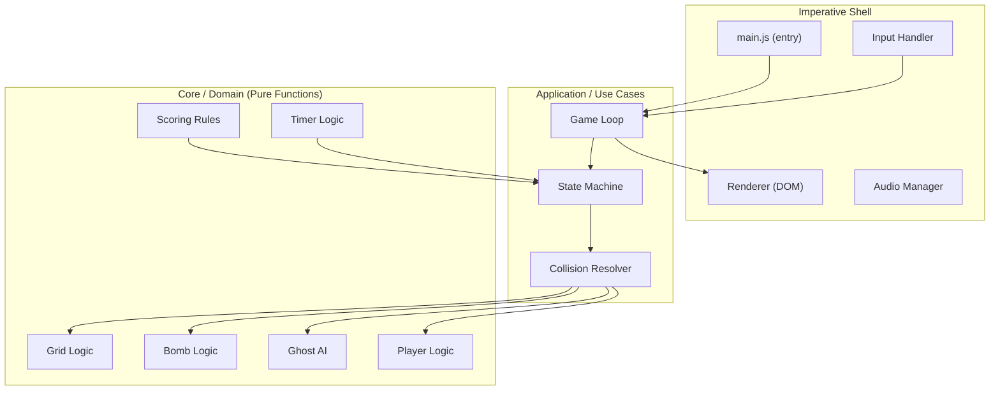

# 📋 Ms. Ghostman — Implementation Plan

> **Architecture**: Feature-First / Clean Architecture (Functional Core, Imperative Shell)  
> **Stack**: Vanilla JS (ES2026) · HTML · CSS Grid · DOM API only  
> **Tooling**: Biome (lint + format) · Vite (dev server + bundler) · Vitest (unit tests)  
> **Target**: 60 FPS via `requestAnimationFrame` · No canvas · No frameworks

---

## Table of Contents

1. [Architecture Overview](#1-architecture-overview)
2. [Directory Structure](#2-directory-structure)
3. [Workflow Tracks (Balanced Workload)](#3-workflow-tracks-balanced-workload)
   - [Track A — Core Engine & Orchestration ~17.5h (Dev 1)](#track-a--core-engine--orchestration-175h-dev-1)
   - [Track B — Grid, Physics & Player ~18.5h (Dev 2)](#track-b--grid-physics--player-185h-dev-2)
   - [Track C — AI & Gameplay Systems ~17.0h (Dev 3)](#track-c--ai--gameplay-systems-170h-dev-3)
   - [Track D — Rendering & UI Shell ~18.5h (Dev 4)](#track-d--rendering--ui-shell-185h-dev-4)
4. [Integration Milestones](#4-integration-milestones)
5. [Shared Contracts & Interfaces](#5-shared-contracts--interfaces)
6. [Testing Strategy](#6-testing-strategy)
7. [Performance Budget](#7-performance-budget)

---

## 1. Architecture Overview



### Key Principles

1. **Functional Core**: All game rules (`grid`, `bomb`, `ghost`, `player`, `scoring`, `timer`) are **pure functions** — no DOM references, no side effects. They accept state and return new state.
2. **Imperative Shell**: The game loop, renderer, and input handler are the only modules that touch the DOM or browser APIs.
3. **Signals for Reactivity**: The HUD subscribes to game-state signals (score, lives, timer) and updates only the specific DOM nodes that changed — no full re-renders.
4. **Object Pooling**: Explosion fire tiles, bomb entities, and ghost sprites are pooled to avoid GC pressure.
5. **CSS `transform` + `will-change`**: All movement uses `transform: translate()` on promoted layers. No `top`/`left` animation.

---

## 2. Directory Structure

```
make-your-game/
├── index.html                     # Entry HTML — single page
├── package.json                   # ES module, exports, scripts
├── biome.json                     # Biome linter/formatter config
├── vite.config.js                 # Dev server config
│
├── docs/
│   ├── requirements.md            # Original project requirements
│   ├── audit.md                   # Audit checklist
│   ├── game-description.md        # Full game rules & description
│   └── implementation-plan.md     # This file
│
├── src/
│   ├── main.js                    # App entry — bootstraps everything
│   │
│   ├── core/                      # 🧠 Domain layer (PURE — zero DOM)
│   │   ├── grid.js                # Grid creation, cell queries, pathfinding
│   │   ├── grid.test.js           # Grid unit tests
│   │   ├── bomb.js                # Bomb placement, fuse, explosion calc
│   │   ├── bomb.test.js           # Bomb unit tests
│   │   ├── ghost.js               # Ghost AI decision logic
│   │   ├── ghost.test.js          # Ghost AI unit tests
│   │   ├── player.js              # Player state transitions
│   │   ├── player.test.js         # Player unit tests
│   │   ├── scoring.js             # Score calculations, combos
│   │   ├── scoring.test.js        # Scoring unit tests
│   │   ├── timer.js               # Countdown logic
│   │   ├── timer.test.js          # Timer unit tests
│   │   ├── collision.js           # Collision detection (grid-based)
│   │   ├── collision.test.js      # Collision unit tests
│   │   └── constants.js           # Shared enums, cell types, speeds
│   │
│   ├── features/                  # 🎯 Feature modules (colocated)
│   │   ├── feat.game-loop/
│   │   │   ├── game-loop.js       # requestAnimationFrame loop
│   │   │   ├── state-machine.js   # Game states (menu, playing, paused, over, win)
│   │   │   └── game-loop.test.js
│   │   │
│   │   ├── feat.renderer/
│   │   │   ├── renderer.js        # DOM grid builder & updater
│   │   │   ├── sprite-pool.js     # Object pool for fire/bomb sprites
│   │   │   ├── animations.js      # CSS class toggling, transitions
│   │   │   └── renderer.test.js
│   │   │
│   │   ├── feat.input/
│   │   │   ├── input-handler.js   # Keyboard event management
│   │   │   └── input-handler.test.js
│   │   │
│   │   ├── feat.hud/
│   │   │   ├── hud.js             # Score, lives, timer DOM updates (Signals)
│   │   │   ├── hud.css            # HUD styling
│   │   │   └── hud.test.js
│   │   │
│   │   ├── feat.pause-menu/
│   │   │   ├── pause-menu.js      # Pause overlay: continue / restart
│   │   │   ├── pause-menu.css     # Overlay styling
│   │   │   └── pause-menu.test.js
│   │   │
│   │   ├── feat.screens/
│   │   │   ├── start-screen.js    # Title / start screen
│   │   │   ├── game-over.js       # Game over screen
│   │   │   ├── victory.js         # Victory screen
│   │   │   ├── level-complete.js  # Level transition screen
│   │   │   ├── screens.css        # Screen styling
│   │   │   └── screens.test.js
│   │   │
│   │   └── feat.maps/
│   │       ├── level-1.json       # Map data for level 1
│   │       ├── level-2.json       # Map data for level 2
│   │       ├── level-3.json       # Map data for level 3
│   │       └── map-loader.js      # Parses JSON → grid state
│   │
│   ├── infrastructure/            # 🔌 Adapters & side-effect boundaries
│   │   ├── dom-adapter.js         # Safe DOM creation utilities
│   │   ├── audio-adapter.js       # Sound effect playback (optional bonus)
│   │   └── storage-adapter.js     # High score persistence (localStorage)
│   │
│   └── shared/                    # 🔗 Cross-cutting utilities
│       ├── signal.js              # Minimal Signal implementation
│       ├── signal.test.js
│       ├── object-pool.js         # Generic object pool
│       ├── object-pool.test.js
│       ├── result.js              # Result<T, E> pattern helpers
│       └── types.js               # JSDoc typedefs (shared)
│
├── assets/
│   ├── sprites/                   # SVG sprites for player, ghosts, bombs, etc.
│   └── sounds/                    # Optional sound effects
│
└── styles/
    ├── reset.css                  # CSS reset / normalize
    ├── variables.css              # CSS custom properties (colors, sizes, timing)
    ├── grid.css                   # CSS Grid layout for the game board
    └── animations.css             # Keyframe animations (explosion, death, spawn)
```

---

## 3. Workflow Tracks (Balanced Workload)

The workload (~71.5 hours total) has been divided into 4 perfectly balanced tracks (~18 hours each). Each dev operates independently based on shared contracts.

---

### Track A — Core Engine & Orchestration ~17.5h (Dev 1)

> **Scope**: Scaffolding, game loop heartbeat, state machine, constants, map loading, and wiring everything into the final game structure.

#### A-1: Project Scaffolding & Tooling (2.h)
**Priority**: 🔴 Critical  
- Initialize Vite, Biome, Vitest, index.html structure
- Create base CSS files (`reset.css`, `variables.css`, `grid.css`)

#### A-2: Shared Utilities (3.5h)
**Priority**: 🔴 Critical  
- Signals (`createSignal`, `createComputed`, `createEffect`)
- Object Pool (`createPool` structure for GC-friendly memory)
- Result Pattern (`ok`, `err`) and Type Definitions (`types.js`)

#### A-3: Game Loop & State Machine (4h)
**Priority**: 🔴 Critical  
- Fixed-timestep `requestAnimationFrame` loop with accumulator
- State machine (MENU, PLAYING, PAUSED, GAME_OVER, VICTORY)

#### A-4: Constants & Map Loader (4h)
**Priority**: 🔴 Critical  
- `constants.js` (Cell types, directions, speeds, tuning variables)
- `map-loader.js` (Loads JSON maps into `GridState`, creates spawns/pellets)
- Design 3 level maps (Level 1, Level 2, Level 3)

#### A-5: Main Orchestrator (4h)
**Priority**: 🟡 Medium  
- Wires all modules together into `src/main.js` (DOM initialization, core logic instancing, loop starting)

**Track A Total**: ~17.5 hours

---

### Track B — Grid, Physics & Player ~18.5h (Dev 2)

> **Scope**: Pure logic for board rules, moving entities, bomb mechanics, collision resolving, and taking user inputs.

#### B-1: Grid Core Logic (3h)
**Priority**: 🔴 Critical  
- `grid.js` (pure functions): `getCell`, `setCell`, `getNeighbors`, `getValidMoves`
- Range generation logic `getExplosionRange` (raycats for explosions stopping at walls)

#### B-2: Collision Engine (3h)
**Priority**: 🔴 Critical  
- `collision.js`: player vs ghost, player vs explosion, ghost vs explosion, player vs pellet/powerup

#### B-3: Bomb Logic & Explosions (4h)
**Priority**: 🔴 Critical  
- `bomb.js`: Fuse timers, cross geometry calculation, chain reaction resolution (`checkChainReaction`)

#### B-4: Player Logic & States (3h)
**Priority**: 🔴 Critical  
- `player.js`: Movement, applying powerups, taking damage, invincibility timers

#### B-5: Input Handler & Controls (2.5h)
**Priority**: 🔴 Critical  
- Keyboard listener, hold-to-move input smoothing, debounced spacing for bombs

#### B-6: Infrastructure Adapters (3h)
**Priority**: 🟢 Low  
- LocalStorage save logic (`storage-adapter.js`) for high scores
- Audio effects (`audio-adapter.js`) integration

**Track B Total**: ~18.5 hours

---

### Track C — AI & Gameplay Systems ~17.0h (Dev 3)

> **Scope**: Ghost behaviors (AI), scoring, power systems, timing rules, and pause sub-systems.

#### C-1: Ghost AI Logic (5h)
**Priority**: 🔴 Critical  
- `ghost.js`: Implement the 4 distinct personalities logic (Blinky, Pinky, Inky, Clyde).
- Intersection turning rules, "no-reverse" constraints.

#### C-2: Ghost Spawning & Management (3h)
**Priority**: 🔴 Critical  
- Staggered spawns from the ghost house.
- Managing the array of ghosts over time.

#### C-3: Power Pellet System (2h)
**Priority**: 🟡 Medium  
- Implement the stun mechanic across the Ghost array (turn blue, reverse direction, slow down). Stun timer tracking.

#### C-4: Scoring & Timer Systems (3h)
**Priority**: 🟡 Medium  
- `scoring.js`: Handle multipliers, combos for bomb chain kills
- `timer.js`: Countdown logic, time bonus calculation

#### C-5: Pause Menu System (2h)
**Priority**: 🟢 Low  
- `pause-menu.js`: Overlay UI layer for pause toggle, continue, and restart logic using pure DOM helpers.

#### C-6: SVG Sprites & Asset Prep (2h)
**Priority**: 🟢 Low  
- Prepare inline SVG paths / strings for Ms. Ghostman, enemies, bombs, and pellets.

**Track C Total**: ~17.0 hours

---

### Track D — Rendering & UI Shell ~18.5h (Dev 4)

> **Scope**: Taking the game state and drawing it fast. CSS, DOM pooling, animations, HUD, and Screens.

#### D-1: CSS Design System & Grid System (3h)
**Priority**: 🔴 Critical  
- CSS architecture (`variables.css` colors config, CSS-grid layouts based on var count) layer promotions.

#### D-2: DOM Renderer Engine (5.5h)
**Priority**: 🔴 Critical  
- `renderer.js`: Safe DOM creation (`createEl`), board initialization.
- Sub-cell interpolation for silky smooth rendering of Entities via `transform: translate`.
- Implement `sprite-pool.js` (DOM elements pooling for fire and bombs).

#### D-3: HUD Components (Signals-driven) (3h)
**Priority**: 🔴 Critical  
- `hud.js`: Granular reactive updates using signals to update scores/timers without relayouts.

#### D-4: Game Screens (3h)
**Priority**: 🟡 Medium  
- Screens: Title screen, GameOver screen, Win screen, Level Complete transitions.

#### D-5: Entity Rendering Integration (4h)
**Priority**: 🟡 Medium  
- Map player, ghost, and bomb logical states to visual states (toggling `.ghost--stunned`, `.bomb--pulsing`). Handling CSS `transitionend` and `animationend` events cleanly.

**Track D Total**: ~18.5 hours

---

## 4. Integration Milestones

These are the points where tracks converge. Each milestone requires code from multiple tracks.

```mermaid
gantt
    title Ms. Ghostman — Integration Timeline
    dateFormat  X
    axisFormat %s

    section Track A (Core/Loop)
    A-1 Scaffolding         :a1, 0, 2
    A-2 Shared Utils        :a2, 2, 3
    A-3 Game Loop & State   :a3, 5, 4
    A-4 Map Loader          :a4, 9, 4
    A-5 Orchestrator        :a5, 13, 4

    section Track B (Grid/Physics)
    B-1 Grid Logic          :b1, 2, 3
    B-2 Collision           :b2, 5, 3
    B-3 Bomb Logic          :b3, 8, 4
    B-4 Player Logic        :b4, 12, 3
    B-5 Input Handler       :b5, 15, 3

    section Track C (AI/Systems)
    C-1 Ghost AI            :c1, 2, 5
    C-2 Ghost Management    :c2, 7, 3
    C-3 Power Pellets       :c3, 10, 2
    C-4 Scoring/Time        :c4, 12, 3
    C-5 Pause System        :c5, 15, 2

    section Track D (UI/Render)
    D-1 CSS Grid Design     :d1, 2, 3
    D-2 DOM Renderer        :d2, 5, 6
    D-3 HUD Signals         :d3, 11, 3
    D-4 Screens             :d4, 14, 3
    D-5 Visual Mapping      :d5, 17, 4

    section Integration
    M1 Static Grid Render   :milestone, m1, 10, 0
    M2 Player & Inputs Move :milestone, m2, 13, 0
    M3 Ghosts Enact Chaos   :milestone, m3, 15, 0
    M4 Full Orchestration   :milestone, m4, 18, 0
```



### Milestone 1: Grid Renders 
**Requires**: A-1, A-2, A-4, B-1, D-1, D-2  
**Result**: A static game grid renders in the browser from JSON map data.

### Milestone 2: Player Moves & Bombs Work 
**Requires**: M1 + A-3, B-3, B-4, B-5, D-3 
**Result**: Player moves with arrow keys, drops bombs, explosions destroy walls. HUD shows score/lives/timer.

### Milestone 3: Ghosts Move & Chase 
**Requires**: M2 + B-2, C-1, C-2, C-3, D-5
**Result**: Ghosts patrol the maze, collision with player causes life loss, bombs kill ghosts.

### Milestone 4: Full Game 
**Requires**: M3 + A-5, B-6, C-4, C-5, D-4
**Result**: Complete game with pause menu, scoring, levels, game over/victory screens. Performance validated at 60 FPS.

---

## 5. Shared Contracts & Interfaces

All tracks must agree on these data shapes. They are defined in `src/shared/types.js` and `src/core/constants.js`.

### Grid State
```js
/** @typedef {{ cells: ReadonlyArray<ReadonlyArray<number>>, width: number, height: number }} GridState */
```

### Entity Position
```js
/** @typedef {{ row: number, col: number }} Position */
```

### Player State
```js
/** @typedef {{ row: number, col: number, direction: number, lives: number, maxBombs: number, fireRadius: number, speed: number, isInvincible: boolean, invincibilityTimer: number }} PlayerState */
```

### Ghost State
```js
/** @typedef {{ type: number, row: number, col: number, direction: number, state: number, speed: number, stateTimer: number }} GhostState */
```

### Bomb State
```js
/** @typedef {{ row: number, col: number, fuseRemaining: number, fireRadius: number, ownerId: string }} BombState */
```

### Game State (Master)
```js
/**
 * @typedef {{
 *   grid: GridState,
 *   player: PlayerState,
 *   ghosts: ReadonlyArray<GhostState>,
 *   bombs: ReadonlyArray<BombState>,
 *   activeFires: ReadonlyArray<Position>,
 *   score: number,
 *   level: number,
 *   timer: TimerState,
 *   gameStatus: number
 * }} GameState
 */
```

---

## 6. Testing Strategy

| Layer | Tool | What to Test |
|---|---|---|
| **Core Domain** | Vitest | Every pure function — grid, bomb, ghost, player, scoring, collision, timer |
| **Features** | Vitest + jsdom | DOM creation, signal subscriptions, input event handling |
| **Integration** | Vitest + jsdom | Full game loop scenarios: start → play → pause → win |
| **Performance** | Browser DevTools | Manual 60 FPS validation, paint flashing, layer analysis |
| **Audit Compliance** | Manual checklist | Walk through every line of `audit.md` |

### Test Naming Convention
```
describe('grid', () => {
  it('returns the correct cell type for a valid position', () => { ... })
  it('returns undefined for out-of-bounds positions', () => { ... })
})
```

---

## 7. Performance Budget

| Metric | Budget | How to Enforce |
|---|---|---|
| FPS | ≥ 60 (50-60 acceptable) | Fixed-timestep loop, DevTools Performance tab |
| Frame budget | < 16.67ms per frame | Profile update + render time |
| DOM elements | ≤ 500 (grid + entities) | Object pooling for transient elements |
| Layout thrashing | Zero | Batch reads before writes; use `transform` only |
| Paint areas | Minimal | `will-change` on moving entities only; DevTools paint flashing |
| Layer count | 3-5 max | Player, ghosts (1 layer), bombs/fire (1 layer), HUD (1 layer) |
| GC pauses | < 1ms | Object pooling, avoid allocations in hot loop |
| JS heap | < 10MB | No retained references, clean up on level change |

---

> **Next Step**: Each dev takes their track workflow and begins implementation. All tracks start with A-1 (scaffolding) since Dev 1 sets up the project. After A-1 is committed, all other tracks can begin in parallel.
