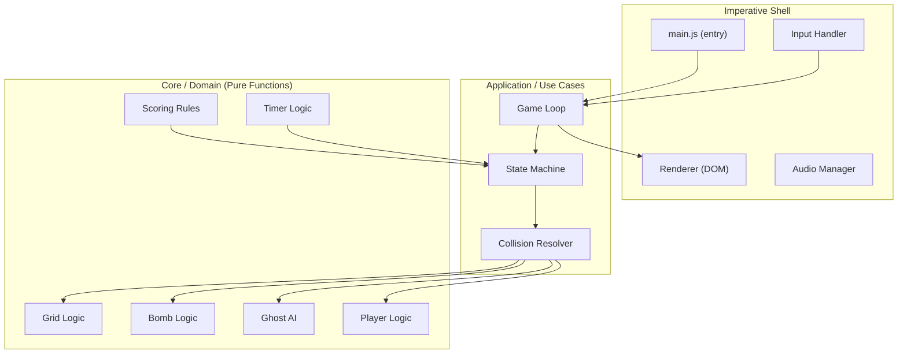

# 📋 Ms. Ghostman — Implementation Plan

> **Architecture**: Feature-First / Clean Architecture (Functional Core, Imperative Shell)  
> **Stack**: Vanilla JS (ES2026) · HTML · CSS Grid · DOM API only  
> **Tooling**: Biome (lint + format) · Vite (dev server + bundler) · Vitest (unit tests)  
> **Target**: 60 FPS via `requestAnimationFrame` · No canvas · No frameworks

---

## Table of Contents

1. [Architecture Overview](#1-architecture-overview)
2. [Directory Structure](#2-directory-structure)
3. [Workflow Tracks (Balanced Workload)](#3-workflow-tracks-balanced-workload)
   - [Track A — Core Engine & Orchestration (Dev 1)](#track-a--core-engine--orchestration-dev-1)
   - [Track B — Grid, Physics & Player (Dev 2)](#track-b--grid-physics--player-dev-2)
   - [Track C — AI & Gameplay Systems (Dev 3)](#track-c--ai--gameplay-systems-dev-3)
   - [Track D — Rendering & UI Shell (Dev 4)](#track-d--rendering--ui-shell-dev-4)
4. [Integration Milestones](#4-integration-milestones)
5. [Shared Contracts & Interfaces](#5-shared-contracts--interfaces)
6. [Testing Strategy](#6-testing-strategy)
7. [Performance Budget](#7-performance-budget)

---

## 1. Architecture Overview



### Key Principles

1. **Functional Core**: All game rules (`grid`, `bomb`, `ghost`, `player`, `scoring`, `timer`) are **pure functions** — no DOM references, no side effects. They accept state and return new state. Immutability is enforced via Array methods (`toSpliced`, `with`, `toSorted`) and spread operators.
2. **Imperative Shell**: The game loop, renderer, and input handler are the only modules that touch the DOM or browser APIs. All DOM creation uses `createElement` (No `innerHTML` to prevent XSS).
3. **Signals for Reactivity**: The HUD subscribes to game-state signals (score, lives, timer) and updates only the specific DOM nodes that changed — no full re-renders, preventing jank.
4. **Object Pooling**: Explosion fire tiles, bomb entities, and ghost sprites are pooled to avoid GC pressure and ensure stable 60 FPS.
5. **CSS `transform` + `will-change`**: All movement uses `transform: translate()` on promoted layers. No `top`/`left` animation.

---

## 2. Directory Structure

```
make-your-game/
├── index.html                     # Entry HTML — single page
├── package.json                   # ES module, exports, scripts
├── biome.json                     # Biome linter/formatter config
├── vite.config.js                 # Dev server config
│
├── docs/
│   ├── requirements.md            # Original project requirements
│   ├── audit.md                   # Audit checklist
│   ├── game-description.md        # Full game rules & description
│   └── implementation-plan.md     # This file
│
├── src/
│   ├── main.js                    # App entry — bootstraps everything
│   │
│   ├── core/                      # 🧠 Domain layer (PURE — zero DOM)
│   │   ├── grid.js                # Grid creation, cell queries, pathfinding
│   │   ├── grid.test.js           # Grid unit tests
│   │   ├── bomb.js                # Bomb placement, fuse, explosion calc
│   │   ├── bomb.test.js           # Bomb unit tests
│   │   ├── ghost.js               # Ghost AI decision logic
│   │   ├── ghost.test.js          # Ghost AI unit tests
│   │   ├── player.js              # Player state transitions
│   │   ├── player.test.js         # Player unit tests
│   │   ├── scoring.js             # Score calculations, combos
│   │   ├── scoring.test.js        # Scoring unit tests
│   │   ├── timer.js               # Countdown logic
│   │   ├── timer.test.js          # Timer unit tests
│   │   ├── collision.js           # Collision detection (grid-based)
│   │   ├── collision.test.js      # Collision unit tests
│   │   └── constants.js           # Shared enums, cell types, speeds
│   │
│   ├── features/                  # 🎯 Feature modules (colocated)
│   │   ├── feat.game-loop/
│   │   │   ├── game-loop.js       # requestAnimationFrame loop
│   │   │   ├── state-machine.js   # Game states (menu, playing, paused, over, win)
│   │   │   └── game-loop.test.js
│   │   │
│   │   ├── feat.renderer/
│   │   │   ├── renderer.js        # DOM grid builder & updater
│   │   │   ├── sprite-pool.js     # Object pool for fire/bomb sprites
│   │   │   ├── animations.js      # CSS class toggling, transitions
│   │   │   └── renderer.test.js
│   │   │
│   │   ├── feat.input/
│   │   │   ├── input-handler.js   # Keyboard event management
│   │   │   └── input-handler.test.js
│   │   │
│   │   ├── feat.hud/
│   │   │   ├── hud.js             # Score, lives, timer DOM updates (Signals)
│   │   │   ├── hud.css            # HUD styling
│   │   │   └── hud.test.js
│   │   │
│   │   ├── feat.pause-menu/
│   │   │   ├── pause-menu.js      # Pause overlay: continue / restart
│   │   │   ├── pause-menu.css     # Overlay styling
│   │   │   └── pause-menu.test.js
│   │   │
│   │   ├── feat.screens/
│   │   │   ├── start-screen.js    # Title / start screen
│   │   │   ├── game-over.js       # Game over screen
│   │   │   ├── victory.js         # Victory screen
│   │   │   ├── level-complete.js  # Level transition screen
│   │   │   ├── screens.css        # Screen styling
│   │   │   └── screens.test.js
│   │   │
│   │   └── feat.maps/
│   │       ├── level-1.json       # Map data for level 1
│   │       ├── level-2.json       # Map data for level 2
│   │       ├── level-3.json       # Map data for level 3
│   │       └── map-loader.js      # Parses JSON → grid state
│   │
│   ├── infrastructure/            # 🔌 Adapters & side-effect boundaries
│   │   ├── dom-adapter.js         # Safe DOM creation utilities
│   │   ├── audio-adapter.js       # Sound effect playback (optional bonus)
│   │   └── storage-adapter.js     # High score persistence (localStorage)
│   │
│   └── shared/                    # 🔗 Cross-cutting utilities
│       ├── signal.js              # Minimal Signal implementation
│       ├── signal.test.js
│       ├── object-pool.js         # Generic object pool
│       ├── object-pool.test.js
│       ├── result.js              # Result<T, E> pattern helpers
│       └── types.js               # JSDoc typedefs (shared)
│
├── assets/
│   ├── sprites/                   # SVG sprites for player, ghosts, bombs, etc.
│   └── sounds/                    # Optional sound effects
│
└── styles/
    ├── reset.css                  # CSS reset / normalize
    ├── variables.css              # CSS custom properties (colors, sizes, timing)
    ├── grid.css                   # CSS Grid layout for the game board
    └── animations.css             # Keyframe animations (explosion, death, spawn)
```

---

## 3. Workflow Tracks (Balanced Workload)

The workload (~71.5 hours total) has been divided into 4 perfectly balanced tracks (~18 hours each). Each track is designed so that developers work on **independent modules** with clear **interface contracts** between them. No track needs to touch another track's internal files.

---

### Track A — Core Engine & Orchestration (Dev 1)

> **Scope**: The heartbeat of the game — the loop, state machine, timing, map loading, and the shared utilities everything depends on.
> **Total Estimate**: ~17 hours

#### A-1: Project Scaffolding & Tooling
**Priority**: 🔴 Critical  
**Estimate**: 2 hours

- [ ] Initialize `package.json` with `"type": "module"` and `exports` map
- [ ] Install and configure **Vite** for dev server (no framework plugin)
- [ ] Install and configure **Biome** (`biome.json`) for linting + formatting
- [ ] Install and configure **Vitest** for unit testing
- [ ] Create `index.html` with semantic structure (No `<canvas>`). Use safe DOM injection roots (`#game-root`, `#hud-root`).
- [ ] Create main CSS files: `reset.css`, `variables.css`, `grid.css`, `animations.css`
- [ ] Create `src/main.js` entry point (empty bootstrap)
- [ ] Verify dev server runs, linter passes, test runner works

#### A-2: Shared Utilities — Signals, Object Pool, Result Pattern
**Priority**: 🔴 Critical  
**Estimate**: 3 hours

- [ ] Implement `src/shared/signal.js`: Provides `createSignal`, `createComputed`, and `createEffect` for DOM reactivity without frameworks. Must support batched updates.
- [ ] Implement `src/shared/object-pool.js`: `createPool(factory, reset, initialSize)` to pre-allocate memory and prevent GC jank.
- [ ] Implement `src/shared/result.js`: `ok(data)` and `err(error)` pattern to avoid `try/catch` and `throw`.
- [ ] Define JSDoc typedefs in `src/shared/types.js` (`GameState`, `PlayerState`, etc).

#### A-3: Constants & Cell Types
**Priority**: 🔴 Critical  
**Estimate**: 1 hour

- [ ] Define `src/core/constants.js`: Directions (`UP`, `DOWN`), grid content (`WALL`, `PELLET`, `EMPTY`), tuning properties, and Scoring variables.
- [ ] Freeze all objects with `Object.freeze()` to enforce the immutability rules.

#### A-4: Game Loop with `requestAnimationFrame`
**Priority**: 🔴 Critical  
**Estimate**: 4 hours

- [ ] Implement `src/features/feat.game-loop/game-loop.js`:
  - `createGameLoop(updateFn, renderFn)` running strictly on `requestAnimationFrame`. Absolute requirement for 60fps rule.
  - Implement fixed-timestep update loop (16.67ms tick) with an accumulator to decouple pure-logic simulation from visual rendering.
  - Pass interpolation factor to `renderFn`.
- [ ] Implement `src/features/feat.game-loop/state-machine.js`: `createStateMachine(initial)` handling valid transitions (e.g. `PLAYING` -> `PAUSED`).

#### A-5: Map Data & Loader
**Priority**: 🔴 Critical  
**Estimate**: 3 hours

- [ ] Design 3 level maps as JSON files (Level 1: 30% destructible walls, Level 3: 55% destructible walls).
- [ ] Implement `src/features/feat.maps/map-loader.js`: parsing logic ensuring map integrity. Convert raw numbers into `GridState`.
- [ ] Auto-place pellets on empty paths. Return via the `Result` pattern.

#### A-6: Main Game Orchestrator
**Priority**: 🟡 Medium  
**Estimate**: 4 hours

- [ ] Implement `src/main.js` — the **imperative shell** that wires everything:
  - Initializes game state from Map data.
  - Links inputs to the loop. 
  - Subscribes HUD to the state signals.
  - Orchestrates level complete/game over transitions.

---

### Track B — Grid, Physics & Player (Dev 2)

> **Scope**: Pure logic for board rules, moving entities, bomb mechanics, collision resolving, and taking user inputs. 
> **Total Estimate**: ~17.5 hours

#### B-1: Grid Logic (Core Domain)
**Priority**: 🔴 Critical  
**Estimate**: 3 hours

- [ ] Implement `src/core/grid.js` (Pure Functions):
  - `createGrid`, `getCell`, `setCell`, `getValidMoves`.
  - Ensure immutability via `Array.prototype.with()` / spread operators. Do not mutate arrays.
  - Generate explosion ranges accounting for indestructible rays stopping.

#### B-2: Collision Detection (Core Domain)
**Priority**: 🟡 Medium  
**Estimate**: 3 hours

- [ ] Implement `src/core/collision.js` (Pure Functions): 
  - `checkPlayerGhostCollision`, `checkPlayerExplosionCollision`, `checkPlayerPelletCollision`, `checkGhostExplosionCollision`.
  - Operations occur on logical sub-grid boundaries (distance checks).

#### B-3: Bomb Logic (Core Domain)
**Priority**: 🔴 Critical  
**Estimate**: 4 hours

- [ ] Implement `src/core/bomb.js` (Pure Functions):
  - `createBomb`, `tickBomb` (decrements fuse).
  - `calculateExplosion`: Computes `{ row, col }` hits using B-1's range logic.
  - `checkChainReaction`: Allows bomb explosions to trigger bombs inside the blast radius.

#### B-4: Player Logic (Core Domain)
**Priority**: 🔴 Critical  
**Estimate**: 3 hours

- [ ] Implement `src/core/player.js` (Pure Functions):
  - `createPlayer` state initialization.
  - `movePlayer` transitions row/col based on grid valid paths.
  - `damagePlayer`, `tickInvincibility`, `applyPowerUp`.

#### B-5: Input Handler
**Priority**: 🔴 Critical  
**Estimate**: 2.5 hours

- [ ] Implement `src/features/feat.input/input-handler.js`:
  - Maps `keydown` / `keyup` to intentions.
  - Sustains movement with "hold-to-move". Uses `using` declarative cleanup for event listeners.
  - Debounce Spacebar and Esc.

#### B-6: Infrastructure Adapters
**Priority**: 🟢 Low (Bonus)  
**Estimate**: 2 hours

- [ ] Implement `src/infrastructure/storage-adapter.js`: Persistent High Score handling safely wrapped in `try/catch` and returning Result objects.
- [ ] Implement `src/infrastructure/audio-adapter.js`: Loads `.wav`/`.mp3` effects and plays them statelessly.

---

### Track C — AI & Gameplay Systems (Dev 3)

> **Scope**: Ghost behaviors (AI), scoring, power systems, timing rules, and pause sub-systems.
> **Total Estimate**: ~18 hours

#### C-1: Ghost AI Logic (Core Domain)
**Priority**: 🔴 Critical  
**Estimate**: 5 hours

- [ ] Implement `src/core/ghost.js` (Pure Functions):
  - `chooseDirection`: Intersection logic taking player pos and grid into account.
  - **Blinky (Red)**: Euclidean chase algorithm.
  - **Pinky (Pink)**: Cut-off logic mapping tiles ahead of player.
  - **Inky (Cyan)**: Bi-directional dependency factoring Blinky.
  - **Clyde (Orange)**: True random. All ghosts strictly adhere to **no-reversing** rules unless stunned.

#### C-2: Ghost Spawning & Management
**Priority**: 🔴 Critical  
**Estimate**: 3 hours

- [ ] Manage ghost array state loops (`tickAllGhosts`).
- [ ] Implement staggered spawner interval logic based on `timerMs`. Dead ghost pathing to Ghost House for regeneration.

#### C-3: Power Pellet System
**Priority**: 🟡 Medium  
**Estimate**: 2 hours

- [ ] Implement `STUNNED` cascade across the ghost array. Apply half-speed multipliers.
- [ ] Decrement stun timer, handling visual flash warning states when recovering to `NORMAL`.

#### C-4: Scoring Logic (Core Domain)
**Priority**: 🟡 Medium  
**Estimate**: 1.5 hours

- [ ] Implement `src/core/scoring.js` (Pure Functions): Add standard pellet score logic.
- [ ] `addComboScore`: Math computation `200 × 2^(n-1)` multiplier tracking multiple ghosts killed by one explosion.

#### C-5: Timer Logic (Core Domain)
**Priority**: 🟡 Medium  
**Estimate**: 1.5 hours

- [ ] Implement `src/core/timer.js` (Pure Functions): Fixed duration countdowns for Level completion. Failure results in Game Over. Time left converts to score via `calculateTimeBonus`.

#### C-6: Pause Menu System
**Priority**: 🔴 Critical  
**Estimate**: 2 hours

- [ ] Implement `src/features/feat.pause-menu/*`: DOM Overlay handling resuming and restarting. Modifies State Machine flags.

#### C-7: SVG Sprites & Asset Prep
**Priority**: 🟢 Low (Bonus)  
**Estimate**: 3 hours

- [ ] Export or handcraft clean SVG icons for UI and Actors (Ghost, Bombs, UI Hearts).

---

### Track D — Rendering & UI Shell (Dev 4)

> **Scope**: Mapping state to visual DOM, optimizing for 60fps via compositor layers, CSS animation, object pools, and HUD signals.
> **Total Estimate**: ~19 hours

#### D-1: CSS Design System & Grid Layout
**Priority**: 🔴 Critical  
**Estimate**: 3 hours

- [ ] Write `styles/variables.css` & `styles/grid.css`. 
- [ ] Use CSS variables exclusively. Map grid to CSS Grid Layout `repeat(cols, size)`. Assign `will-change: transform` only to explicitly dynamic `.moving` targets.

#### D-2: DOM Renderer Engine
**Priority**: 🔴 Critical  
**Estimate**: 5 hours

- [ ] Implement `src/features/feat.renderer/renderer.js`: **Explicitly use `document.createElementNS` / `createElement`**. No `innerHTML` ever (AGENTS.md constraint).
- [ ] Use Object pooling (`sprite-pool.js`) for rendering dynamic elements like Bombs and Fire particles to absolutely minimize DOM node creation and GC hits. 
- [ ] Handle sub-pixel translation logic `moveEntity(id, x, y, interpolation)` for perfectly smooth 60 FPS transitions decoupled from the 16.6ms logic loop.

#### D-3: HUD (Signals-Driven)
**Priority**: 🔴 Critical  
**Estimate**: 2.5 hours

- [ ] Implement `src/features/feat.hud/*`: Listen to `scoreSignal`, `timerSignal`, `livesSignal`, and `maxBombsSignal`.
- [ ] DOM modification is precise: Only target the `textContent` of the specific metric that mutated. This guarantees no reflow jank.

#### D-4: Game Screens (Start, Game Over, Victory)
**Priority**: 🟡 Medium  
**Estimate**: 3 hours

- [ ] Implement visual screens `src/features/feat.screens/*` triggered by the state machine.
- [ ] Built with 100% vanilla `createElement` logic. Animated text styling for Game Over / Victory counters.

#### D-5: Player & Bomb Rendering Integration
**Priority**: 🟡 Medium  
**Estimate**: 3 hours

- [ ] Wire Player states to visual `.player--invincible` and directional classes. Map physics boundaries to active DOM offsets.
- [ ] Handle bomb `.bomb--pulsing` CSS animations scaling up on fuse. Ensure `transitionend` events clear states securely.

#### D-6: Ghost Rendering Integration
**Priority**: 🟡 Medium  
**Estimate**: 2.5 hours

- [ ] Maps Ghost AI internal states to SVG styles (Inverting to blue `.ghost-stunned` and drawing eyes-only `.ghost-dead`.

---

## 4. Integration Milestones

These are the points where tracks converge. Each milestone requires code from multiple tracks.

```mermaid
gantt
    title Ms. Ghostman — Integration Timeline
    dateFormat  X
    axisFormat %s

    section Track A (Core/Loop)
    A-1 Scaffolding         :a1, 0, 2
    A-2 Shared Utils        :a2, 2, 3
    A-3 Constants           :a3, 5, 1
    A-4 Game Loop           :a4, 6, 4
    A-5 Map Loader          :a5, 10, 3
    A-6 Orchestrator        :a6, 13, 4

    section Track B (Grid/Physics)
    B-1 Grid Logic          :b1, 2, 3
    B-2 Collision           :b2, 5, 3
    B-3 Bomb Logic          :b3, 8, 4
    B-4 Player Logic        :b4, 12, 3
    B-5 Input Handler       :b5, 15, 3
    B-6 Infrastructure      :b6, 18, 1

    section Track C (AI/Systems)
    C-1 Ghost AI            :c1, 2, 5
    C-2 Ghost Management    :c2, 7, 3
    C-3 Power Pellets       :c3, 10, 2
    C-4 Scoring Logic       :c4, 12, 2
    C-5 Timer Logic         :c5, 14, 2
    C-6 Pause System        :c6, 16, 2
    C-7 SVGs                :c7, 18, 1

    section Track D (UI/Render)
    D-1 CSS Grid Design     :d1, 2, 3
    D-2 DOM Renderer        :d2, 5, 5
    D-3 HUD Signals         :d3, 10, 3
    D-4 Game Screens        :d4, 13, 3
    D-5 Player/Bomb Vis     :d5, 16, 3
    D-6 Ghost Vis           :d6, 19, 1

    section Integration
    M1 Static Grid Render   :milestone, m1, 10, 0
    M2 Player & Inputs Move :milestone, m2, 13, 0
    M3 Ghosts Enact Chaos   :milestone, m3, 16, 0
    M4 Full Orchestration   :milestone, m4, 19, 0
```



### Milestone 1: Grid Renders (Day 3)
**Requires**: A-1, A-3, B-1, A-5, D-1, D-2  
**Result**: A static game grid renders in the browser securely (createElement) from JSON map data.

### Milestone 2: Player Moves & Bombs Work (Day 4)
**Requires**: M1 + A-4, B-3, B-4, B-5, D-3  
**Result**: Player moves with hold-to-move inputs. Drops bombs dynamically. Grid recalculates safely on destruction.

### Milestone 3: Ghosts Move & Chase (Day 5)
**Requires**: M2 + C-1, C-2, C-3, B-2  
**Result**: Ghosts patrol via proper AI trees. Physics collisions register damage/kills accurately. Fixed 60fps verified against AI loads.

### Milestone 4: Full Game (Day 6-7)
**Requires**: M3 + A-6, B-6, C-4, C-5, C-6, D-4  
**Result**: Implemented scoring, state loops (GameOver, Victory), and cleanly pausing via Signals. No Frame drops on pause menu.

---

## 5. Shared Contracts & Interfaces

All tracks must agree on these data shapes. They are defined in `src/shared/types.js` and `src/core/constants.js`.

### Grid State
```js
/** @typedef {{ cells: ReadonlyArray<ReadonlyArray<number>>, width: number, height: number }} GridState */
```

### Entity Position
```js
/** @typedef {{ row: number, col: number }} Position */
```

### Player State
```js
/** @typedef {{ row: number, col: number, direction: number, lives: number, maxBombs: number, fireRadius: number, speed: number, isInvincible: boolean, invincibilityTimer: number }} PlayerState */
```

### Ghost State
```js
/** @typedef {{ type: number, row: number, col: number, direction: number, state: number, speed: number, stateTimer: number }} GhostState */
```

### Bomb State
```js
/** @typedef {{ row: number, col: number, fuseRemaining: number, fireRadius: number, ownerId: string }} BombState */
```

### Game State (Master)
```js
/**
 * @typedef {{
 *   grid: GridState,
 *   player: PlayerState,
 *   ghosts: ReadonlyArray<GhostState>,
 *   bombs: ReadonlyArray<BombState>,
 *   activeFires: ReadonlyArray<Position>,
 *   score: number,
 *   level: number,
 *   timer: TimerState,
 *   gameStatus: number
 * }} GameState
 */
```

---

## 6. Testing Strategy

| Layer | Tool | What to Test |
|---|---|---|
| **Core Domain** | Vitest | Every pure function — grid, bomb, ghost, player, scoring, collision, timer |
| **Features** | Vitest + jsdom | DOM creation, signal subscriptions, input event handling |
| **Integration** | Vitest + jsdom | Full game loop scenarios: start → play → pause → win |
| **Performance** | Browser DevTools | Manual 60 FPS validation, paint flashing, layer analysis |
| **Audit Compliance** | Manual checklist | Walk through every line of `audit.md` |

### Test Naming Convention
```js
describe('grid', () => {
  it('returns the correct cell type for a valid position', () => { ... })
  it('returns undefined for out-of-bounds positions', () => { ... })
})
```

---

## 7. Performance Budget

Failure to meet these budgets is a test failure (non-negotiable 60FPS per `audit.md`).

| Metric | Budget | How to Enforce |
|---|---|---|
| FPS | **Strictly ≥ 60** | Fixed-timestep interpolation loop + `requestAnimationFrame`. DevTools profiler tracking. |
| Frame budget | < 16.67ms per frame | Profile update + interpolation + DOM writes times total. |
| DOM elements | ≤ 500 (grid + dynamic) | Object pooling for all transient elements (particles). |
| Layout thrashing | **Zero** | Separate read / write passes in the engine orchestrator. Mutate CSS variables or transform properties only. |
| Paint areas | Minimal | `will-change: transform` on moving elements ONLY. Render layer grouping via DOM hierarchy. |
| GC Pauses | **Zero** in `update` Loop | All array returns map purely without leaking closures. Avoid massive `map` calls per frame. Object pools mandatory. |
| XSS Potential | **Zero** | `innerHTML` strictly forbidden. Raw `createTextNode` injection only. |

---

> **Next Step**: Each dev takes their track workflow and begins implementation. All tracks start with A-1 (scaffolding) since Dev 1 sets up the project. After A-1 is committed, all other tracks can begin in parallel.
