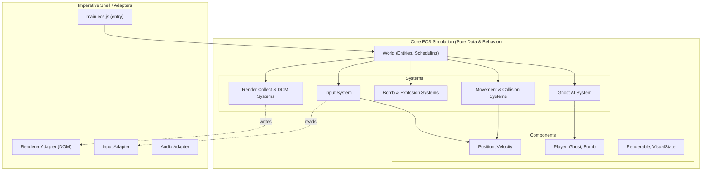

# 📋 Ms. Ghostman — ECS Implementation Plan v3

> **Architecture**: Entity-Component-System (ECS)  
> **Stack**: Vanilla JS (ES2026) · HTML · CSS Grid · DOM API only  
> **Tooling**: Biome (lint + format) · Vite (dev server + bundler) · Vitest (unit tests) · Playwright (e2e)  
> **Target**: 60 FPS via `requestAnimationFrame` · No canvas · No frameworks

---

## Table of Contents

1. [Architecture Overview](#section-1-architecture-overview)
2. [Directory Structure](#section-2-directory-structure)
3. [Workflow Tracks (Prototype-First MVP Order)](#section-3-workflow-tracks-balanced-workload)
    - [Track A — World, Game Flow, Scaffolding, Testing & QA (Dev 1)](track-a.md)
    - [Track B — Components, Input, Movement, Bombs & Gameplay Physics (Dev 2)](track-b.md)
    - [Track C — Scoring, Game Flow UI, Audio & Runtime Feedback (Dev 3)](track-c.md)
    - [Track D — Resources, Map, Rendering & Visual Assets (Dev 4)](track-d.md)
4. [Integration Milestones](#section-4-integration-milestones)
5. [Shared Contracts & Interfaces](#section-5-shared-contracts--interfaces)
6. [Testing Strategy](#section-6-testing-strategy)
7. [Performance Budget & Acceptance Criteria](#section-7-performance-budget--acceptance-criteria)
8. [Done Criteria](#section-8-done-criteria)
9. [Asset Creation & Pipeline](#section-9-asset-creation--pipeline)
10. [Maintenance Notes](#section-10-maintenance-notes)

---

<a id="section-1-architecture-overview"></a>
## 🏗️ 1. Architecture Overview

### 1.1 What Is ECS?

**Entity-Component-System (ECS)** is a data-oriented architecture:

- **Entity**: an opaque ID representing a game object.
- **Component**: pure data attached to entities (no behavior, no DOM state).
- **System**: deterministic logic that processes entities with matching components.

For this game, ECS helps keep simulation deterministic, isolate DOM side effects, and scale gameplay features without creating tightly coupled classes.

### 1.2 Source Of Truth References

1. `docs/requirements.md` + `docs/game-description.md` define project requirements and intended gameplay behavior.
2. `docs/audit.md` defines pass/fail acceptance criteria.
3. `audit-traceability-matrix.md` is the canonical requirement-to-audit-to-ticket-to-test coverage map and status tracker used by automated policy checks.
4. `ticket-tracker.md` tracks live execution status for Section 3 tickets.
5. `assets-pipeline.md` defines visual/audio authoring and optimization standards.
6. When implementation details are ambiguous, resolve against those references first.



### Core Architectural Boundaries

1. **World Layer**
   - Owns entity lifecycle, component stores, resources, and system scheduler.
   - Provides deterministic frame context (dt, pause flag, elapsed simulation time).
2. **ECS Simulation Layer (Pure or Mostly Pure)**
   - Systems run in fixed order and mutate component data in place in hot paths.
   - No DOM calls in simulation systems.
3. **Adapter Layer**
   - Input adapter, render adapter, storage adapter, audio adapter.
   - Converts browser events/DOM into normalized data for ECS resources.
   - **Adapters are registered as World resources** and accessed via the resource API. Systems MUST NOT import adapters directly — direct imports violate DOM isolation boundaries.
4. **Render Boundary**
   - Two-stage rendering:
     - `render-collect-system`: computes render intents from ECS state
     - `render-dom-system`: applies batched DOM writes only at end-of-frame

### Frame Pipeline

1. `requestAnimationFrame` tick.
2. **Input snapshot** (adapter).
3. **Fixed-step simulation pass** (0..N updates from accumulator, bounded to prevent spiral-of-death).
4. **Render intent collection**.
5. **One batched DOM commit pass**.
6. **HUD and overlay updates** via `textContent` and class toggles.

### Deterministic Runtime Contract

1. Simulation uses a **configurable fixed timestep** driven by `SIMULATION_HZ` (default `60`), yielding `FIXED_DT_MS = 1000 / SIMULATION_HZ` (`≈16.6667ms`). The `SIMULATION_HZ` constant lives in `constants.js`; changing it adjusts simulation rate without touching loop logic.
2. Catch-up is clamped (`maxStepsPerFrame`, default `5`) after tab throttling or CPU stalls.
3. `frameTime` is clamped before accumulator integration to avoid runaway bursts.
4. System order and query iteration are stable and centrally declared in `world.js`.
5. Structural entity/component mutations are deferred and applied at one sync point per tick.
6. Cross-system events (bomb chains, collisions, scoring) pass through deterministic event queues.

### Pause Semantics

- `rAF` continues running.
- Simulation updates are skipped while paused.
- Pause UI remains responsive; no timer progression while paused.
- On unpause, timing baseline is reset and accumulator is cleared/capped to prevent burst catch-up.
- `visibilitychange` / `blur` are treated as lifecycle events that force input and clock resynchronization.

### Input Determinism Contract

1. Input adapter tracks hold state from `keydown`/`keyup` sets; gameplay does not depend on OS key-repeat.
2. Held key state is cleared on `blur` and document hidden transitions.
3. World snapshots input once per fixed simulation step and systems consume only that snapshot.

### ECS Mutation Contract

1. Structural mutations (add/remove entity/component) are deferred to a sync point after system execution.
2. Entity IDs are recycled with stale-handle protection semantics.
3. Cross-system event queues are processed in deterministic insertion order.

### Key Principles

1. **ECS-First**: The game strictly follows Entity (numeric IDs), Components (pure data records), and Systems (deterministic behavior).
2. **DOM Isolation**: Simulation systems (movement, AI, collisions) must NEVER touch the DOM object. All DOM side effects are handled exclusively by the `Render DOM System` and adapters explicitly built to wrap DOM nodes.
3. **Data-Oriented & Zero Allocation**: Inside the core fixed-timestep update, arrays and pools are pre-allocated. Mutations on hot-path buffers occur in-place to avoid GC pause and frame drops.
4. **Stable Scheduling**: System execution order is rigidly defined in the `World` object. Components are updated predictably.
5. **Rendering Pipeline**: Simulation feeds intents. The `Render Collect System` processes what needs drawing and emits a frame-local render-intent buffer from ECS data. The `Render DOM System` then applies a single batch-write phase of transforms and opacity to avoid layout thrashing.

### Component Storage Architecture

Component storage uses a **Struct-of-Arrays (SoA)** layout for numeric hot-path data and plain object arrays for complex/non-numeric components:

- **Numeric components** (position, velocity, timers): `TypedArray` per field (e.g., `Float64Array`, `Int32Array`) indexed by entity ID. Maximises cache locality and eliminates per-entity GC pressure.
- **Complex components** (ghost state, renderable, visual-state): Plain object arrays — one object per entity slot, mutated in place.
- **Query matching**: Bitmask-based in `query.js` — each component type owns a unique power-of-two bit; an entity's component mask is the bitwise OR of all attached component bits. Fastest approach for ≤ 32 component types.

```js
// Example SoA for Position — hot-path friendly
const positions = {
  row:       new Float64Array(MAX_ENTITIES),
  col:       new Float64Array(MAX_ENTITIES),
  prevRow:   new Float64Array(MAX_ENTITIES),
  prevCol:   new Float64Array(MAX_ENTITIES),
  targetRow: new Float64Array(MAX_ENTITIES),
  targetCol: new Float64Array(MAX_ENTITIES),
};
```

Entity IDs are recycled via a free-list pool in `entity-store.js`. Stale-handle protection is provided by a generation counter per slot.

---

<a id="section-2-directory-structure"></a>
## 📁 2. Directory Structure

```text
make-your-game/
├── index.html
├── package.json
├── biome.json
├── vite.config.js
│
├── docs/
│   ├── requirements.md
│   ├── audit.md
│   ├── game-description.md
│   ├── README.md
│   ├── schemas/
│   │   ├── visual-manifest.schema.json
│   │   └── audio-manifest.schema.json
│   └── implementation/
│       ├── agentic-workflow-guide.md
│       ├── audit-traceability-matrix.md
│       ├── assets-pipeline.md
│       ├── implementation-plan.md      # This file
│       ├── ticket-tracker.md
│       ├── track-a.md
│       ├── track-b.md
│       ├── track-c.md
│       └── track-d.md
│
├── tests/
│   ├── README.md
│   ├── e2e/
│   │   └── audit/
│   │       ├── audit-question-map.js
│   │       └── audit.e2e.test.js       # Audit inventory scaffold; execution types are tracked in audit-question-map.js
│   ├── integration/
│   │   ├── gameplay/               # Multi-system interaction tests
│   │   └── adapters/               # Adapter boundary tests (jsdom)
│   └── unit/
│       ├── systems/                # One test file per system
│       ├── resources/              # clock, rng, event-queue tests
│       └── world/                  # entity-store, query, world tests
│
├── src/
│   ├── main.ecs.js                    # App entry — bootstraps the ECS World
│   │
│   ├── game/                          # Game-flow orchestration (not ECS simulation)
│   │   ├── bootstrap.js               # World assembly + system registration order
│   │   ├── level-loader.js            # Level transition orchestration
│   │   └── game-flow.js               # FSM driver: MENU → PLAYING ↔ PAUSED → GAMEOVER/VICTORY
│   │
│   ├── debug/                         # Dev/test utilities — excluded from production builds
│   │   └── replay.js                  # Input recording, state hashing, replay playback
│   │
│   ├── ecs/
│   │   ├── world/
│   │   │   ├── world.js               # Lifecycle, system scheduling, frame context
│   │   │   ├── entity-store.js        # ID generation & recycling
│   │   │   └── query.js               # Component mask matching
│   │   ├── components/
│   │   │   ├── registry.js            # canonical component bitmask registry
│   │   │   ├── spatial.js             # position + velocity + collider (always co-occur)
│   │   │   ├── actors.js              # player + ghost + input-state (actor data)
│   │   │   ├── props.js               # bomb + fire + power-up (prop data)
│   │   │   ├── stats.js               # Health, lives, score, timer tags
│   │   │   └── visual.js              # renderable + visual-state (render queries)
│   │   ├── systems/
│   │   │   ├── input-system.js        # Applies adapter input to components
│   │   │   ├── player-move-system.js  # Grid-constrained player motion
│   │   │   ├── ghost-ai-system.js     # Normal, stunned, dead pathing
│   │   │   ├── bomb-tick-system.js    # Fuse countdown, chain reaction marking
│   │   │   ├── explosion-system.js    # Bomb destruction and fire spawn
│   │   │   ├── collision-system.js    # Entity overlap checks
│   │   │   ├── power-up-system.js     # Applies pickups and timed boosts
│   │   │   ├── scoring-system.js      # Applies events to total score
│   │   │   ├── timer-system.js        # Level countdown
│   │   │   ├── life-system.js         # Respawn and invincibility logic
│   │   │   ├── pause-system.js        # Freeze simulation while rAF continues
│   │   │   ├── spawn-system.js        # Ghost stagger spawn and respawn
│   │   │   ├── level-progress-system.js # Manages levels and game states
│   │   │   ├── render-collect-system.js # Maps simulation to visuals
│   │   │   └── render-dom-system.js   # Batches writes to the DOM
│   │   └── resources/
│   │       ├── constants.js           # Enums, speeds, config
│   │       ├── rng.js                 # Seeded RNG for determinism
│   │       ├── clock.js               # Deterministic / injected time tracking
│   │       ├── event-queue.js         # Deterministic event ordering between systems
│   │       ├── map-resource.js        # Loaded static grid & spawn points
│   │       └── game-status.js         # FSM: MENU → PLAYING ↔ PAUSED, WIN_LEVEL → LEVEL_COMPLETE → PLAYING/VICTORY, GAME_OVER
│   │
│   ├── adapters/
│   │   ├── dom/
│   │   │   ├── renderer-adapter.js    # DOM helper wrappers (no `innerHTML`)
│   │   │   ├── sprite-pool-adapter.js # Object pool for DOM elements
│   │   │   ├── hud-adapter.js         # Updates textContent for UI
│   │   │   └── screens-adapter.js     # Menus and overlays
│   │   ├── io/
│   │   │   ├── input-adapter.js       # Captures native key events
│   │   │   ├── storage-adapter.js     # Highscore saving
│   │   │   └── audio-adapter.js       # Sound playback
│   │
│   └── shared/
│       ├── result.js
│       └── utils.js                   # Pure math wrappers, arrays
│
├── assets/
│   ├── source/
│   │   ├── visual/
│   │   └── audio/
│   ├── generated/
│   │   ├── sprites/
│   │   ├── ui/
│   │   ├── sfx/
│   │   └── music/
│   └── manifests/
│       ├── visual-manifest.json
│       └── audio-manifest.json
│
└── styles/
    ├── variables.css
    ├── grid.css
    └── animations.css
```

---

<a id="section-3-workflow-tracks-balanced-workload"></a>
## 🧭 3. Workflow Tracks (Prototype-First MVP Order)

The work is divided into **4 ownership tracks** (A, B, C, D), with execution **prototype-first while still dependency-safe across all tracks**.

### 📌 Ticket Progress Tracking

Live ticket progress for this section is tracked in `docs/implementation/ticket-tracker.md`.

### Phase Gates (Global Execution Order)

| Phase | Goal | Primary Ticket Bands | Exit Criteria |
|---|---|---|---|
| P0 Foundation | Boot deterministic runtime and data contracts | A-01..A-03, A-10, B-01, D-01..D-04 | App boots, fixed-step world ticks, resources/map contracts available, render intent contracts defined |
| P1 Visual Prototype (Fast Feedback) | Get first playable-on-screen loop as early as possible | A-11, B-02..B-03, D-05..D-09 | Board renders, player movement is visible, frame pipeline runs through render collect and DOM commit |
| P2 Playable MVP | Deliver core gameplay loop and user-facing flow | A-07, A-12, B-04..B-05, C-01..C-06 | Start/pause/continue/restart works, score/lives/timer/HUD update, collision outcomes are visible and testable |
| P3 Feature Complete + Hardening | Add genre depth and lock quality gates | A-04..A-06, A-08, A-13, B-06..B-09, C-07 | Bomb depth, ghost AI, power-ups, event contracts, audio runtime integration, CI and automated test hardening |
| P4 Polish & Validation | Final production quality and asset governance | A-09, A-14, C-08..C-10, D-10..D-11 | Asset schemas/manifests, UI/audio polish, audit-ready evidence |

### Phase Transitions & Codebase Audits

> **Important Instruction:**
> Every time a phase of the plan tracker is finished, all tracks MUST run prompt `codebase-analysis-audit` (repository prompt file: `.github/prompts/code-analysis-audit.prompt.md`) against the whole codebase and merge their generated reports.
>
> Then Track A MUST run `.github/prompts/phase-deduplicate-track-audits.prompt.md` to produce one deduplicated fix report per track (A/B/C/D), assign ownership, and save those reports under `docs/audit-reports/<phase>/`.
>
> After that, each track MUST fix all issues assigned to their track report before phase closure.

### Workload Summary (Balanced Ownership)

| Track | Developer | Tickets | Scope |
|---|---|---|---|
| Track A | Dev 1 | 14 | World engine, game flow, scaffolding, all testing (unit/integration/e2e/audit), CI, QA and evidence. Track A can update all tests; feature tracks can update scoped tests tied to owned files. All visual assets are co-owned by Track A and Track D |
| Track B | Dev 2 | 9 | Components, input, movement and collision, bombs/explosions, power-ups, ghost AI, gameplay event contracts |
| Track C | Dev 3 | 10 | Scoring/timer/lives, spawn, pause/progression, HUD/screens/storage adapters, audio adapter/cues/SFX/music/manifest |
| Track D | Dev 4 | 11 | Resources, map loading, renderer and sprite pools, CSS/layout, gameplay and UI visual assets (co-owned with Track A), visual manifest governance |
| **Total** | **4 Devs** | **44** | |

### Critical Path By Dev

| Dev | Critical Path Focus | Must Land Before | Depends On |
|---|---|---|---|
| Dev 1 | ECS world engine, game loop orchestration, CI wiring, all test and audit evidence (global test ownership) | Any gameplay integration and final acceptance | None initially; later depends on B/C/D feature code for tests |
| Dev 2 | Components, input, movement, collision, bombs, power-ups, ghost AI, event contracts | Consumers of simulation outcomes across C and D | Dev 1 world setup; Dev 4 resource/map contracts |
| Dev 3 | Scoring/timer/lives, pause/progression, HUD/screens, audio pipeline | MVP UX readiness and audio feedback completeness | Dev 2 collision/event outputs; Dev 4 resources and layout primitives |
| Dev 4 | Resources, map, render pipeline, sprite pools, visual assets and manifests | Deterministic world-state correctness and visual/perf evidence | Dev 1 world setup; Dev 2 movement/collision outputs |

#### Scheduling Rule

1. Execute tickets by global phase (`P0 → P1 → P2 → P3 → P4`) across all tracks.
2. Inside a phase, claim only tickets whose declared dependencies are complete.
3. Ownership stays by track; phase sequencing controls implementation order.
4. Prototype-first override: prioritize P1 visual feedback tickets before broad test hardening.
5. If a higher-phase ticket is pulled early, record the reason in `ticket-tracker.md`.

---

### Track Ticket Documents

Track ticket definitions, checklists, and verification gates are maintained in dedicated documents:

- [Track A — World, Game Flow, Scaffolding, Testing & QA (Dev 1)](track-a.md)
- [Track B — Components, Input, Movement, Bombs & Gameplay Physics (Dev 2)](track-b.md)
- [Track C — Scoring, Game Flow UI, Audio & Runtime Feedback (Dev 3)](track-c.md)
- [Track D — Resources, Map, Rendering & Visual Assets (Dev 4)](track-d.md)

Live execution status is tracked in [Ticket Progress Tracker](ticket-tracker.md).

When ticket definitions change in any track file, update [audit-traceability-matrix.md](audit-traceability-matrix.md) and [ticket-tracker.md](ticket-tracker.md) in the same PR.

### 🔗 Coverage Traceability Reference

Coverage mapping has been centralized in `audit-traceability-matrix.md`.
Ticket execution status has been centralized in `ticket-tracker.md`.

1. Requirement-to-audit coverage mapping is maintained only in the matrix.
2. Audit-to-ticket and audit-to-test/evidence mapping is maintained only in the matrix.
3. Track ticket documents in `docs/implementation/track-*.md` remain the implementation source of truth and must keep verification-gate checklist items up to date.
4. Ticket status changes and Depends on/Blocks mappings must be updated in `docs/implementation/ticket-tracker.md`.
5. Any ticket, audit, or test-anchor change in this plan must be mirrored in `audit-traceability-matrix.md` in the same PR.

---

<a id="section-4-integration-milestones"></a>
## 🗓️ 4. Integration Milestones

```mermaid
gantt
    title Ms. Ghostman - Prototype-First Integration Timeline
    dateFormat  X
    axisFormat %s

    section P0 Foundation
    Runtime + ECS Core: p0a, 0, 5
    Component + Resource + Map Contracts: p0b, 1, 4

    section P1 Visual Prototype
    Input + Movement + Static Board Render: p1a, 5, 3
    Render Collect + DOM Commit Loop: p1b, 6, 2

    section P2 Playable MVP
    Collision + Score + Timer/Lives: p2a, 8, 3
    Pause/Progression + HUD/Screens: p2b, 9, 3

    section P3 Feature Complete + Hardening
    Bombs + Ghost AI + Power-ups: p3a, 11, 4
    Event Hooks + Audio Critical + Test Hardening: p3b, 12, 4

    section P4 Polish & Validation
    Audio/UI/Manifest Polish: p4a, 16, 4
    Final Evidence + Audit Readiness: p4b, 18, 4

    section Integration
    M1 Engine Foundation: milestone, m1, 5, 0
    M2 Visual Prototype: milestone, m2, 8, 0
    M3 Playable MVP: milestone, m3, 11, 0
    M4 Feature Complete + Hardening: milestone, m4, 16, 0
    M5 Full Game + Polish: milestone, m5, 22, 0
```



### Milestone 1: Engine Foundation (Day 2-3)
**Requires**: A-01, A-02, A-03, B-01, D-01, D-02, D-03, D-04  
**Result**: Core ECS world schedules deterministic ticks with resources, map contracts, and render intent contracts ready.

### Milestone 2: Visual Prototype (Day 3)
**Requires**: M1 + B-02, B-03, D-05, D-06, D-07, D-08  
**Result**: First on-screen playable prototype with visible board and controllable movement.

### Milestone 3: Playable MVP (Day 4)
**Requires**: M2 + B-04, C-01, C-02, C-03, C-04, C-05  
**Result**: Core gameplay loop playable (start, move, score, lose life, pause/continue/restart, HUD/overlays).

### Milestone 4: Feature Complete + Hardening (Day 5-6)
**Requires**: M3 + A-04, A-05, A-06, A-07, A-08, B-05, B-06, B-07, B-08, B-09, C-06, C-07, D-09  
**Result**: Feature-complete gameplay with bombs, ghost AI, power-ups, deterministic event contracts, audio integration, and robust automated checks.

### Milestone 5: Full Game + Polish (Day 7)
**Requires**: All tracks complete + A-09, C-08, C-09, C-10, D-10, D-11  
**Result**: Playable from Start Menu through all 3 levels to Victory/Game Over. All tests passing, audit evidence collected.

### Gate Evidence Required (All Milestones)

1. Test evidence: relevant Vitest suites green, including new deterministic replay or regression tests for changed systems.
2. Performance evidence (for gameplay-critical changes): p50/p95/p99 frame-time stats + dropped-frame notes over representative 60s traces.
3. Pause evidence: rAF remains active while simulation/timer/fuse progression is frozen.
4. Rendering evidence: no recurring forced layout/reflow loops in render commit.
5. Environment evidence: browser version, OS, machine class, and throttle conditions.

---

<a id="section-5-shared-contracts--interfaces"></a>
## 🤝 5. Shared Contracts & Interfaces

Shared structure inside component storage array definitions. These are documented using JSDoc `typedef` for IDE support and clarity.

### Primitive Types
```js
/** @typedef {number} EntityId - Simply a unique numeric ID */
```

### Frame Context & Clock (Resource)
```js
/** 
 * @typedef {Object} FrameContext
 * @property {number} dtMs       - Fixed simulation delta time in ms (= FIXED_DT_MS = 1000/SIMULATION_HZ)
 * @property {number} simTimeMs  - Elapsed simulation time (does not advance while paused)
 * @property {number} alpha      - Render interpolation factor: `accumulator / FIXED_DT_MS` (0…1).
 *                                 Used in render-collect-system to lerp visual positions:
 *                                 `displayRow = prevRow + (row - prevRow) * alpha`
 *                                 `displayCol = prevCol + (col - prevCol) * alpha`
 * @property {boolean} isPaused  - Global simulation freeze flag
 * @property {number} frameIndex - Monotonic fixed-step counter (for deterministic event ordering)
 */
```

### Input State (Resource/Component)
```js
/**
 * @typedef {Object} InputState
 * @property {boolean} up
 * @property {boolean} down
 * @property {boolean} left
 * @property {boolean} right
 * @property {boolean} bomb - Action 1
 * @property {boolean} pause - Menu toggle
 */
```

### Event Queue (Resource)
```js
/**
 * @typedef {Object} GameEvent
 * @property {string} type - Event discriminator (e.g. BombDetonated, GhostKilled)
 * @property {number} frame - Fixed-step frame index
 * @property {number} order - Monotonic insertion index used for deterministic ordering
 * @property {Object} payload - Event-specific data
 */
```

### Core Components
```js
/**
 * @typedef {Object} Position
 * @property {number} row - Current grid row
 * @property {number} col - Current grid column
 * @property {number} prevRow - Row in previous fixed frame
 * @property {number} prevCol - Col in previous fixed frame
 * @property {number} targetRow - Destination for lerping
 * @property {number} targetCol - Destination for lerping
 */

/**
 * @typedef {Object} Player
 * @property {number} lives
 * @property {number} maxBombs
 * @property {number} fireRadius
 * @property {number} invincibilityMs - Protection timer
 * @property {number} speedBoostMs - Speed boost remaining time
 * @property {boolean} isSpeedBoosted - Speed boost active flag
 */

/**
 * @typedef {Object} Ghost
 * @property {number} type - Personality ID (0=Blinky, 1=Pinky, 2=Inky, 3=Clyde)
 * @property {number} state - NORMAL (0), STUNNED (1), DEAD (2)
 * @property {number} speed
 * @property {number} timerMs - State duration timer
 */

/**
 * @typedef {Object} Bomb
 * @property {number} fuseMs - Time until detonation
 * @property {number} radius
 * @property {number} ownerId - Entity that placed it
 */
```

### Render Intent

The render-intent buffer is **pre-allocated once** (`new Array(MAX_RENDER_INTENTS)`) at startup and reused every frame. CSS class state is encoded as a **bitmask integer** (`classBits`) instead of `string[]` to eliminate per-frame array allocations.

```js
/**
 * @typedef {Object} RenderIntent
 * @property {number} entityId
 * @property {string} kind      - Sprite/element type key
 * @property {number} row       - Interpolated display row
 * @property {number} col       - Interpolated display col
 * @property {number} classBits - Bitmask of visual state flags (see VISUAL_FLAGS in constants.js)
 */
// Visual state bit flags (combine with bitwise OR):
// const VISUAL_FLAGS = { STUNNED: 1, INVINCIBLE: 2, HIDDEN: 4, DEAD: 8, SPEED_BOOST: 16 };
```

### Map Resource
```js
/**
 * @typedef {Object} MapResource
 * @property {number} width
 * @property {number} height
 * @property {Uint8Array} cells - Flattened grid cell layout
 * @property {number} pelletCount - Progress tracker
 * @property {Object} playerSpawn - {row, col}
 * @property {Array<{row, col}>} ghostSpawns
 */
```

---

<a id="section-6-testing-strategy"></a>
## 🧪 6. Testing Strategy

| Boundary Layer | Tool | What to Test |
|---|---|---|
| **World Engine** | Vitest | Component registration, query accuracy, entity ID pooling constraints, deterministic execution order. |
| **Pure Systems** | Vitest | Deterministic output: Mock a system tick against a mocked component pool. Verify exact property writes. No DOM needed. |
| **Map Loader** | Vitest | Parses blueprint strictly. Rejects invalid maps. |
| **DOM Adapters** | Vitest + jsdom | Verifies `createElementNS` behaves securely without string/`innerHTML` injections. Assert pooled lengths; verify pool hiding via offscreen transform. |
| **Replay Determinism** | Vitest | Same seed + same input trace (`src/debug/replay.js`) must produce same `hashWorldState` output at frame N. |
| **Pause & Timer Invariants** | Vitest + integration fixtures | While paused, rAF remains active and simulation time remains frozen. Timer/fuse/invincibility counters do not drift. |
| **Accessibility Invariants** | Vitest + jsdom | Pause focus enters overlay on open and restores to prior target on close. Keyboard-only control path remains valid. |
| **Security Boundaries** | Vitest + static checks | HUD/menu updates use safe sinks (`textContent`, explicit attributes); untrusted storage data is validated on read. |
| **Regression Fixes** | Vitest | Repro test first, then fix, then pass. Verify no cross-system side effects outside component/resource contracts. |
| **Smoke Test** | **Playwright** | Boot game, run headlessly for 60 s with randomised input injections. Assert no unhandled exceptions. Write this first — it is the single highest-value test. |
| **Audit — Fully Automatable (F-01..F-16, B-01, B-02, B-03, B-04)** | **Playwright** (real browser) | Crash-free run, rAF usage, pause/continue/restart, hold-to-move, HUD metrics, genre compliance, good-practices checks, and SVG presence/asset checks via CI/static gates. |
| **Audit — Semi-Automatable (F-17, F-18, B-05)** | **Playwright** + `page.evaluate()` | Frame timing and async-performance measurements via Performance API thresholds. |
| **Audit — Manual-With-Evidence (F-19, F-20, F-21, B-06)** | DevTools traces (PR artifacts) | Paint usage, layer count, layer promotion, and overall-project judgment. Require a signed evidence note — NOT a Vitest assertion. |

---

<a id="section-7-performance-budget--acceptance-criteria"></a>
## ⚡ 7. Performance Budget & Acceptance Criteria

Failure to meet these budgets violates the `audit.md` strict pass parameters.

### Budget Targets

| Metric | Budget | ECS Implementation Enforcement |
|---|---|---|
| FPS | **Target: 60 FPS sustained. Acceptable: ≥ 60 FPS at p95. Unacceptable: any sustained period > 500 ms below 60 FPS.** | Engine decouples fixed-step loop (systems) from rAF render pass. |
| Frame Time | p95 ≤ 16.7 ms, p99 ≤ 20 ms | Zero internal allocations in hot loops. No recurring long tasks > 50 ms. |
| DOM Elements | ≤ 500 total (assert at startup) | Dev-mode assertion after level load. Transient rendering uses fixed Object Pools. |
| Layout Thrashing | **Zero** | Properties ONLY written via single batch function at tail of tick (Render DOM System). |
| Layer Promotion (`will-change`) | Player + 4 ghost sprites only | `will-change: transform` on always-moving sprites. Target baseline ≈5 promoted sprite layers. |
| GC Pauses / Jank | < 1 ms recurring pause budget after warm-up; no sustained jank bursts | SoA TypedArray storage. Entity recycling via free-list pool. Render-intent buffer reused each frame. |
| Catch-up Stability | Max `5` fixed steps per frame | Accumulator bounded to prevent spiral-of-death. |
| Modularity Leak | **Zero** | Simulation systems agnostic of DOM APIs. Adapters injected as World resources. |

### Required Evidence

For gameplay-critical changes (update/render/input):
1. DevTools Performance trace summary.
2. Pause/resume verification note (rAF active, simulation frozen).
3. Brief note on paint/layer observations.
4. Frame-time stats (`p50`, `p95`, `p99`) from a representative 60-second run.
5. Environment note (browser version, machine class, and scenario).

---

<a id="section-8-done-criteria"></a>
## ✅ 8. Done Criteria

A change is complete only when:
1. Biome passes for modified scope.
2. Relevant Vitest suites pass.
3. ECS boundaries are respected (pure systems have no DOM side effects).
4. Functional coverage remains intact:
   - Single player
   - Pause Continue/Restart
   - Timer/score/lives HUD
   - Genre-aligned gameplay
5. Performance criteria are validated for gameplay-critical changes.
6. Every question in `docs/audit.md` has explicit verification coverage (Fully Automatable, Semi-Automatable, or Manual-With-Evidence), with automated checks passing and required evidence artifacts attached.

---

<a id="section-9-asset-creation--pipeline"></a>
## 🎨 9. Asset Creation & Pipeline

This section is mandatory for delivery readiness and complements Track C (Audio) and Track D (Visual).

### 9.1 Scope and Ownership

1. Track D owns visual asset authoring, rendering, and optimization (co-owned with Track A).
2. Track C owns audio asset authoring, decoding, and playback.
3. Asset authoring, optimization, and validation standards are defined in `assets-pipeline.md`.
4. Asset changes should be reviewed with gameplay and performance in the same PR when behavior is affected.

### 9.2 Visual Asset Rules (DOM/SVG-first)

1. Preferred format is SVG for icons, characters, and UI glyphs where feasible.
2. Raster textures should be exported at exact display targets to avoid runtime scaling churn.
3. Every image asset must have declared dimensions in metadata/manifests so layout space is reserved and CLS risk is minimized.
4. Animation in gameplay paths must favor `transform` and `opacity` to preserve compositor-only motion.
5. Do not use unbounded filter stacks or expensive paint-heavy effects in hot scenes.

### 9.3 Audio Asset Rules

1. Provide at least one broadly compatible compressed format for each clip category (`.mp3` or `.m4a`), and optional higher-efficiency/open variants when supported (`.ogg`/Opus).
2. Use short, pre-trimmed SFX for gameplay events; avoid long tails that overlap and inflate active voice count.
3. Looping tracks must include loop-safe edit points and fade handling to prevent seam artifacts.
4. Normalize loudness across categories (UI, gameplay, ambience, music) and keep headroom for mix peaks.
5. Keep decode/startup latency constraints explicit for latency-sensitive cues.

### 9.4 Build and Validation Gates

1. Add CI checks for maximum asset sizes and required naming conventions.
2. Enforce that assets referenced by manifests/routes exist and are reachable.
3. Reject oversized additions without documented justification in the PR.
4. Keep an auditable source-to-export path (source files, export settings, generated outputs).

### 9.5 Runtime Loading Strategy

1. Load first-interaction critical assets eagerly (player sprite set, HUD, immediate SFX).
2. Defer non-critical/offscreen assets and prefetch upcoming-level bundles during safe frames.
3. Reserve dimensions for lazily loaded visual media to avoid layout shifts.
4. Keep object pools warm for high-churn entities and map visual instances from render intents only.

---

<a id="section-10-maintenance-notes"></a>
## 🛠️ 10. Maintenance Notes

1. This repository is ECS-only; no legacy alternative-architecture workflow docs are maintained.
2. `AGENTS.md` is the normative constraints source. This plan is the execution source for ECS work.
3. Keep documentation links synchronized when adding/removing docs under `docs/`.
4. If architecture constraints change, update `AGENTS.md` first and then align this plan.
